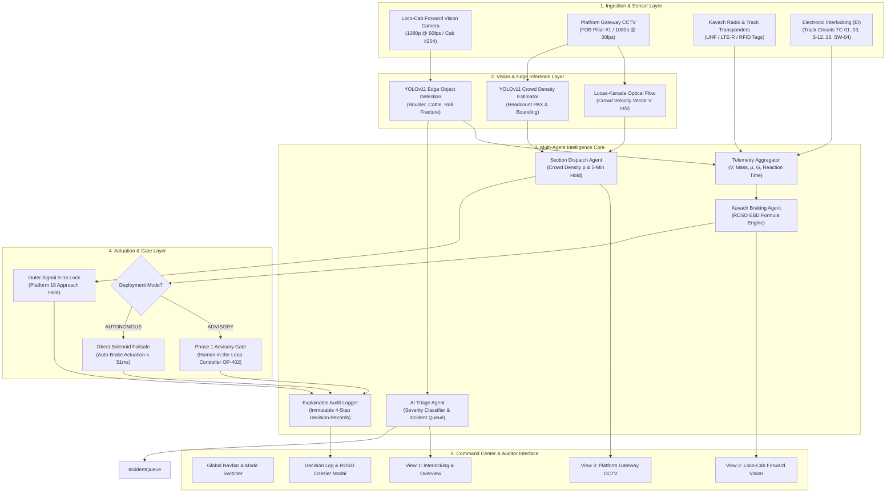
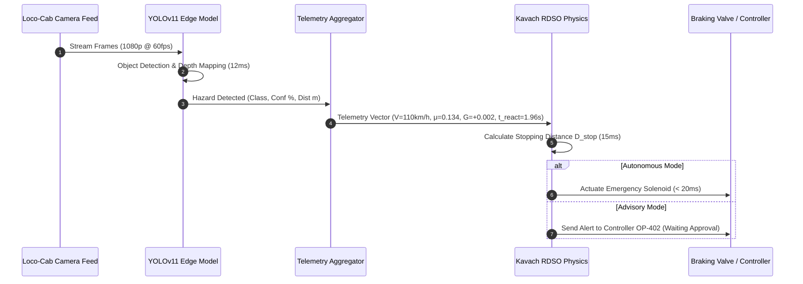
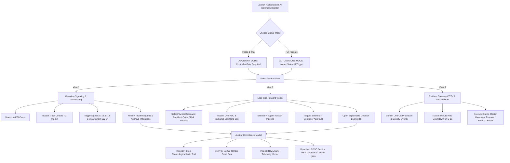

# RailSuraksha AI (रेल-सुरक्षा)
### National-Grade Railway Safety, Interlocking Monitoring & Incident Intelligence Platform

[-black?style=flat&logo=next.js)](https://nextjs.org/)
[](https://react.dev/)
[](https://www.typescriptlang.org/)
[](https://tailwindcss.com/)
[](https://vitest.dev/)
[](https://rdso.indianrailways.gov.in/)

---

## 📌 Executive Summary & Problem Statement

Indian Railways operates one of the world's most dense rail networks. Critical safety vulnerabilities such as **track obstruction (boulders, stray cattle, rail fractures)** and **platform foot-over-bridge (FOB) crowd surges** require sub-second detection and fail-safe deterministic intervention.

**RailSuraksha AI (रेल-सुरक्षा)** bridges:
1. **Edge Computer Vision (YOLOv11 & Optical Flow)** for low-latency obstacle and crowd hazard detection.
2. **Deterministic RDSO-Standard Physics Engine (Kavach EBD)** calculating Emergency Braking Distances based on kinematic train dynamics.
3. **Station Section Dispatch & Platform Hold Engine** preventing stampedes and platform crowd surges.
4. **Explainable AI Compliance & Auditability Engine** producing tamper-evident SHA-256 digital seals and official RDSO Section 14B Compliance Dossiers.

---

## 🏗️ System Architecture



---

## 📹 How the Cameras Work (Vision Pipeline Architecture)

RailSuraksha AI ingests two synchronized optical edge streams:

### A. Loco-Cab Forward Vision Camera (`LocoCameraFeed.tsx`)
- **Mount & Capture:** Windshield-mounted camera in locomotive cab #204 streaming 1080p @ 60fps covering up to $1,000\text{m}$ forward track section.
- **YOLOv11 Edge Inference ($\le 12\text{ ms}$):** Classifies hazards into `BOULDER`, `CATTLE`, and `RAIL_FRACTURE` with dynamic bounding boxes and confidence scores.
- **Depth / Range Mapping:** Accurately estimates obstacle distance $D_{\text{obstacle}}$ ($340\text{m}$, $680\text{m}$, $210\text{m}$).
- **HUD Live Telemetry Overlay:** Real-time speed ($V\text{ km/h}$), brake pressure ($P\text{ bar}$), distance, deceleration gauge, and solenoid state (`CLEAR` vs `EMERGENCY_SOLENOID_ACTUATED`).



### B. Platform Gateway CCTV (`PlatformGatewayFeed.tsx`)
- **Mount & Location:** Wide-angle CCTV on Foot-Over-Bridge (FOB) Pillar #1 overlooking CSMT Platform 17/18 staircases.
- **YOLOv11 Headcount Estimation:** Continuously tallies passenger volume ($\text{PAX}$).
- **Lucas-Kanade Optical Flow:** Computes crowd velocity vector towards platform edges ($V_{\text{crowd}}\text{ m/s}$).
- **Occupancy Index ($\rho$):** Calculates density $\rho \in [0.0, 1.0]$. When $\rho > 0.80$, triggers an interlock hold on outer approach signal $S\text{-}16$ and starts a deterministic 5-minute evacuation countdown.

---

## ⚡ Multi-Agent Intelligence Core & RDSO Kavach Physics

### 1. Kavach Emergency Braking Distance (EBD) Physics
The system enforces the strict RDSO kinematics braking equation:

$$D_{\text{stop}} = \frac{V^2}{2 \cdot g \cdot (\mu + G)} + (V \cdot t_{\text{reaction}})$$

Where:
- $V$: Train velocity in $\text{m/s}$ ($\frac{V_{\text{km/h}} \times 1000}{3600}$)
- $g$: Acceleration due to gravity ($9.81\text{ m/s}^2$)
- $\mu$: Rail-wheel friction coefficient (Standard steel rail = $0.134$)
- $G$: Track gradient ($+0.002$ uphill, $-0.002$ downhill)
- $t_{\text{reaction}}$: System reaction latency ($1.96\text{ seconds}$)

### 2. Multi-Agent Latency Profile
- **Stage 1 (Vision Hazard Detector):** $12\text{ ms}$
- **Stage 2 (Telemetry Aggregator):** $24\text{ ms}$
- **Stage 3 (RDSO Physics Engine):** $15\text{ ms}$
- **Stage 4 (Actuation Gate):** $20\text{ ms}$ (Autonomous) / Controller Decision (Advisory)
- **Total Pipeline Execution Latency:** $\approx 51\text{ ms}$ (Edge Compute)

---

## 🔄 Interactive User Flow



---

## 🛠️ How to Use the Software (Operator & Station Master Guide)

### 🚀 Quick Start (Running Locally)

```bash
# 1. Install dependencies
npm install

# 2. Run unit and integration tests (18 passing tests)
npm test

# 3. Start local development server
npm run dev
```

Open [http://localhost:3000](http://localhost:3000) in your browser.

---

### Step-by-Step Operator Guide

#### Step 1: Global Navigation & Mode Selection
- **Navbar Switcher:** Switch between **⚠️ ADVISORY (Phase 1)** (requires human-in-the-loop approval) and **⚡ AUTONOMOUS** (automatic sub-51ms brake actuation).
- **Tactical View Tabs:** Switch between View 1 (Overview), View 2 (Loco-Cab), and View 3 (Platform Gateway).

#### Step 2: View 1 — Overview & Track Interlocking
- **KPI Strip:** Review operational metrics (Active Trains, Track Circuits, Signals Active, Incidents Logged, Platform Holds, Telemetry Latency).
- **Interactive Interlocking Canvas:** Click signal lamps ($S\text{-}12$, $S\text{-}14$, $S\text{-}16$) to cycle aspects (`CLEAR` $\to$ `CAUTION` $\to$ `STOP`) and switch points ($\text{SW-04}$) to change route alignment (`NORMAL` $\to$ `REVERSE`).
- **Incident Triage Queue:** Filter alerts by severity (`CRITICAL`, `MODERATE`, `LOW`), inspect distance telemetry, and click `[APPROVE ACTION]` to authorize mitigations.

#### Step 3: View 2 — Loco-Cab Forward Vision
- **Select Scenario:** Test 3 distinct tactical scenarios:
  1. *Scenario 1:* 1.2m Boulder on Track 1A ($340\text{m}$, $110\text{ km/h}$).
  2. *Scenario 2:* Stray Cattle on Track 2 ($680\text{m}$, $110\text{ km/h}$).
  3. *Scenario 3:* Linear Rail Fracture on Curve Loop ($210\text{m}$, $90\text{ km/h}$).
- **Run Pipeline:** Click `[RUN 4-AGENT KAVACH PIPELINE]`.
  - In **Advisory Mode**, click `[APPROVE SOLENOID]` to authorize brake application.
  - In **Autonomous Mode**, watch immediate emergency solenoid actuation and deceleration to $0\text{ km/h}$.

#### Step 4: View 3 — Platform Gateway CCTV & Dispatch
- **Live Crowd Monitoring:** View live 1080p CCTV stream with YOLOv11 headcount and optical flow velocity vectors.
- **5-Minute Hold Countdown:** Outer signal $S\text{-}16$ holds approaching train #12137 (Punjab Mail) while Platform 17 staircase bottleneck is cleared.
- **Station Master Manual Overrides:**
  - `[RELEASE NOW]`: Immediately releases signal $S\text{-}16$.
  - `[EXTEND +3M]`: Adds 180 seconds to the hold timer.
  - `[RESET 5M]`: Resets countdown to the full 300-second interval.

#### Step 5: Compliance Auditing & Exporting Dossiers
- Click `[View 4-Step Explainable Decision Log Modal]`.
- Inspect the 4-step chronological audit trail and verify the **SHA-256 Tamper-Proof Seal** (`#9f8c4a1e7b2d...`).
- Click `[DOWNLOAD RDSO SECTION 14B COMPLIANCE DOSSIER]` to export a certified JSON compliance report.

---

## 📊 Supported Features Matrix

| Module | Feature | Implementation Details | Status |
| :--- | :--- | :--- | :--- |
| **Design System** | Light-Blue Mintlify UI | `#F0F6FC` canvas, `#FFFFFF` cards (`#D0DFEE` border), `#2B7FFF` accent, 4px button radius (strictly 0 pill buttons). | ✅ Implemented |
| **Navigation** | Global Persistent Navbar | 3 tactical view switchers, live status pulse, Advisory vs Autonomous mode toggle. | ✅ Implemented |
| **View 1** | 6-Metric KPI Strip | Active Trains, Track Circuits, Active Signals, Incidents Logged, Platform Holds, Telemetry Latency. | ✅ Implemented |
| **View 1** | Track Interlocking Map | Interactive track circuits (TC-01..03), clickable signals (S-12, S-14, S-16), switch point toggle (SW-04). | ✅ Implemented |
| **View 1** | AI Incident Triage Queue | Severity filtering (`CRITICAL`, `MODERATE`, `LOW`), confidence bars, distance badges, `[APPROVE ACTION]` workflow. | ✅ Implemented |
| **View 2** | Loco-Cab Forward Vision | 3 tactical hazard scenarios (Boulder, Cattle, Rail Fracture), live video stream, dynamic YOLO bounding box HUD. | ✅ Implemented |
| **View 2** | 4-Agent Execution Canvas | Micro-timing simulation (12ms Vision $\to$ 24ms Telemetry $\to$ 15ms RDSO $\to$ Actuation), kinematic gauges, Advisory approval gate. | ✅ Implemented |
| **View 3** | Platform Gateway CCTV | YOLOv11 & Optical Flow crowd detection overlay, live headcount and density index ($\rho$), 1s countdown ticker. | ✅ Implemented |
| **View 3** | Station Master Dispatch | 5-minute deterministic hold on signal S-16, manual override buttons (`[RELEASE NOW]`, `[EXTEND +3M]`, `[RESET 5M]`). | ✅ Implemented |
| **Auditor** | Explainable Decision Log Modal | 4-step chronological audit timeline, SHA-256 seal, copy-to-clipboard, raw JSON telemetry viewer. | ✅ Implemented |
| **Compliance**| RDSO Section 14B Dossier Export| One-click client-side download of certified JSON compliance report. | ✅ Implemented |
| **Physics** | Kavach EBD Engine | Pure TypeScript implementation of RDSO kinematic formula $D_{\text{stop}} = \frac{V^2}{2g(\mu + G)} + V \cdot t_{\text{reaction}}$. | ✅ Implemented |
| **Verification**| Vitest Test Suite | 18 passing unit and integration tests across physics, triage, interlocking, and compliance logging. | ✅ Implemented (18/18 Passing) |

---

## 📁 Repository Structure

```
RailSuraksha-AI-/
├── docs/
│   ├── system_architecture_and_user_guide.md    # Master architecture & user guide
│   ├── three_developer_execution_plan.md        # 3-developer team execution plan
│   └── api_endpoints_and_backend_schema.md      # API & contract specifications
├── src/
│   ├── app/
│   │   ├── globals.css                          # Mintlify design tokens & Tailwind CSS v4
│   │   ├── layout.tsx                           # Global Next.js app wrapper
│   │   └── page.tsx                             # Main Command Center orchestrator
│   ├── components/
│   │   ├── Navbar.tsx                           # Global header & Advisory/Autonomous switcher
│   │   ├── LocoCameraFeed.tsx                   # Loco cab video & dynamic HUD overlay
│   │   ├── AgentPipelineCanvas.tsx              # 4-stage Kavach pipeline visualizer
│   │   ├── PlatformGatewayFeed.tsx              # Platform CCTV crowd surge & hold monitor
│   │   ├── Common/
│   │   │   └── Card.tsx                         # Mintlify container card wrapper
│   │   ├── Overview/
│   │   │   ├── KpiStrip.tsx                     # 6-metric operational summary strip
│   │   │   ├── InterlockingMap.tsx              # Interactive track circuits & signals
│   │   │   └── IncidentQueue.tsx                # AI Triage incident priority list
│   │   └── Auditor/
│   │       └── DecisionLogModal.tsx             # 4-step audit timeline & compliance export
│   ├── lib/
│   │   ├── agents/
│   │   │   ├── kavachBrakingAgent.ts            # RDSO Emergency Braking Distance physics
│   │   │   ├── triageAgent.ts                   # Severity scoring & classifier
│   │   │   ├── sectionDispatchAgent.ts          # Platform hold timer & crowd density agent
│   │   │   └── explainableLogger.ts             # Immutable 4-step decision log generator
│   │   └── mockData.ts                          # Static datasets, circuits & demo video streams
│   └── types/
│       └── apiContracts.ts                      # Shared TypeScript interfaces & types
├── tests/
│   ├── railsuraksha.test.ts                     # Kavach physics & triage agent test suite
│   └── feature3_interlocking_compliance.test.ts # Interlocking & compliance audit test suite
├── context.md                                   # Persistent project context
├── features_implemented.md                      # Implemented features tracking
└── tracker.md                                   # Agent handoff log
```

---

## 📜 License & Compliance Standards

Built in compliance with:
- **RDSO Specification:** `RDSO/SPN/196/2020` (Indian Railways Kavach Standard).
- **Safety Interlocking:** Indian Railways General & Subsidiary Rules (G&SR).
