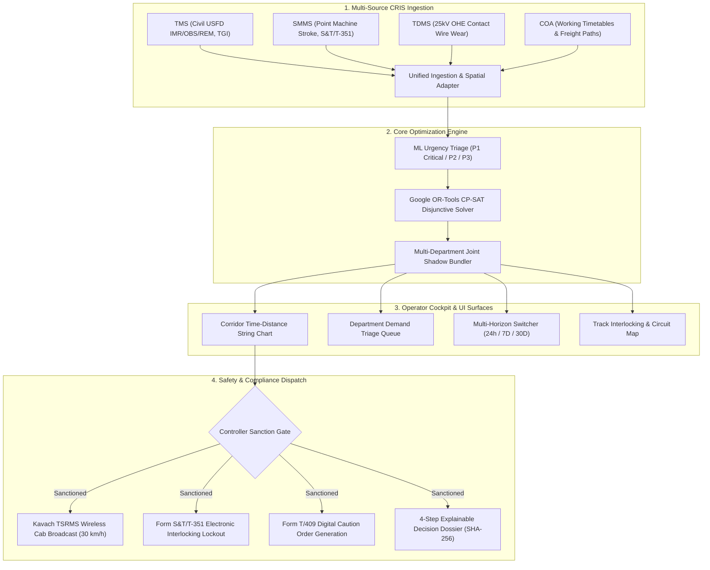

# RailSuraksha AI (Auto-BDMS) — Product Requirements Document (PRD)

**System Name:** RailSuraksha AI (रेल-सुरक्षा): Automated Block Planning & Corridor Optimization System (Auto-BDMS)  
**Smart India Hackathon (SIH) Problem Statement:** 26027 — *"AI-Powered Automatic Block Planning to Maximize Asset Availability for Train Operations on Indian Railways"*  
**Document Version:** 3.0.0 (Unified Grounded Specification)  
**Target Platform:** National Railway Corridor Operations, Divisional Control Centers (Sr. DOM / Section Controllers), and Maintenance Directorates  
**Governing Standards:** Indian Railways Permanent Way Manual (**IRPWM 2020**), AC Traction Manual (**ACTM Vol II**), Indian Railways Signal Engineering Manual (**IRSEM 2021**), General and Subsidiary Rules (**G&SR Chapter 15**), RDSO TCAS Specification (**RDSO/SPN/196/2020 Kavach Ver 4.0**), and Google OR-Tools CP-SAT.

---

## 1. Executive Summary & Problem Understanding

### 1.1 The Operational Challenge on Indian Railways
Indian Railways is the fourth-largest rail network in the world, operating over 13,000 passenger trains and 8,000 freight rakes daily across 68,000+ route kilometers. To maintain track geometry, overhead equipment (OHE), and signaling infrastructure, railway engineering departments require scheduled track possessions known as **maintenance blocks**.

Currently, fixed railway infrastructure is maintained by three separate engineering directorates:
1. **Civil / P-Way Engineering (Track Management System - TMS):** Governed by *IRPWM 2020* (Chapters 5 & 6). Manages rails, sleepers, ballast beds, points, crossings, ultrasonic flaw detection (USFD), and Track Geometry Index (TGI) deficits.
2. **Electrical / TRD (Traction Distribution Management System - TDMS):** Governed by *ACTM Vol II*. Manages 25kV AC Overhead Equipment (OHE), catenary/contact wire wear, neutral sections, and insulator washing.
3. **Signal & Telecom / S&T (Signalling Maintenance & Management System - SMMS):** Governed by *IRSEM 2021* (Part II). Manages electronic interlocking (EI), point machines, track circuits, axle counters, and statutory **Form S&T/T-351** disconnection notices.
4. **Operating / Traffic Directorate:** Governed by *G&SR Chapter 15*. Section Controllers in Divisional Control Offices manage live train dispatching, timetables, and train precedence via the **Control Office Application (COA)**.

### 1.2 Systemic Failure Modes of Legacy Operations
Under the existing Block & Disconnection Management System (BDMS / e-BDMS), each department requests line disconnections independently without cross-departmental alignment:
* **Departmental Silos & Corridor Fragmentation:** A single track section is frequently blocked three separate times in a single week (e.g., Civil tamping for 3.0h on Monday, Electrical OHE inspection for 2.5h on Wednesday, S&T point overhaul for 2.0h on Friday), accumulating **7.5+ hours of weekly disruption per 100 km section**.
* **Section Controller Cognitive Overload:** Controllers manually evaluate complex train timetables against pending block memos. Under intense pressure to prevent passenger punctuality loss, controllers frequently reject or truncate maintenance requests, resulting in dangerous **deferred maintenance backlogs**.
* **Unplanned Speed Restrictions & Capacity Loss:** Deferred maintenance leads to acute rail flaws and emergency **Temporary Speed Restrictions (TSRs)**, permanently slowing corridor speeds and cancelling scheduled freight paths.
* **Safety Disconnect in Field Dissemination:** Speed restrictions and caution orders rely on manual paperwork (**Form T/409**), creating risks of driver non-compliance and track gang accidents.

---

## 2. Product Vision & Value Proposition: Auto-BDMS

**RailSuraksha AI (Auto-BDMS)** is an AI-driven, constraint-optimized Automatic Block Planning System that unifies maintenance requisitions across all three engineering directorates and synchronizes them with real-time train paths from COA:

1. **Multi-Source Ingestion & Spatial Normalization:** Ingests live defect logs from TMS, TDMS, and SMMS, automatically mapping physical linear chainages (`KM 108/4 to 112/2`) into discrete electrical **Track Circuit IDs** (`TC-01` through `TC-06`).
2. **Automated Multi-Department Joint Shadow Blocking:** Clusters co-located demands into coordinated **Joint Shadow Blocks** where Civil track gangs and S&T crews work concurrently underneath de-energized OHE windows during natural nocturnal traffic lulls (01:30 AM to 05:00 AM).
3. **Google OR-Tools CP-SAT Disjunctive Optimization:** Solves corridor time-distance scheduling via mathematical constraint programming, guaranteeing zero passenger train cancellations, minimum safety headways ($\Delta_{\text{clear}} \ge 15\text{ min}$), and double-discharge earthing buffers ($\Delta_{\text{earth}} \ge 10\text{ min}$, $\Delta_{\text{restore}} \ge 10\text{ min}$).
4. **Multi-Horizon Rolling Framework (RHF):** Operates seamlessly across **24-Hour Tactical**, **7-Day Operational**, and **30-Day Strategic** planning horizons.
5. **Direct Safety Integration via RDSO Kavach TCAS:** Direct electronic transmission of Temporary Speed Restrictions ($30\text{ km/h}$) via the **Kavach TSRMS** to locomotive cab units, automated **Form S&T/T-351** electronic interlocking lockouts, **Form T/409** Caution Order generation, and immutable **SHA-256** audit dossiers complying with RDSO Form 14B.

---

## 3. Key Operational Invariants & Governing Constraints

1. **Zero Passenger Train Cancellation:** The mathematical solver strictly enforces that no scheduled passenger or express train path is cancelled or truncated.
2. **Passenger Safety Clearance Headway ($\Delta_{\text{clear}}$):** A mandatory minimum buffer of **$\ge 15\text{ minutes}$** is enforced between the formal termination of a maintenance block and the arrival of any high-priority passenger train.
3. **OHE Power Block Earthing Buffers ($\Delta_{\text{earth}}, \Delta_{\text{restore}}$):** Per *ACTM Vol II*, civil and signaling work beneath 25kV OHE can only commence $\ge 10\text{ minutes}$ after power isolation and double-discharge earthing, and must conclude $\ge 10\text{ minutes}$ prior to re-energization.
4. **Machine Turnaround & Gradient-Aware Kinematics:** Heavy track tampers (CSM, Duomatic) and Tower Wagons cannot teleport; transit velocities between stations are dynamically modeled accounting for track gradients ($G_s$) and curve resistance ($r_c$).
5. **Electronic Interlocking Fail-Safe State:** Upon block sanction, conflicting signal aspects (`S-12`, `S-14`) are clamped to danger (`RED`) in electronic interlocking relay logic to physically protect track gangs.

---

## 4. Quantifiable Target Success Metrics

| Metric | Legacy BDMS Operations | RailSuraksha AI (Auto-BDMS) | Impact Delta |
| :--- | :--- | :--- | :--- |
| **Weekly Corridor Downtime** | 7.5 to 12.0 hours / 100km | 3.5 to 4.5 hours / 100km | **35% to 50% Reduction** |
| **Corridor Path Capacity** | Baseline congested | +18% commercial paths | **+18% Capacity Increase** |
| **Passenger Delay Propagation** | 12 to 18 mins / block | < 1.2% secondary delay | **~65% Delay Reduction** |
| **Optimization Solver Latency** | 2 to 3 days manual coordination | < 30 seconds (OR-Tools) | **Near Real-Time** |
| **TSR Compliance & Safety** | Manual paper caution orders | 100% Wireless Kavach TCAS | **Zero Human Error Margin** |
| **Audit Verification** | Manual register entries | SHA-256 Cryptographic Dossier | **100% Tamper-Evident** |
