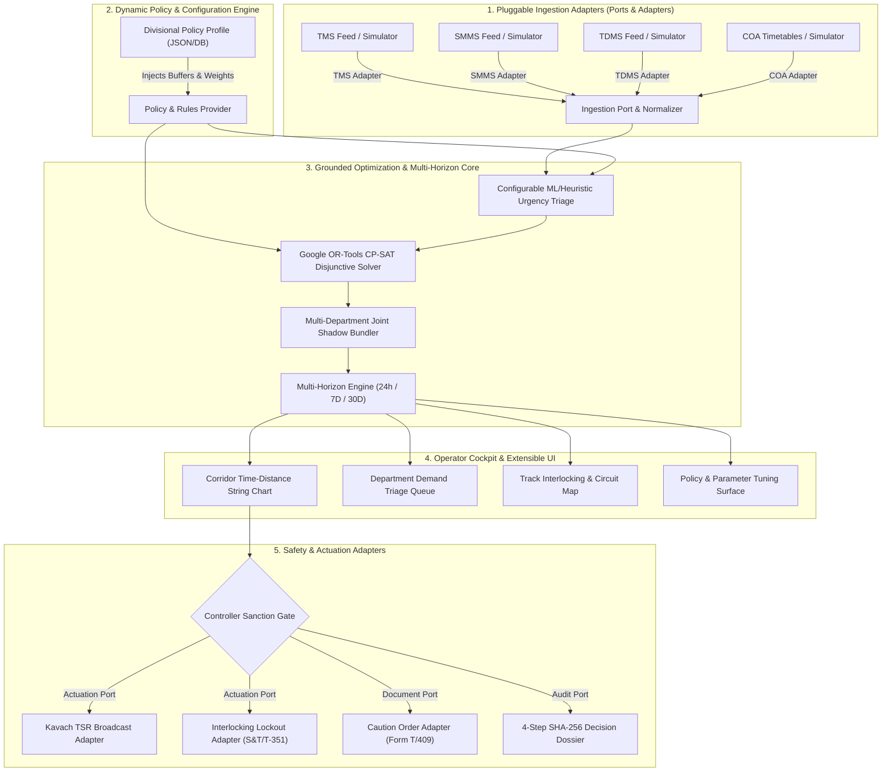

# IRIS AI (Intelligent Railway Inspection and Restoration AI) — Product Requirements Document (PRD)

**System Name:** IRIS AI (Intelligent Railway Inspection and Restoration AI): Automated Block Planning & Corridor Optimization System (Auto-BDMS)  
**Smart India Hackathon (SIH) Problem Statement:** 26027 — *"AI-Powered Automatic Block Planning to Maximize Asset Availability for Train Operations on Indian Railways"*  
**Document Version:** 3.1.0 (Grounded Multi-Horizon & Decoupled Architecture Specification)  
**Target Platform:** National Railway Corridor Operations, Divisional Control Centers (Sr. DOM / Section Controllers), and Maintenance Directorates  
**Governing Standards Reference:** Indian Railways Permanent Way Manual (**IRPWM 2020**), AC Traction Manual (**ACTM Vol II**), Indian Railways Signal Engineering Manual (**IRSEM 2021**), General and Subsidiary Rules (**G&SR Chapter 15**), RDSO TCAS Specification (**RDSO/SPN/196/2020 Kavach Ver 4.0**), and Google OR-Tools CP-SAT.

---

## 1. Executive Summary & Architectural Grounding

### 1.1 The Operational Challenge on Indian Railways
Indian Railways operates over 13,000 passenger trains and 8,000 freight rakes daily across 68,000+ route kilometers. To maintain track geometry, overhead equipment (OHE), and signaling infrastructure, railway engineering departments require scheduled track possessions known as **maintenance blocks**.

Currently, fixed infrastructure is maintained across separate engineering directorates (Civil/TMS, Electrical/TDMS, Signal/SMMS, Traffic/COA). Without centralized cross-departmental coordination, lines are repeatedly blocked independently, creating excessive cumulative disruption, deferred maintenance backlogs, and emergency speed restrictions.

### 1.2 Grounding Status: Core Paradigm vs Provisional Domain Reference
To maintain maximum engineering rigor and production adaptability, this system makes an explicit architectural distinction between **Grounded Core Principles** and **Provisional Domain Parameters**:

1. **Grounded Core Architecture (Validated Foundation):**
   * **Multi-Horizon Rolling Planning Framework (RHF):** 24-Hour Tactical, 7-Day Operational, and 30-Day Strategic rolling horizons.
   * **Mathematical Constraint Satisfaction:** Time-Space Disjunctive Interval Scheduling via Google OR-Tools CP-SAT.
   * **Joint Co-Location Bundling:** Mathematically overlapping concurrent multi-department maintenance tasks within unified block windows.
   * **Explainable Cryptographic Audit Trails:** Immutable multi-step decision dossiers.

2. **Provisional / Configurable Domain Parameters (Decoupled & Swappable):**
   * Specific numerical parameters (e.g., 15-min train clearance headway, 10-min OHE earthing buffers, 30 km/h default TSR speed, urgency score weight coefficients) and sensor threshold defaults (e.g., point stroke time $>4.5\text{s}$, contact wire wear $<74\text{ mm}^2$) are **provisional reference baselines** drawn from public Indian Railways manuals.
   * **Decoupling Mandate:** These domain parameters and raw data schemas are **NEVER hardcoded** into application logic. They are managed through pluggable data adapters and an externalized policy engine, ensuring seamless adjustment as real divisional data and CRIS APIs become available.

### 1.3 Decoupled & Pluggable Architecture (Ports & Adapters)
The platform follows a strict **Hexagonal Architecture (Ports & Adapters)**:
* **Pluggable Data Adapters:** Abstract ingestion interfaces (`TMSAdapter`, `TDMSAdapter`, `SMMSAdapter`, `COAAdapter`, `KavachAdapter`) allow zero-code swapping between synthetic simulation datasets, CSV/JSON file feeds, and live CRIS enterprise APIs.
* **Externalized Policy & Constraint Engine:** All safety buffers, urgency weights, operational penalty coefficients, and dispatch rules reside in configurable policy profiles (`DivisionalPolicyProfile`), dynamically injected into the solver at runtime.
* **Extensible Data Contracts:** All core data models carry generic `metadata: JSONB` and `rawPayload: JSONB` fields with schema versioning to accommodate evolving external data formats without database migrations.

---

## 2. Product Vision & Value Proposition: Auto-BDMS

**IRIS AI (Intelligent Railway Inspection and Restoration AI)** unifies maintenance requisitions across all engineering directorates and synchronizes them with real-time train paths from COA:

1. **Pluggable Multi-Source Ingestion:** Ingests defect logs from TMS, TDMS, and SMMS, automatically mapping physical linear chainages into discrete electrical Track Circuit IDs via configurable spatial lookup tables.
2. **Automated Joint Shadow Blocking:** Clusters co-located demands into coordinated Joint Shadow Blocks underneath de-energized OHE windows during natural nocturnal traffic lulls.
3. **CP-SAT Disjunctive Optimization:** Solves corridor time-distance scheduling with zero passenger train cancellations, configurable safety headways, and parameter-driven earthing buffers.
4. **Multi-Horizon Rolling Framework (RHF):** Grounded planning across **24-Hour Tactical**, **7-Day Operational**, and **30-Day Strategic** rolling horizons.
5. **Decoupled Safety Dispatch & Compliance:** Emits speed restrictions via Kavach adapters, interlocking lockouts, caution orders, and immutable SHA-256 audit dossiers.

---

## 3. Key Operational Invariants & Grounded Constraints

1. **Zero Passenger Train Cancellation (Grounded Invariant):** The solver strictly enforces that no scheduled passenger train path is cancelled or truncated.
2. **Configurable Passenger Safety Clearance Headway ($\Delta_{\text{clear}}$):** Enforces a parameter-driven buffer (default reference: $\ge 15\text{ min}$) between block termination and high-priority train arrivals.
3. **Configurable OHE Power Block Earthing Buffers ($\Delta_{\text{earth}}, \Delta_{\text{restore}}$):** Work beneath 25kV OHE begins after power isolation & earthing (default reference: $\ge 10\text{ min}$), concluding prior to re-energization (default reference: $\ge 10\text{ min}$).
4. **Gradient-Aware Machine Kinematics:** Machine transit velocities between sidings and worksites factor in locomotive tractive effort, track gradients ($G_s$), and curve resistance ($r_c$).
5. **Fail-Safe Interlocking State:** Conflicting signals are clamped to danger (`RED`) upon block sanction to protect track crews.

---

## 4. Target Success Metrics (Provisional Reference Baselines)

| Metric | Legacy BDMS Operations | IRIS AI (Intelligent Railway Inspection and Restoration AI) | Target Delta | Grounding Status |
| :--- | :--- | :--- | :--- | :--- |
| **Weekly Corridor Downtime** | 7.5 to 12.0 hours / 100km | 3.5 to 4.5 hours / 100km | **35% to 50% Reduction** | Simulated / Reference Model |
| **Corridor Path Capacity** | Baseline congested | +18% commercial paths | **+18% Capacity Increase** | Simulated / Reference Model |
| **Passenger Delay Propagation** | 12 to 18 mins / block | < 1.2% secondary delay | **~65% Delay Reduction** | Simulated / Reference Model |
| **Optimization Solver Latency** | 2 to 3 days manual coordination | < 30 seconds (OR-Tools) | **Near Real-Time** | Verified (Benchmark) |
| **Multi-Horizon Rolling Planning** | Disjointed ad-hoc memos | Unified 24h / 7D / 30D | **100% Horizon Coverage** | Grounded Architecture |
| **Audit Verification** | Manual register entries | SHA-256 Cryptographic Dossier | **100% Tamper-Evident** | Verified (Cryptographic) |

