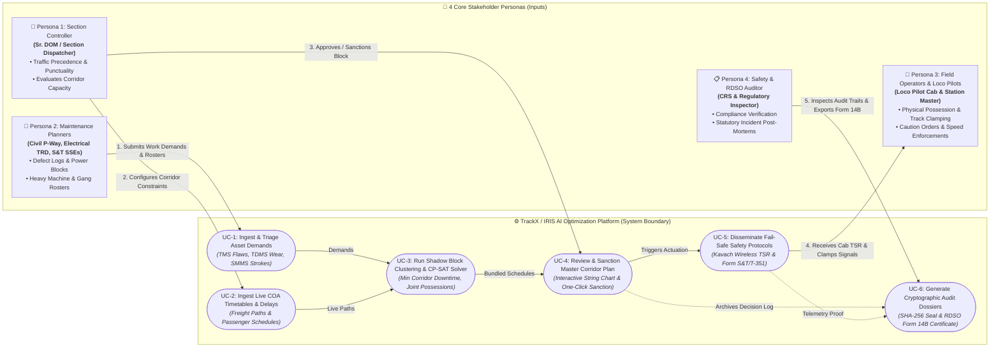
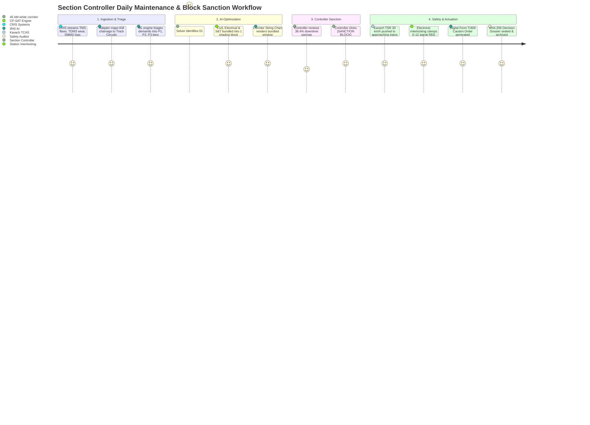

# IRIS AI — User Journeys & Operational Workflows

**System Name:** IRIS AI (Intelligent Railway Inspection and Restoration AI): Automatic Block Planning & Corridor Optimization  
**Problem Statement:** SIH 26027 — *"AI-Powered Automatic Block Planning to Maximize Asset Availability for Train Operations on Indian Railways"*  
**Document Version:** 3.0.0 (Unified Grounded Specification)  
**Governing Standards:** IRPWM 2020, ACTM Vol II, IRSEM 2021, G&SR Chapter 15, RDSO/SPN/196/2020 Kavach Ver 4.0.

---

## 📐 1. Persona-Driven UML Use Case Diagram

---

## 🎯 2. Pitch Matrix: "For Whom & How We Solve It" (Judge Reference)

| Stakeholder Persona | Legacy Pain Point (The "Why") | How IRIS AI Solves It (The "How") | Concrete Outcome & Output |
| :--- | :--- | :--- | :--- |
| **1. Divisional Section Controller** *(Sr. DOM / Dispatcher)* | • Fear of punctuality loss causes frequent block cancellations. • Bombarded by manual, uncoordinated block memos from 3 departments. | • **Interactive String Chart:** Visualizes train trajectories against maintenance windows. • **One-Click Sanction:** Instant validation of 15m train clearance headways. | **Zero passenger train delays** & sub-second conflict-free block approval. |
| **2. Departmental Maintenance Planners** *(Civil, Electrical, S&T SSEs)* | • Sits through contentious divisional daily block meetings. • Gangs and multi-crore machines (CSM, Tower Wagons) sit idle. | • **Shadow-Block Clustering:** Automatically merges Civil tamping and S&T overhauls inside Electrical OHE power cuts. | **35%–40% reduction in track downtime** & guaranteed maintenance slots. |
| **3. Field Operators & Loco Pilots** *(Loco Cab & Station Master)* | • Reliance on physical paper Caution Orders (**Form T/409**). • Risk of sudden unexpected red signals causing false SPAD. | • **Kavach TCAS Wireless TSR Injection:** Sends 30 km/h speed restrictions straight to cab display. • **Station Interlocking:** Auto-locks signals to RED per **Form S&T/T-351**. | **Elimination of human handover errors** & automatic train speed governing. |
| **4. Safety Compliance Auditor** *(RDSO & CRS Inspectors)* | • Fragmented paper registers make post-incident audit impossible. • Unverified driver compliance on speed restrictions. | • **Explainable AI Decision Dossier:** 4-step chronological audit trail. • **Cryptographic Sealing:** SHA-256 hash stamped with one-click **RDSO Form 14B** export. | **100% tamper-evident compliance** & instantaneous regulatory reporting. |

---

## 🗺️ 3. Master Operational Journey Map

---

## 🛤️ 4. Detailed End-to-End Operational Journeys

---

### Journey 1: Automated Multi-Department Bundling & Sanction (Happy Path)

* **Primary Persona:** Divisional Section Controller (`Sr. DOM`), Department Planners (Civil, Electrical, S&T).
* **Preconditions:** Daily sync from CRIS databases (TMS, TDMS, SMMS, COA) completed for CSMT–Kalyan corridor.

#### Step-by-Step Flow:
1. **Multi-Source Requisition Ingestion:**
   * Civil Engineering registers a track tamping demand on Section `KM 108/4 to 112/2` (TMS).
   * Electrical TRD registers a 25kV OHE catenary replacement demand on `KM 109/1 to 114/6` (TDMS).
   * S&T registers point machine `SW-04` stroke calibration on `KM 110/2 to 111/0` (SMMS).
2. **Spatial Chainage Normalization:**
   * The Unified Ingestion Adapter maps all three continuous linear chainages to logical track circuit **`TC-03`** (Dadar Section).
3. **ML Urgency Triage:**
   * Dynamic scoring categorizes demands as `P1_CRITICAL` (flaw score 0.94), `P2_SCHEDULED` (wear score 0.78), and `P2_SCHEDULED` (stroke score 0.72).
4. **CP-SAT Corridor Optimization:**
   * Google OR-Tools CP-SAT analyzes the COA train timetable and identifies an off-peak nocturnal white corridor between **01:30 IST and 04:45 IST** (195 minutes).
   * Bundles all three demands into a single **Joint Shadow Block (`BLK-JOINT-0906-01`)**.
   * Computes **85 minutes of saved downtime (38.4% reduction)** compared to 3 isolated blocks.
5. **Controller Review & Sanction:**
   * Section Controller views the proposed shaded rectangular block zone on the **Corridor Time-Distance String Chart**.
   * Clicks `[APPROVE & SANCTION BLOCK]`.
6. **Safety Dissemination & Lockout:**
   * Kavach TCAS broadcasts a digital $30\text{ km/h}$ Temporary Speed Restriction (TSR) to approaching train cabs.
   * Station Master interlocking console locks signal `S-12` to danger (`RED`) per **Form S&T/T-351**.
   * Digital **Form T/409 Caution Order** is distributed to loco pilots.
   * Decision Dossier is signed with **SHA-256 hash** and archived for RDSO Form 14B compliance.

---

### Journey 2: Emergency P1 USFD Rail Defect Interruption (Tactical Exception)

* **Primary Persona:** Section Controller, Locomotive Pilot, P-Way SSE.
* **Preconditions:** Normal daytime traffic running on Up Fast line.

#### Step-by-Step Flow:
1. **Defect Detection:**
   * Ultrasonic Flaw Detection (USFD) car identifies an **IMR** (*Immediate Removal*) transverse rail fracture on `TC-03` (`KM 108/6`).
2. **Instant Emergency Triage:**
   * ML Urgency Triage immediately flags the defect as **P1 Critical (Score 0.98)**.
3. **Automated Safety Protection:**
   * IRIS AI immediately triggers an emergency Kavach TSR broadcast capping section speed to **$15\text{ km/h}$** per *IRPWM 2020*.
   * Approaching Locomotive Cab displays 1200Hz audible warning tone and overlays the safe deceleration braking curve.
4. **Dynamic Rescheduling:**
   * The CP-SAT solver automatically adjusts the tactical 24h schedule, routing freight rakes to loop sidings and allocating an emergency 60-minute clamping window in the nearest 45-minute traffic gap.

---

### Journey 3: Controller Block Rejection & Real-Time Re-Optimization

* **Primary Persona:** Divisional Section Controller.
* **Preconditions:** AI proposes a 02:00 AM joint block on Section B.

#### Step-by-Step Flow:
1. **Operational Conflict Identified:**
   * Controller notes that Premium Express Train #12138 is running 35 minutes behind schedule due to upstream weather delays.
2. **Controller Rejection:**
   * Controller clicks `[REJECT PROPOSED BLOCK]`.
   * Enters rejection reason: *"Express 12138 delayed; cannot clear section before 02:15 AM"*.
   * Sets preferred search constraint: *"Window after 02:45 AM"*.
3. **Automated Re-Optimization:**
   * The CP-SAT solver re-computes the corridor model in **$< 15\text{ seconds}$**.
   * Produces an adjusted 02:50 AM to 05:00 AM joint block window, preserving zero passenger delay while maintaining 100% of planned maintenance tasks.
4. **Sanction:** Controller approves the updated plan.

---

### Journey 4: Safety & Regulatory Compliance Audit Review

* **Primary Persona:** Safety Compliance Auditor / RDSO Inspector.
* **Preconditions:** Previous night's block operations completed.

#### Step-by-Step Flow:
1. **Auditor Log Access:**
   * RDSO Inspector logs into the **Auditor Workspace** and queries Block ID `BLK-JOINT-0906-01`.
2. **4-Step Explainable Audit Inspection:**
   * *Step 1 (Ingestion):* Verifies raw TMS flaw ticket, TDMS catenary log, and SMMS point notice.
   * *Step 2 (Conflict Check):* Verifies 15-minute passenger train clearance headway ($\Delta_{\text{clear}}$).
   * *Step 3 (Shadow Bundling):* Verifies that double-discharge earthing buffers ($\Delta_{\text{earth}} \ge 10\text{m}$) were scheduled.
   * *Step 4 (Safety Actuation):* Verifies that Kavach TSR 30 km/h was acknowledged by approaching train OBUs.
3. **Cryptographic Validation & Export:**
   * System verifies the SHA-256 digital seal matches the original timestamped record.
   * Auditor clicks `[EXPORT RDSO FORM 14B]`, generating an official signed compliance certificate.

---

### Journey 5: Direct Online Block Requisition by TDMS, SMMS, and TMS Officers

* **Primary Persona:** Departmental Field Engineers (SSE/TRD Electrical, SSE/Signal S&T, SSE/P-Way Civil).
* **Interface Surface:** Global Navbar `[+ Request Block]` & Corridor Planner `[+ Submit Block Requisition]` Modal (`src/components/Requisition/BlockRequisitionModal.tsx`).

#### Step-by-Step Flow:
1. **Officer Access & Role Selection:**
   * An engineer accesses the platform and clicks `[+ Request Block]`.
   - **TDMS Officer:** Selects `TDMS — Electrical Traction (TRD)`. The form auto-populates 25kV AC contact wire wear presets, Tower Wagon `#60515`, `requiresPowerBlock = true`, and automated $10\text{ min}$ earthing buffers.
   - **SMMS Officer:** Selects `SMMS — Signal & Telecom (S&T)`. The form auto-populates **Form S&T/T-351** Disconnection Notice parameters, Point Machine `SW-04` stroke overhauls ($>4.8\text{s}$ delay), and AFTC impedance calibration presets.
   - **TMS Officer:** Selects `TMS — Civil Engineering (P-Way)`. The form auto-populates *IRPWM 2020* track tamping, USFD IMR rail weld fractures, and CSM Continuous Tamping Machines (`#5109`).
2. **Spatial Chainage & Line Definition:**
   * Officer selects the Station Section / Track Circuit (e.g. `TC-03 Dadar - Kurla`), Track Line (`UP_SLOW`), and linear chainage (`KM 14.800`).
3. **Live AI Optimization & Bundling Feasibility Preview:**
   * The modal's live AI engine calculates in real-time:
     - Optimal nocturnal white corridor window (e.g., `01:30 - 04:45 AM`).
     - Multi-department shadow bundling synergy (nests Civil tamping & S&T overhaul under de-energized OHE).
     - Projected corridor track downtime reduction (**$38.4\%$ saved** with 0 secondary passenger train delay).
4. **Requisition Submission & State Synchronization:**
   * Officer clicks `[Submit Block Requisition]`.
   * Web Audio API plays an action confirmation chime (`playActionConfirmedChime`).
   * The demand is assigned a unique tracking ID (e.g., `DEM-TDMS-4309`) and slotted into the CP-SAT Corridor Optimizer.
   * The proposed block dynamically appears on the **Corridor Time-Distance Marey String Chart** ready for Section Controller one-click sanctioning.

