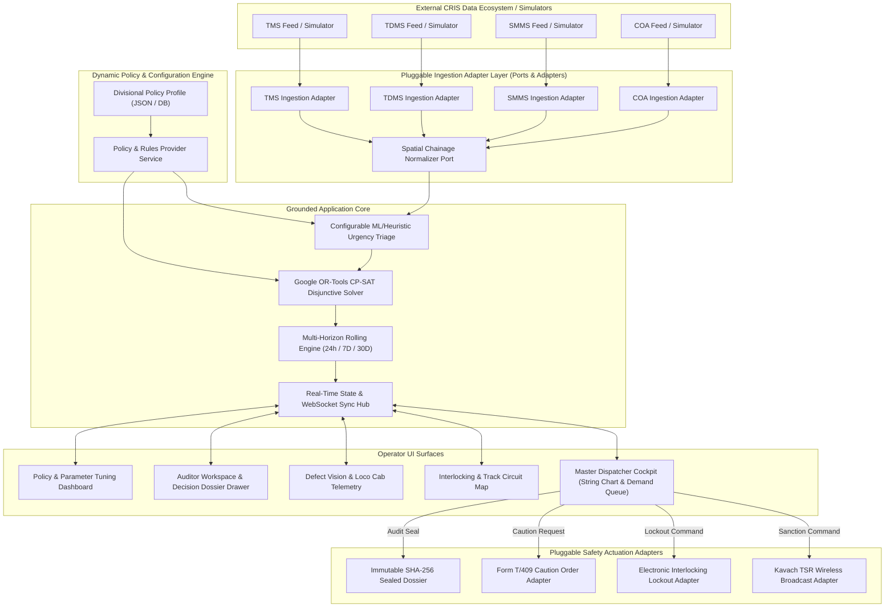

# IRIS AI — Information Architecture & Navigation Hierarchy

**System Name:** IRIS AI (Intelligent Railway Inspection and Restoration AI): Automatic Block Planning & Corridor Optimization  
**Problem Statement:** SIH 26027 — *"AI-Powered Automatic Block Planning to Maximize Asset Availability for Train Operations on Indian Railways"*  
**Document Version:** 3.0.0 (Unified Grounded Specification)  
**Governing Standards:** IRPWM 2020, ACTM Vol II, IRSEM 2021, G&SR Chapter 15, RDSO/SPN/196/2020 Kavach Ver 4.0.

---

## 🏛️ 1. Global Sitemap & Route Hierarchy

IRIS AI organizes its operational surfaces into four synchronized workspaces accessible via a persistent top-level navigation bar:

```text
┌────────────────────────────────────────────────────────────────────────────────────────┐
│                                IRIS AI GLOBAL SITEMAP                             │
├────────────────────────────────────────────────────────────────────────────────────────┤
│ 1. MASTER DISPATCHER COCKPIT (Route: /)                                                │
│    ├── 1.1 KPI Metric Strip (6 Real-Time Operational Cards)                            │
│    ├── 1.2 Multi-Horizon Time Horizon Switcher [24h Tactical | 7D Operational | 30D]   │
│    ├── 1.3 Corridor Time-Distance String Chart (SVG Canvas)                            │
│    └── 1.4 Department Demand & Triage Queue (Filterable TMS/TDMS/SMMS Tasks)          │
│                                                                                        │
│ 2. SECTION INTERLOCKING & CIRCUIT MAP (Route: /interlocking)                           │
│    ├── 2.1 Track Circuit Topology View (TC-01 through TC-06)                           │
│    ├── 2.2 Signal Head Aspect Indicators (S-12, S-14, S-16)                            │
│    ├── 2.3 Turnout Point Clamping Status (SW-04 Normal/Reverse)                       │
│    └── 2.4 Active Maintenance Block Overlap Boundaries                                 │
│                                                                                        │
│ 3. DEFECT VISION & CAB TELEMETRY (Route: /vision-telemetry)                            │
│    ├── 3.1 TMS Civil Track Rail Camera (USFD Rail Defect Detection)                   │
│    ├── 3.2 TDMS Electrical Pantograph Camera (25kV OHE Catenary Wire Wear)             │
│    ├── 3.3 SMMS Axle & Point Cam (Point Motor Calibration & Stroke Diagnostics)        │
│    └── 3.4 Kavach Cab HUD (Speedometer, Target Deceleration Curve, Audio Alarms)       │
│                                                                                        │
│ 4. AUDITOR WORKSPACE & DECISION DOSSIER (Route: /auditor-workspace)                    │
│    ├── 4.1 Chronological 4-Step Explainable Decision Timeline                          │
│    ├── 4.2 Cryptographic SHA-256 Hash Verification Tool                                │
│    ├── 4.3 Form S&T/T-351 Disconnection Notice Archive                                 │
│    ├── 4.4 Form T/409 Caution Order Log                                                │
│    ├── 4.5 RDSO Form 14B Safety Compliance Certificate Generator                       │
│    └── 4.6 Divisional Policy & Safety Parameter Tuner (Config Surface)                 │
└────────────────────────────────────────────────────────────────────────────────────────┘
```

---

## 🔄 2. Decoupled Data Flow & Subsystem Communication Topology



---

## 📊 3. Information Taxonomy & Extensible Data Entities

### 3.1 Departmental Maintenance Demand Entity `[Extensible Contract]`
* **Hierarchy:** Directorate $\to$ Department $\to$ Asset Type $\to$ Linear Chainage (KM) $\to$ Track Circuit ID $\to$ Metadata.
* **Attributes:**
  * `demandId` (String): Unique UUID / CRIS tracking number.
  * `department` (Enum): `TMS_CIVIL` | `TDMS_ELECTRICAL` | `SMMS_SIGNAL`.
  * `assetType` (Enum): `RAIL_TRACK` | `OHE_CATENARY` | `POINT_MACHINE` | `TRACK_CIRCUIT`.
  * `chainageKm` (String): Physical linear marker (e.g. `KM 108/4 - 112/2`).
  * `trackCircuitId` (String): Logical normalized circuit (e.g. `TC-03`).
  * `urgencyTier` (Enum): `P1_CRITICAL` | `P2_SCHEDULED` | `P3_ROUTINE`.
  * `urgencyScore` (Float): Calculated urgency index ($0.00\text{ to }1.00$).
  * `estimatedDurationMinutes` (Integer): Required physical work duration.
  * `requiredAssets` (Array): Machines (e.g. `CSM_TAMPER`, `TOWER_WAGON`) and gangs.
  * `status` (Enum): `PENDING_TRIAGE` | `SLOTTED` | `SANCTIONED` | `COMPLETED`.
  * `rawPayload` (JSONB): Unmodified original payload from external system for complete traceability.
  * `metadata` (JSONB): Extensible key-value pairs for division-specific attributes without schema changes.

### 3.2 Joint Shadow-Block Plan Entity `[Extensible Contract]`
* **Hierarchy:** Division $\to$ Corridor Section $\to$ Time Window $\to$ Bundled Demands $\to$ Safety Directives.
* **Attributes:**
  * `blockId` (String): Unique block identifier (e.g. `BLK-JOINT-0906-01`).
  * `sectionId` (String): Corridor section identifier (e.g. `CSMT-KYN-UP`).
  * `trackCircuits` (Array): List of blocked circuits (`["TC-03", "TC-04"]`).
  * `startTime` / `endTime` (ISO Timestamps / HH:mm strings).
  * `durationMinutes` (Integer): Total sanctioned possession duration.
  * `bundledDemands` (Array of Demand Records): Co-located tasks executed within block.
  * `downtimeSavedMinutes` (Integer): Net reduction in corridor downtime.
  * `kavachTsr` (Object): Enforced speed restriction and broadcast status.
  * `policyVersion` (String): Version identifier of the safety policy profile used during optimization.
  * `sha256AuditSeal` (String): 64-character hexadecimal cryptographic hash.

### 3.3 Divisional Policy Profile Entity `[Decoupled Configuration]`
* **Hierarchy:** Railway Zone $\to$ Operating Division $\to$ Seasonal/Traffic Profile $\to$ Rule Parameters.
* **Attributes:**
  * `policyId` (String): e.g. `POL-CR-MUMBAI-2026-V1`.
  * `divisionCode` (String): e.g. `CR_MUMBAI`.
  * `minPassengerClearanceMin` (Integer): e.g. `15` (configurable).
  * `oheEarthingBufferMin` (Integer): e.g. `10` (configurable).
  * `oheRestorationBufferMin` (Integer): e.g. `10` (configurable).
  * `defaultTsrSpeedKmph` (Integer): e.g. `30` (configurable).
  * `urgencyWeights` (Object): `{ "safety": 0.40, "overdue": 0.35, "traffic": 0.25 }`.
  * `secondaryDelayPenaltyWeight` (Float): e.g. `1.5`.

### 3.4 Explainable Decision Dossier Entity
* **Hierarchy:** Sanctioned Block $\to$ Chronological 4-Step Audit Timeline $\to$ Regulatory Export.
* **Attributes:**
  * `Step 1 (Ingestion Evidence):` Raw CRIS tickets, adapter schema version, and normalized track circuit mapping.
  * `Step 2 (Conflict & Headway Analysis):` Preceding and succeeding train time headways evaluated against active policy profile.
  * `Step 3 (Joint Shadow Optimization):` Mathematical bundling justification, solver gap, and savings calculation.
  * `Step 4 (Safety Actuation & Dispatch):` Timestamped Kavach TSR broadcast, Form S&T/T-351 lockout, and Form T/409 Caution Order.

