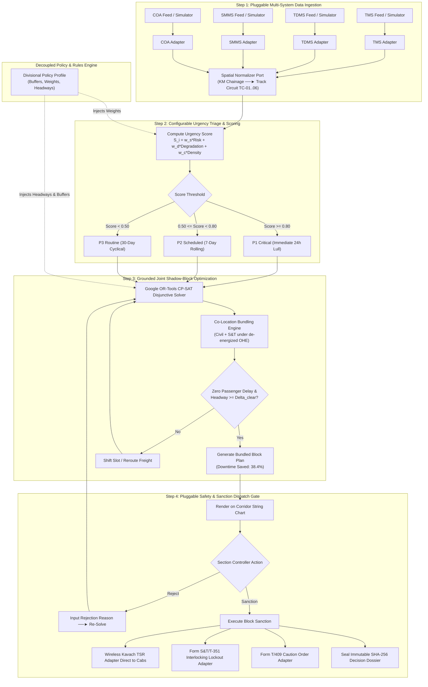
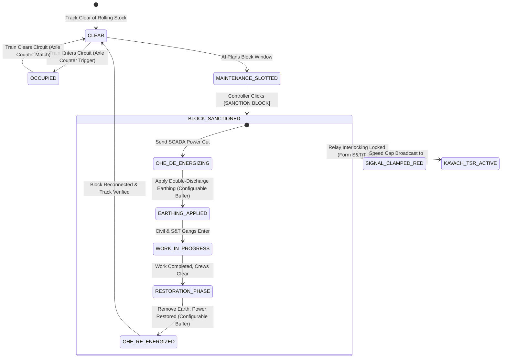
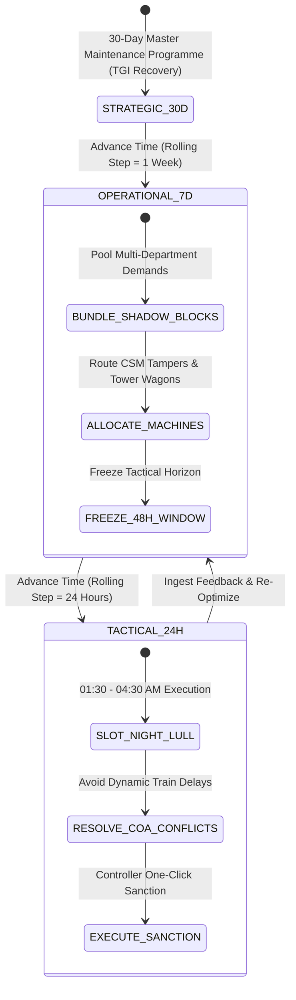

# IRIS AI — Application Flows & State Transition Diagrams

**System Name:** IRIS AI (Intelligent Railway Inspection and Restoration AI): Automatic Block Planning & Corridor Optimization  
**Problem Statement:** SIH 26027 — *"AI-Powered Automatic Block Planning to Maximize Asset Availability for Train Operations on Indian Railways"*  
**Document Version:** 3.1.0 (Grounded Multi-Horizon & Decoupled Architecture Specification)  
**Governing Standards Reference:** IRPWM 2020, ACTM Vol II, IRSEM 2021, G&SR Chapter 15, RDSO/SPN/196/2020 Kavach Ver 4.0.

---

## 🔄 1. Continuous 4-Step Operational Loop Flowchart

---

## 🚦 2. Track Circuit & Interlocking State Machine

---

## 📅 3. Multi-Horizon Rolling State Transition Flow `[Grounded Core]`

