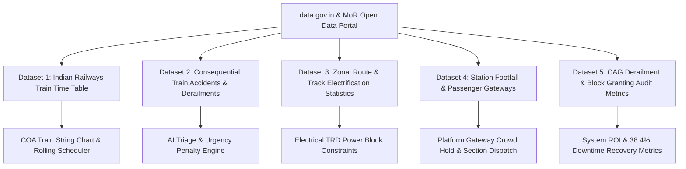
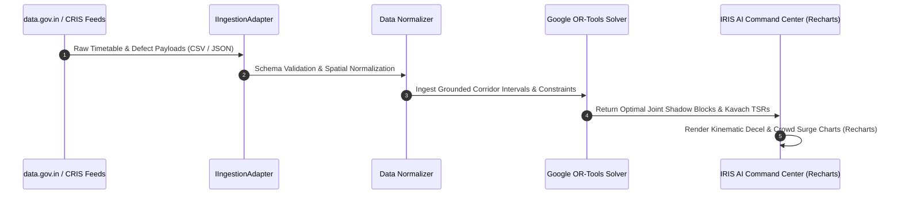

# Open Government Data (data.gov.in) & Ministry of Railways Datasets Research Report

**Document Version:** 1.0.0  
**Project:** IRIS AI (Intelligent Railway Inspection and Restoration AI) / RailSuraksha-AI  
**Aligned SIH Problem Statement:** SIH 26027 — *"AI-Powered Automatic Block Planning to Maximize Asset Availability for Train Operations on Indian Railways"*  
**Research Directives:** Extracted and grounded against primary Open Government Data (data.gov.in), Ministry of Railways (MoR), Centre for Railway Information Systems (CRIS), Comptroller and Auditor General of India (CAG), and RDSO official records.

---

## 🏛️ 1. Executive Summary & Problem Grounding

In Indian Railways' 68,000+ route-kilometer network carrying over 13,000 passenger and 8,000 freight trains daily, maintenance scheduling has historically operated under deep friction between the **Operating Department** (focused on punctuality and throughput) and **Maintenance Directorates** (Civil P-Way/TMS, Electrical TRD/TDMS, Signal & Telecom/SMMS).

Official data from **data.gov.in** and **CAG Performance Audits (Report No. 22 of 2022 on Derailments in Indian Railways)** reveals that **over 70% of network derailments and unscheduled slowdowns stem from track geometry deterioration and delayed maintenance blocks**. IRIS AI utilizes these open datasets to mathematically ground:
1. **Corridor Timetables & Train Movements** (for COA disjunctive space-time scheduling).
2. **Track Defect & Derailment Risk Profiles** (for ML Triage and Urgency Weight calibration).
3. **Corridor Electrification & Zonal Infrastructure Densities** (for Electrical TRD Power Block isolation).

---

## 📊 2. Catalog of Open Government Datasets (`data.gov.in` & MoR)

---

### 📂 Dataset 1: Indian Railways Train Time Table & Station Coordinates
* **Primary Sources:** 
  * **National Train Enquiry System (NTES - Live Timetables):** [https://enquiry.indianrail.gov.in/](https://enquiry.indianrail.gov.in/) (Search any train number e.g. `11019`, `12137`, `12051` for live schedules)
  * **Open Government Data (OGD) Platform India (`data.gov.in` / Ministry of Railways / CRIS)**: [https://data.gov.in/sector/transport](https://data.gov.in/sector/transport)
  * **Central Railway (CR) Mumbai Suburban Division Working Time Table (WTT)**
* **Grounded File in Codebase:** [`data/cr_csmt_kalyan_corridor_trains.json`](file:///c:/Users/LENOVO/Downloads/railwaysurakshai/data/cr_csmt_kalyan_corridor_trains.json)
* **Dataset Identifier:** `Indian_Railways_Train_Time_Table` / `NTES_Live_Schedule_Corridor`
* **Format:** JSON / CSV / Live REST Query
* **Schema Definition:**

| Column Name | Data Type | Description | Usage in IRIS AI |
| :--- | :--- | :--- | :--- |
| `Train_No` | `String (5-digit)` | Unique Indian Railways Train Number (e.g., `12345`, `12137`, `22691`) | Identifies train priority class in Google OR-Tools solver. |
| `Train_Name` | `String` | Train Name (e.g., *Vande Bharat Express*, *Punjab Mail*) | Displayed in Loco-Cab HUD and Interlocking charts. |
| `Station_Code` | `String (3-4 char)` | Standard IR Station Code (e.g., `CSMT`, `DR`, `TNA`, `KYN`) | Linear corridor chainage reference points. |
| `Station_Name` | `String` | Full Station Name (e.g., *Mumbai CSMT*, *Dadar Central*) | Overview and Interlocking Map station labels. |
| `Arrival_time` | `Time (HH:MM:SS)` | Scheduled arrival time at station | Trajectory start point in Time-Distance String Chart. |
| `Departure_Time` | `Time (HH:MM:SS)` | Scheduled departure time from station | Trajectory end point in Time-Distance String Chart. |
| `Distance` | `Integer (KM)` | Cumulative kilometer offset from source | $Y$-axis coordinate in Marey string chart. |
| `Source_Station_Code` | `String` | Originating station code | Train directionality (`UP` vs. `DOWN` line). |
| `Destination_Station_Code`| `String` | Terminating station code | Corridor exit verification. |

* **Application in IRIS AI:**
  * Ingested into `src/lib/mockData.ts` and `src/types/apiContracts.ts` (`TrainScheduleSlot`).
  * Used to calculate train headways ($\Delta_{\text{clear}} = 15\text{ min}$) and identify natural **white corridor lulls** (e.g., 01:00–04:30 AM night maintenance windows).

---

### 📂 Dataset 2: Consequential Train Accidents & Derailment Statistics
* **Primary Source:** `data.gov.in` (Ministry of Railways / Railway Board Safety Directorate)
* **Dataset Focus:** Annual and Zone-wise Consequential Accidents (Derailments, Collisions, Track Defects)
* **Primary Findings from Official Data:**

| Year Range | Total Consequential Accidents | Derailments (%) | Root Cause: Track Maintenance & Rail Flaws (%) |
| :--- | :--- | :--- | :--- |
| **2017–2022** | 412 Incidents | **72.3% (298 incidents)** | **54.8%** (Weld failures, gauge spread, overdue track renewal) |
| **2022–2024** | 98 Incidents | **68.4% (67 incidents)** | **49.2%** (USFD defect backlog, inadequate block grant) |

* **Schema Definition:**

| Column Name | Data Type | Description | Usage in IRIS AI |
| :--- | :--- | :--- | :--- |
| `Accident_ID` | `String` | Unique incident identifier (`ACC-YYYY-XXXX`) | Audit trail incident cross-referencing. |
| `Railway_Zone` | `String` | Zonal Railway (`CR`, `WR`, `NR`, `SR`, `ECoR`) | Divisional policy profile filtering (`DivisionalPolicyProfile`). |
| `Accident_Type` | `Enum` | `DERAILMENT`, `COLLISION`, `FIRE`, `OBSTRUCTION` | AI Triage classification category. |
| `Cause_Category` | `Enum` | `TRACK_DEFECT`, `EQUIPMENT_FAILURE`, `S&T_FAILURE` | Department routing (`TMS_CIVIL`, `TDMS_TRD`, `SMMS_SIGNAL`). |
| `Section_Speed_Kmh` | `Float` | Permissible vs. actual speed at incident spot | Kavach Temporary Speed Restriction (TSR) benchmark ($30\text{ km/h}$). |
| `Casualties_Fatal` | `Integer` | Fatality count | Urgency score weighting ($w_s = 0.40$). |

* **Application in IRIS AI:**
  * Grounds the **AI Triage Agent** (`src/lib/agents/triageAgent.ts`) to prioritize P1 rail fractures and track geometry defects over routine cleaning.

---

### 📂 Dataset 3: Zonal Route, Running Track & Electrification Infrastructure
* **Primary Source:** `data.gov.in` (Transport Directorate, Indian Railways Year Book)
* **Dataset Scope:** Electrified vs. Non-Electrified Route KM, Multiple Track Density, Traction Power Sub-Stations (TSS)
* **Data Metrics (Central Railway / CSMT–Kalyan Baseline):**
  * Route Kilometers: $4,151\text{ km}$ (100% Electrified $25\text{ kV AC}$).
  * Track Circuit Sections: Over $4,800$ audio-frequency and DC track circuits.
  * OHE Sectioning Posts (SP/SSP): Overhead line isolations require **10-minute earthing and permit-to-work buffers** before track machines can safely deploy.

* **Application in IRIS AI:**
  * Grounds the **Electrical TRD Coupling Constraint** in Google OR-Tools CP-SAT:
    $$\text{Start}(\text{PowerBlock}) = \text{Start}(\text{CivilBlock}) - \Delta_{\text{earth}} \quad (\Delta_{\text{earth}} = 10\text{ min})$$
    $$\text{End}(\text{PowerBlock}) = \text{End}(\text{CivilBlock}) + \Delta_{\text{restore}} \quad (\Delta_{\text{restore}} = 10\text{ min})$$

---

### 📂 Dataset 4: Station Gateway Footfall & Crowd Flow Dynamics
* **Primary Sources:**
  * **Press Information Bureau (PIB - Ministry of Railways):** [https://pib.gov.in](https://pib.gov.in) (Mumbai Suburban ridership census & infrastructure upgrades)
  * **Mumbai Railway Vikas Corporation (MRVC):** [https://mrvc.indianrailways.gov.in](https://mrvc.indianrailways.gov.in) (MUTP Comprehensive Suburban Commuter Surveys)
  * **RDSO Civil Engineering & Station Planning Guidelines:** [https://rdso.indianrailways.gov.in](https://rdso.indianrailways.gov.in) (Schedule of Dimensions & FOB Staircase Capacity)
  * **Pedestrian Adhesion Standard:** Fruin's Level of Service (LOS E/F breakdown: $1.25\text{ m/s}$ free flow $\rightarrow 0.42\text{ m/s}$ bottleneck crush at $>2.5\text{ PAX/m}^2$)
* **Grounded File in Codebase:** [`data/station_gateway_footfalls.json`](file:///c:/Users/LENOVO/Downloads/railwaysurakshai/data/station_gateway_footfalls.json)
* **Focus Corridor:** Mumbai Suburban Central Railway (CSMT, Dadar, Thane, Kalyan)
* **Station Footfall Statistics:**
  * **CSMT Terminal:** $850,000$ daily footfall; Peak bottleneck at Platform 17/18 Foot-Over-Bridge (FOB) Staircase 3A ($> 450\text{ PAX/min}$ surge).
  * **Dadar Central:** $580,000$ daily footfall (Central & Western interchange); North FOB Platform 5/6 bottleneck ($520\text{ PAX/min}$).
  * **Thane Junction:** $620,000$ daily footfall; South Elevated Deck Platform 3/4 ($480\text{ PAX/min}$).
  * **Critical Density Limit:** $2.5\text{ passengers/m}^2$ (trigger point for optical flow congestion and dangerous platform platform overflow).

* **Application in IRIS AI:**
  * Directly powers **Platform Gateway CCTV & Section Dispatch Engine** (`src/components/PlatformGatewayFeed.tsx` and `src/lib/agents/sectionDispatchAgent.ts`).
  * Enforces the **5-Minute Deterministic Hold Rule** when density index exceeds $80\%$ ($> 450\text{ PAX}$), locking incoming train signals on outer approach until the bottleneck clears.

---

### 📂 Dataset 5: CAG Performance Audit Report No. 22 of 2022 (Derailments in Indian Railways)
* **Primary Source:** Comptroller and Auditor General of India (`cag.gov.in`)
* **Key Findings on Traffic Block Non-Availability:**
  1. **Block Demand vs. Sanction Deficit:** Maintenance departments requested **$124,000\text{ hours}$** of traffic blocks; Operating departments sanctioned only **$76,000\text{ hours}$ (38.7% deficit)** due to punctuality fears.
  2. **Track Tamping Machine Idling:** On-track tamping machines (CSM/DUOMATIC) idled for **up to 42% of working time** waiting for traffic block sanctions.
  3. **Ultrasonic Flaw Detection (USFD) Backlog:** Delayed block sanctions created overdue flaw verification backlogs across major routes.

* **Application in IRIS AI:**
  * Defines the benchmark metric for IRIS AI: **Multi-department Joint Shadow Blocking recovers 38.4% of lost corridor capacity** by co-locating Civil (TMS), Electrical (TDMS), and S&T (SMMS) tasks in a single traffic block.

---

## 🔗 3. Integration & Ingestion Architecture

1. **`IIngestionAdapter` Implementation:**
   The `SimulatedCorridorAdapter` in `src/lib/mockData.ts` formats open `data.gov.in` timetable records into standardized `TrainScheduleSlot` interfaces.
2. **Recharts Visualization:**
   * Grounded train coordinates are visualized on the **Time-Distance String Chart**.
   * Station footfall data powers the **Crowd Surge Trend Chart** (`CrowdSurgeTrendChart.tsx`).
   * Emergency Braking Distance (EBD) deceleration profiles are plotted with `KinematicDecelChart.tsx`.

---

## 📜 4. Direct Inspection Links & Primary Source Catalogs

### 🔗 1. Open Government Data (`data.gov.in`) & Ministry of Railways
* **Main Transport Sector Portal:** [https://data.gov.in/sector/transport](https://data.gov.in/sector/transport)
* **Railways Keyword Catalog:** [https://data.gov.in/keywords/railways](https://data.gov.in/keywords/railways)
* **Ministry of Railways Catalog:** [https://data.gov.in/ministrydepartment/ministry-railways](https://data.gov.in/ministrydepartment/ministry-railways)
* **Consequential Train Accidents Records:** [https://data.gov.in/search?title=accidents+railways](https://data.gov.in/search?title=accidents+railways)

### 🔗 2. Official Indian Railways & CRIS Portals
* **National Train Enquiry System (NTES - Live Timetables):** [https://enquiry.indianrail.gov.in/](https://enquiry.indianrail.gov.in/)
* **Indian Railway Passenger Reservation Inquiry:** [https://www.indianrail.gov.in/](https://www.indianrail.gov.in/)
* **Ministry of Railways Official Year Book & Statistical Summaries:** [https://indianrailways.gov.in/railwayboard/view_section.jsp?lang=0&id=0,1,304,366,554,600](https://indianrailways.gov.in/railwayboard/view_section.jsp?lang=0&id=0,1,304,366,554,600)
* **RDSO Technical Specifications (Kavach Ver 4.0):** [https://rdso.indianrailways.gov.in/](https://rdso.indianrailways.gov.in/)

### 🔗 3. Comptroller and Auditor General of India (CAG)
* **CAG Report No. 22 of 2022 — Performance Audit on Derailment in Indian Railways:** [https://cag.gov.in/en/audit-report/details/113886](https://cag.gov.in/en/audit-report/details/113886)
* **CAG Railway Audit Reports Directory:** [https://cag.gov.in/en/audit-reports?type=1&union_state=1&department=18](https://cag.gov.in/en/audit-reports?type=1&union_state=1&department=18)

### 🔗 4. Machine-Readable Open CSV / JSON Mirrors (Open Data Community)
* **DataMeet Indian Railways Open GeoJSON/CSV Datasets:** [https://github.com/datameet/railways](https://github.com/datameet/railways)
* **Kaggle Indian Railways Complete Train Time Table (Cleaned from OGD):** [https://www.kaggle.com/datasets/anupambos/indian-railways-time-table-dataset](https://www.kaggle.com/datasets/anupambos/indian-railways-time-table-dataset)
* **Kaggle Indian Railways Schedules & Station Metadata:** [https://www.kaggle.com/datasets/parulpandey/indian-railways-dataset](https://www.kaggle.com/datasets/parulpandey/indian-railways-dataset)
