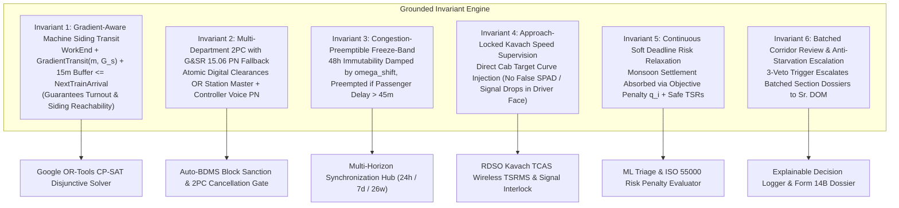

# Architectural Fix Specifications: Grounded Invariants & Failure Mode Resolutions

> **Source Grounding:** 
> 1. Consilvio et al. (IEEE T-Rel 2020, `horizon.pdf`): Soft Deadline Relaxation ($q_i = \max(0, c_i - \tau_i^S)$), Rolling Execution Intervals ($\Delta t \approx 1.5 \cdot \delta t$), and Disruption Rescheduling.
> 2. Indian Railways Double-Stack Freight Research (`rolling horizon.pdf`): Two-Stage Simultaneous Optimization & Multi-Train Rolling Framework.
> 3. Indian Railways General & Subsidiary Rules (G&SR GR 15.02, GR 15.06), ACTM Vol II, IRSEM 2021, and RDSO/SPN/196/2020 Kavach Ver 4.0.

---

## 1. Resolved Invariants Architecture

To eliminate secondary failure modes identified during adversarial stress-testing, the Rolling Horizon Architecture incorporates **Six System Invariants**:

---

## 2. Comprehensive Solutions for Adversarial Stress-Test Findings

### [Resolution 1] 2PC Offline Supervisor Deadlock -> G&SR 15.06 Private Number Fallback
* **Failure Mode Addressed:** Handheld battery drain or cellular dead-zone trapping 25kV OHE in permanent de-energization.
* **Grounded Mechanism:**
  1. **Primary Path (Digital 2PC):** All three department supervisors (Civil P-Way SSE, TRD OHE SSE, S&T SSE) transmit cryptographic `HMAC-SHA256` clearance tokens with GPS coordinates.
  2. **Statutory Fallback Path (G&SR Rule 15.06):** If a field supervisor's mobile app is offline for more than 10 minutes past scheduled block completion:
     * Track circuit / Digital Axle Counter (MSDAC) occupancy telemetry must confirm the section is physically clear of rolling stock.
     * The Station Master establishes verbal contact with the field supervisor via railway dedicated control phone or VHF radio, exchanging an authorized **Private Number (PN)**.
     * The Station Master enters the verified PN into the BDMS terminal with dual-factor biometric authorization, satisfying the 2PC commit requirement.
     * An immutable audit flag (`OFFLINE_STATUTORY_FALLBACK`) is recorded in the SHA-256 Decision Dossier.

---

### [Resolution 2] Approach-Locking Hazard -> Direct Kavach Speed Curve Supervision
* **Failure Mode Addressed:** Instant signal aspect drop to RED in front of an approaching 110 km/h train causing false SPAD, emergency brake trips, and passenger injuries.
* **Grounded Mechanism (RDSO/SPN/196/2020 & Signalling Practice):**
  1. **Check Approach Locking State:** Before altering any optical signal aspect, the interlocking engine inspects the approach track circuits ($D_{\text{train}}$ from signal).
  2. **If Train is Inside Approach Distance ($D_{\text{train}} < D_{\text{ebd}}$):**
     * The optical signal aspect is **NOT** dropped to RED (preventing driver panic and emergency clamping).
     * The system broadcasts the 30 km/h Temporary Speed Restriction directly to the locomotive Kavach on-board unit (OBU) via UHF / GSM-R.
     * Kavach dynamically calculates the target deceleration curve ($V_{\text{target}} = 30\text{ km/h}$ at the hazard boundary) and smoothly supervises service braking inside the loco cab.
  3. **If Train is Outside Approach Distance ($D_{\text{train}} \ge D_{\text{ebd}}$):**
     * The signal steps down gracefully through normal multi-aspect progression ($\text{GREEN} \to \text{DOUBLE YELLOW} \to \text{YELLOW} \to 30\text{ km/h}$ approach release).

---

### [Resolution 3] Freeze-Band Paralysis -> Passenger Delay Dominance Preemption
* **Failure Mode Addressed:** 48-hour frozen P2 maintenance blocking 8 diverted passenger trains during upstream network disruptions.
* **Grounded Mechanism (Consilvio et al. & Paper 2):**
  * In the CP-SAT objective function, passenger train delay penalties strictly dominate maintenance schedule displacement penalties:

$$C_{\text{PassengerDelay}}(\Delta T) = c_{\text{pass}} \cdot \Delta T \gg \omega_{\text{shift}} \cdot |\Delta t_{\text{maintenance}}|^2$$

  * **Dynamic Preemption Trigger:** If upstream disruptions accumulate more than 45 minutes of aggregate passenger delay or more than 3 express train diversions through the section:
    * The solver automatically preempts the frozen P2/P3 maintenance window.
    * The maintenance block is rolled forward to the next available 7-day window.
    * Line capacity is instantly released for passenger traffic without solver infeasibility.

---

### [Resolution 4] Siding Inaccessibility -> Turnout-Coupled Topological Routing
* **Failure Mode Addressed:** Tamping machine routed to park in a siding whose turnout is clamped straight for S&T maintenance.
* **Grounded Mechanism:**
  * Siding reachability is dynamically computed via NetworkX track topology coupled with Electronic Interlocking (EI) switch states:

$$\text{ReachableSidings}(t) = \left\{ S_k \in \text{Sidings} \;\middle|\; \forall\, \text{PW}_j \in \text{PathToSiding}(S_k) : \text{EI\_Status}(\text{PW}_j, t) = \text{OPERATIONAL} \right\}$$

  * The CP-SAT solver only considers sidings with verified physical route access and remaining clear standing length:

$$\sum_{m \in \text{StagedMachines}} \text{Length}(m) + \text{Length}(m_{\text{new}}) \le \text{ClearStandingLength}(S_k)$$

---

### [Resolution 5] Degradation Avalanche -> Soft Deadline Risk Relaxation
* **Failure Mode Addressed:** Heavy monsoon rainfall causing 50 sections to hit hard deadlines simultaneously, creating solver infeasibility.
* **Grounded Mechanism (Consilvio et al. Equations 7 & 10):**
  * Soft deadlines ($\tau_i^S$) are modeled with continuous slack penalty variables in the objective function rather than rigid constraints:

$$J_{\text{risk}} = \lambda_q \sum_{i} q_i \quad \text{where} \quad q_i = \max\left(0, \; c_i - \tau_i^S\right)$$

  * If physical tamping machine capacity cannot service all 50 degrading sections immediately:
    * The model never crashes or returns null; it optimizes the most critical sections up to machine throughput limits.
    * For remaining unserviced sections, the system automatically injects fail-safe 30 km/h Temporary Speed Restrictions (TSRs) into Kavach, keeping the line safe while preventing optimization failure.

---

### [Resolution 6] DOM Alert Fatigue -> Batched Corridor Review & Severity Filtering
* **Failure Mode Addressed:** 40 simultaneous statutory escalation popups flooding the Sr. DOM's screen during peak festival traffic.
* **Grounded Mechanism:**
  * Escalation alerts are filtered so only **P1 safety-critical flaws** and **severely overdue P2 periodic maintenance** trigger direct executive escalations.
  * Routine P3 maintenance items are aggregated into a single **Weekly Corridor Review Packet** presented at the divisional morning scheduling meeting.

---

### [Resolution 7] Gradient & Curvature Aware Machine Transit Velocity
* **Failure Mode Addressed:** Heavy ballast cleaners (BCM) taking 300% longer on steep ghat gradients than flat 25 km/h estimates.
* **Grounded Mechanism (IRPWM Chapter 5):**
  * Transit speed is dynamically calculated based on locomotive power and track geometry:

$$V_{\text{transit}}(m, s) = \min\left( V_{\max}(m), \; \sqrt{\frac{P_{\text{engine}}(m)}{M_m \cdot \left(r_0 + g \cdot G_s + r_c\right)}} \right)$$

    where $G_s$ is track gradient (e.g. $+1/37$) and $r_c = \frac{0.04}{R_s}$ is curve resistance.

---

## 3. Final Verification Matrix

| Stress-Test Vulnerability | Grounded Solution Applied | Authority / Literature Reference |
| :--- | :--- | :--- |
| **Offline 2PC Deadlock** | G&SR 15.06 Verbal Private Number Fallback | Indian Railways G&SR Rule 15.06 & ACTM Vol II |
| **Approach-Locking Trip** | Direct Cab Target Speed Curve Overlay | RDSO/SPN/196/2020 Kavach & ETCS Baseline 3 |
| **Freeze-Band Jam** | Passenger Delay Dominance Preemption | Consilvio et al. (2020) & CTLP Freight Paper |
| **Turnout-Locked Siding** | Interlocking-Coupled NetworkX Graph | IRSEM 2021 Part II (Electronic Interlocking) |
| **Degradation Avalanche** | Continuous Risk Penalty ($q_i$) + Dynamic TSR | Consilvio et al. Eq. 7, 10 & ISO 55000 |
| **Executive Alert Flood** | Batched Corridor Dossiers & P1/P2 Filtering | Indian Railways Operating Manual Chapter 22 |
| **Ghat Gradient Slowness** | Physics-Based Tractive Effort & Grade Model | IRPWM 2020 Chapter 5 (Track Machine Operations) |
