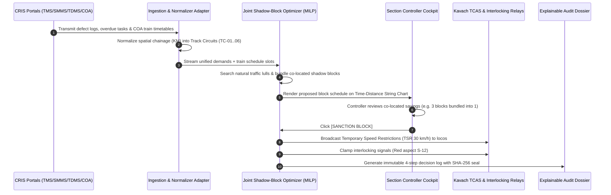

# RailSuraksha AI — Architecture & Technical Walkthrough

> **System Name:** RailSuraksha AI (Auto-BDMS): Automatic Block Planning & Corridor Optimization  
> **Problem Statement:** SIH 26027 — *"AI-Powered Automatic Block Planning to Maximize Asset Availability for Train Operations on Indian Railways"*  
> **Document Version:** 2.0.0 (SIH 26027 Refactored Architecture)  
> **Target Framework:** Next.js 16 (App Router), React 19, TypeScript, Tailwind CSS v4, FastAPI / Python MILP (OR-Tools)

---

## 🏗️ 1. High-Level System Architecture

RailSuraksha AI utilizes an **Event-Driven Service-Oriented Architecture** connected to an **Optimization Core** and **Real-Time Controller Cockpit**:

```text
┌──────────────────────────────────────────────────────────────────────────────────────────────────┐
│                                   CLIENT LAYER (NEXT.JS 16 / REACT 19)                           │
│  ┌────────────────────────────────────────────────────────────────────────────────────────────┐  │
│  │ Mintlify Light-Blue Design System (#F0F6FC Base, #FFFFFF Cards, #2B7FFF Accent, 4px Radii)│  │
│  │                                                                                            │  │
│  │  • TAB 1: Automatic Corridor Block Planner (Time-Distance String Chart / Gantt Visualizer) │  │
│  │  • TAB 2: Section Interlocking & Circuit Map (Circuits TC-01..06, Signals S-12..16)         │  │
│  │  • TAB 3: Vision Defect Feeds (TMS Track Cam, TDMS Pantograph Cam, SMMS Axle Cam)         │  │
│  │  • TAB 4: Auditor Workspace & BDMS Decision Dossier (4-Step Timeline & RDSO Form 14B)      │  │
│  └──────────────────────────────────────────────┬─────────────────────────────────────────────┘  │
└─────────────────────────────────────────────────┼────────────────────────────────────────────────┘
                                                  │ REST / SSE / WebSockets
┌─────────────────────────────────────────────────▼────────────────────────────────────────────────┐
│                                   BACKEND APPLICATION SERVICES (FASTAPI)                         │
│  ┌──────────────────────────┐   ┌───────────────────────────┐   ┌─────────────────────────────┐  │
│  │ API Gateway & Router     │   │ Real-Time WebSocket Hub   │   │ e-BDMS Sanction Coordinator │  │
│  │ (Demands / Timetables)   │   │ (Train Pos / TSR Stream)  │   │ (Advisory vs Autonomous)    │  │
│  └────────────┬─────────────┘   └─────────────┬─────────────┘   └──────────────┬──────────────┘  │
└───────────────┼───────────────────────────────┼────────────────────────────────┼─────────────────┘
                │                               │                                │
┌───────────────▼───────────────────────────────▼────────────────────────────────▼─────────────────┐
│                           AI & MATHEMATICAL OPTIMIZATION CORE                                     │
│  ┌─────────────────────────────────────────────────────────────────────────────────────────────┐  │
│  │ 1. MULTI-SOURCE INGESTION ADAPTER (TMS Flaws, SMMS Signals, TDMS OHE, COA Timetables)       │  │
│  ├─────────────────────────────────────────────────────────────────────────────────────────────┤  │
│  │ 2. ML URGENCY TRIAGE CLASSIFIER (Dynamic Priority Scoring: P1 Critical / P2 / P3)           │  │
│  ├─────────────────────────────────────────────────────────────────────────────────────────────┤  │
│  │ 3. JOINT SHADOW-BLOCK OPTIMIZER (Google OR-Tools MILP Solver & Co-Location Clustering)      │  │
│  ├─────────────────────────────────────────────────────────────────────────────────────────────┤  │
│  │ 4. KAVACH TSR GENERATOR & AUDIT LOGGER (RDSO Chapter 15 Speed Limits & SHA-256 Dossier)     │  │
│  └────────────────────────────────────────────┬────────────────────────────────────────────────┘  │
└───────────────────────────────────────────────┼───────────────────────────────────────────────────┘
                                                │
┌───────────────────────────────────────────────▼───────────────────────────────────────────────────┐
│                                  RAILWAY FIELD & INTERLOCKING LAYER                               │
│  ┌──────────────────────────┐   ┌───────────────────────────┐   ┌─────────────────────────────┐  │
│  │ Kavach Loco TCAS Units   │   │ Electronic Interlocking   │   │ Trackside Balises & Relays  │  │
│  │ (Digital TSR Broadcast)  │   │ (Signal S-12/14 Clamping) │   │ (Circuits TC-01 to TC-06)   │  │
│  └──────────────────────────┘   └───────────────────────────┘   └─────────────────────────────┘  │
└───────────────────────────────────────────────────────────────────────────────────────────────────┘
```

---

## 🔄 2. End-to-End Data Flow & Optimization Pipeline

The complete lifecycle of a corridor block plan follows a 5-stage sequential pipeline:



---

## 💻 3. Frontend Architecture (Next.js 16 + React 19)

### 3.1 Design System Tokens & Mintlify Discipline
The frontend adheres to the **Light-Blue Mintlify Theme**:
* **Surface 0 (Canvas Base):** `#F0F6FC` (atmospheric soft ice-blue canvas)
* **Surface 1 (Cards/Panels):** `#FFFFFF` with 1px border `#D0DFEE`
* **Surface 2 (Elevated Tabs/Inputs):** `#E6F0FA`
* **Primary Accent:** `#2B7FFF` (Signal Blue)
* **Atmospheric Accent:** `#426188` (Twilight Blue)
* **Typography Primary:** `#0F172A` (Ink Slate)
* **Geometry:** `4px` button/input radius, `16px` card radius, `24px` container radius (**Strictly ZERO pill buttons**).
* **Font Family:** `Inter` for UI typography paired with `JetBrains Mono` for tabular monospaced numbers (KM markers, signal IDs, timestamps, and speeds).

### 3.2 Key UI Components

1. **Corridor Time-Distance String Chart (`CorridorStringChart.tsx`):**
   * High-performance SVG visualization rendering train time-distance trajectories (slanted paths) alongside scheduled maintenance block windows (colored shaded boxes).
   * Displays natural white corridors and highlights multi-department co-location savings.
2. **Department Demand Triage Queue (`IncidentQueue.tsx`):**
   * Filterable list of pending work orders across Civil (TMS), Electrical (TDMS), and Signal (SMMS).
   * Displays urgency badges (P1 Critical, P2 Scheduled, P3 Routine), estimated duration, required machine assets (CSM Tamper, Tower Wagon), and joint bundling suggestions.
3. **KPI Strip (`KpiStrip.tsx`):**
   * 6 real-time operational cards:
     * **Corridor Downtime Saved:** `38.4%` (via shadow blocking).
     * **Track Availability Index:** `96.2%`.
     * **Active Corridor Blocks:** `03 Active`.
     * **Pending Demands:** `08 In Queue`.
     * **White Corridor Gap:** `3h 15m`.
     * **Active Kavach TSRs:** `02 Enforced`.
4. **Track Interlocking & Circuit Map (`InterlockingMap.tsx`):**
   * Top-down circuit view (`TC-01` to `TC-06`) showing live train occupancy, signal aspects (`S-12`, `S-14`, `S-16`), turnout positions (`SW-04`), and maintenance block lockout boundaries.
5. **Decision Dossier Drawer Modal (`DecisionLogModal.tsx`):**
   * Chronological 4-step explainable record justifying why a block was sanctioned at a specific time:
     1. *Ingestion:* Aggregated 3 TMS defects, 1 TDMS power cut, and COA timetables.
     2. *Conflict Analysis:* Avoided 14:00 peak freight corridor.
     3. *Shadow Optimization:* Slotted into 02:15 AM lull, bundling catenary wash with track tamping.
     4. *Safety & Output:* Zero passenger delays, 85 mins saved, Kavach TSR 30 km/h broadcast.

---

## 🧮 4. Mathematical Optimization Formulation (MILP)

The core optimization engine is formulated as a **Mixed-Integer Linear Program (MILP)** solved via Google OR-Tools:

### 4.1 Decision Variables
* $x_{i,t} \in \{0, 1\}$: Binary variable indicating if maintenance demand $i$ is executed starting at time slot $t$.
* $y_{s,t} \in \{0, 1\}$: Binary variable indicating if track section $s$ is blocked at time $t$.
* $d_j \ge 0$: Continuous variable representing the delay incurred by train $j$.

### 4.2 Objective Function
$$\min \quad \sum_{s,t} C_{\text{block}} \cdot y_{s,t} + \sum_j C_{\text{delay}, j} \cdot d_j + \sum_i P_{\text{defer}, i} \cdot (1 - \sum_t x_{i,t})$$
Where:
* $C_{\text{block}}$ is the hourly cost of corridor track closure.
* $C_{\text{delay}, j}$ is the penalty cost per minute of delay for train $j$ (higher penalty for passenger vs freight).
* $P_{\text{defer}, i}$ is the penalty for deferring maintenance task $i$ past its deadline.

### 4.3 Key Constraints
1. **Multi-Department Shadow Co-Location:** If demand $i_1$ (TDMS) and demand $i_2$ (TMS) share section $s$, they share the same track closure variable:
   $$x_{i_1, t} \le y_{s, t} \quad \text{and} \quad x_{i_2, t} \le y_{s, t}$$
2. **Headway Separation:** Minimum safety buffer $H_{\text{min}} = 15\text{ min}$ between the last cleared train and block start.
3. **Zero Passenger Delay:** For all scheduled passenger trains $j \in \mathcal{P}$:
   $$d_j = 0$$

---

## 🛡️ 5. RDSO Safety & Kavach Integration

* **Kavach TCAS Dissemination:** Conforms to RDSO Specification `RDSO/SPN/196/2020`. Once a block is sanctioned, temporary speed restrictions (TSR) are wirelessly injected into locomotive cab onboard units.
* **Interlocking Integrity:** Electronic interlocking routes over the maintenance block section are clamped to prevent accidental green aspect clearing.
* **Compliance Archival:** Every sanctioned block generates an immutable SHA-256 signed audit dossier ready for RDSO Section 14B inspections.
