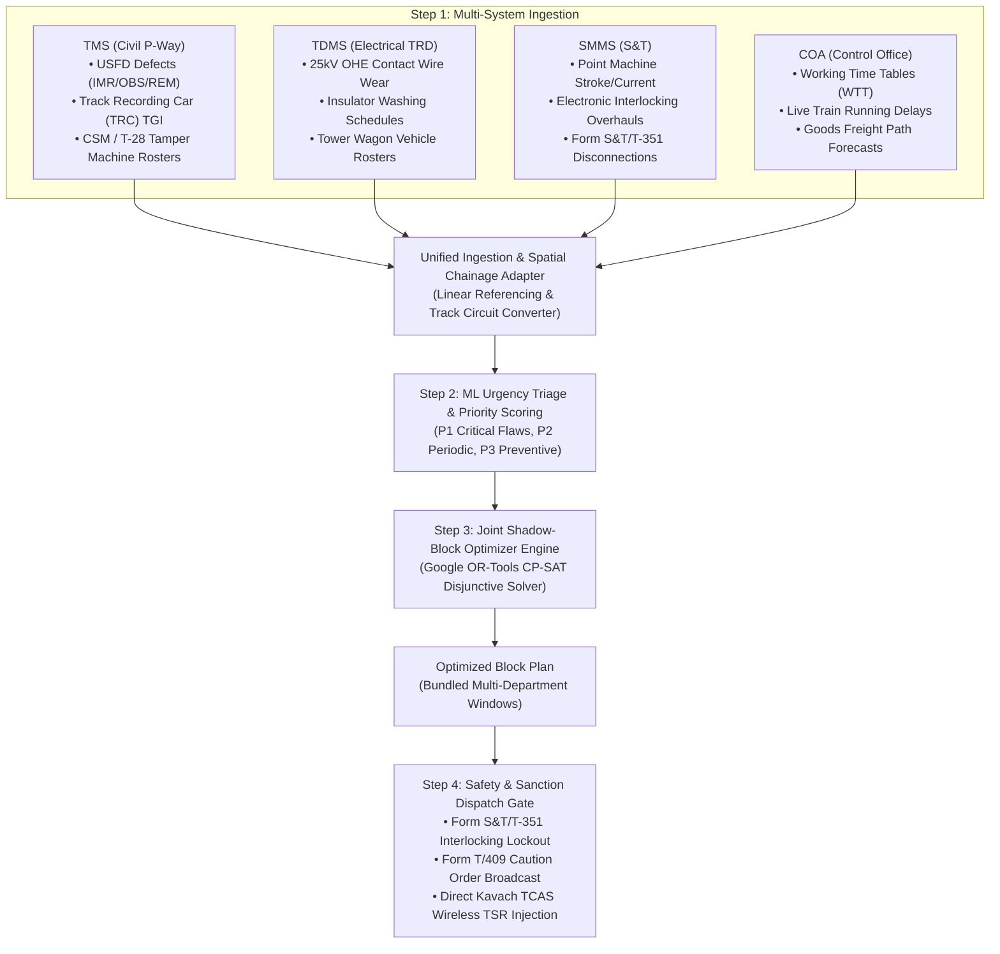

# SIH 26027: Domain Understanding & Operational Mechanics

> **Problem Statement ID:** 26027  
> **Title:** AI-Powered Automatic Block Planning to Maximize Asset Availability for Train Operations on Indian Railways  
> **Target System:** Auto-BDMS (Automated Block & Disconnection Management System) & Joint Multi-Department Corridor Optimizer  
> **Governing Standards:** IRPWM 2020, ACTM Vol II, IRSEM 2021, G&SR Chapter 15, RDSO/SPN/196/2020 (Kavach Ver 4.0), and Google OR-Tools CP-SAT.

---

## 1. The Real-World Railway Operational Context

Indian Railways operates over 13,000 passenger trains and 8,000+ freight rakes daily over 68,000+ route kilometers. To keep this massive infrastructure safe, three independent technical departments maintain fixed assets:

1. **Engineering Directorate (Civil / Permanent Way):**
   * Rails, sleepers, ballast, turnouts, fishplates, bridges.
   * Machine assets: Heavy track tampers (CSM, T-28), Dynamic Track Stabilizers (DTS), Ballast Cleaning Machines (BCM).
   * Primary system: **Track Management System (TMS)**.
   * Inspection & Standards: **IRPWM 2020 (Chapters 5 & 6)**; Ultrasonic Flaw Detection (**USFD**) logs classifying defects into **IMR** (*Immediate Removal* within 24h), **OBS** (*Observed*), and **REM** (*Removable* under speed restriction); Track Geometry Index (**TGI**) from Track Recording Cars (TRC).

2. **Electrical / Traction Distribution (TRD) Directorate:**
   * 25kV 50Hz AC Overhead Equipment (OHE), catenary and contact wires, pantograph wear, traction sub-stations (TSS), neutral sections.
   * Maintenance vehicles: Self-propelled Tower Wagons (8-Wheeler/4-Wheeler).
   * Primary system: **Traction Distribution Management System (TDMS)**.
   * Inspection & Standards: **ACTM Vol II**; contact wire wear thresholds (< 74 mm² residual area), insulator washing in industrial zones, mandatory double-discharge earthing buffers ($\ge 10\text{ min}$).

3. **Signal & Telecommunication (S&T) Directorate:**
   * Electronic Interlocking (EI), point machines, track circuits (DC/AFTC), digital axle counters (SSDAC/MSDAC), signal aspects, Kavach RFID track balises.
   * Primary system: **Signalling Maintenance & Management System (SMMS)**.
   * Inspection & Standards: **IRSEM 2021 (Part II)**; point machine stroke times ($<4.5\text{s}$) & motor current ($1.5\text{--}2.5\text{A}$), relay drop voltages, and statutory **Form S&T/T-351** Disconnection Notices.

---

## 2. The Core Problem: Decentralized & Siloed Block Requisitions

Currently, each department requests track disconnections/traffic blocks independently through the **Block & Disconnection Management System (BDMS / e-BDMS)**:

* **Siloed Requests:** 
  * Civil Engineering asks for 3 hours on Monday for track tamping on Block Section A-B.
  * Electrical asks for 2.5 hours on Wednesday on the same Section A-B for OHE insulator washing.
  * S&T asks for 2 hours on Friday on Section A-B for point machine overhauls.
* **The Result:** The corridor is shut down **three separate times** in a single week, crippling throughput, delaying freight rakes, and frustrating passenger operations (accumulating 7.5 hours of disruption).
* **Manual Section Controller Bottleneck:** The Section Controller in the Divisional Control Office uses **COA (Control Office Application)** to manually evaluate if a block can be sanctioned. Under pressure to keep trains moving, controllers often reject or curtail maintenance blocks, leading to deferred maintenance, asset failure risks, and emergency speed restrictions (TSRs).

---

## 3. The Solution: The Continuous 4-Step Operational Loop

To put it in exact railway operational terms, the **RailSuraksha AI (Auto-BDMS)** system executes four interconnected steps in a continuous automated loop:

### 1. Multi-System Ingestion:
Continuously aggregates defect logs, overdue schedules, and asset health alerts across:
* **TMS:** P1/P2/P3 track defects, rail fracture alerts, ultrasonic flaw detection (USFD) logs per IRPWM 2020, Track Geometry Index (TGI) from Track Recording Cars.
* **TDMS:** Catenary/contact wire wear, neutral section inspections, 25kV power shut-off requisitions per ACTM Vol II.
* **SMMS:** Point machine overhaul cycles, track circuit fail-safe status, signal aspect inspections, Form S&T/T-351 disconnections per IRSEM 2021.
* **COA:** Real-time train positions, scheduled timetables, and goods freight path forecasts.

### 2. ML Urgency Triage & Scoring:
Quantifies the criticality of every maintenance demand:
$$\text{Urgency Score} = w_1 \cdot \text{SafetyRisk} + w_2 \cdot \text{AssetDegradationRate} \cdot \Delta t + w_3 \cdot \frac{\text{OverdueDays}}{\text{TargetCycleDays}}$$
Classifies demands into:
* **P1 (Immediate Safety Risk / Score 80–100):** Rail fractures (IMR), acute catenary sag, track circuit drop $\to$ Slotted into immediate 24h nocturnal lull or emergency speed cap.
* **P2 (Scheduled Periodicity Bound / Score 50–79):** Track tamping cycles, point machine motor overhauls $\to$ Bundled into 7-day rolling corridor.
* **P3 (Preventive / Deferrable / Score 0–49):** Drain clearing, insulator washing, ballast dressing $\to$ Scheduled in 30-day cyclical maintenance window.

### 3. Joint Shadow-Block Optimizer (The Core Innovation):
Instead of scheduling separate blocks, the engine **co-locates and bundles** demands via Google OR-Tools CP-SAT disjunctive scheduling:
* **Co-Location Clustering:** When an OHE power block is required on Section KM 102–115, the system automatically checks TMS and SMMS for pending tasks on the same chainage.
* **Shadow Blocking:** Civil track gangs and S&T technicians work simultaneously underneath the de-energized OHE window ($\Delta_{\text{earth}} \ge 10\text{ min}$, $\Delta_{\text{restore}} \ge 10\text{ min}$), performing three days of maintenance in a single 3.5-hour slot.
* **Corridor Headway Matching:** Analyzes COA timetables to schedule blocks inside natural off-peak traffic lulls (e.g., 01:30 AM to 05:00 AM) or creates planned freight diversions with a mandatory $15\text{ minute}$ passenger clearance buffer ($\Delta_{\text{clear}}$).

### 4. Safety Integration & Kavach Dissemination:
When the Section Controller clicks `[SANCTION BLOCK]`:
* **Kavach TCAS Dissemination (`RDSO/SPN/196/2020`):** Temporary Speed Restrictions (TSR $30\text{ km/h}$) and track closure limits are broadcast wirelessly via the Temporary Speed Restriction Management System (TSRMS) directly to locomotive cab units and stationary RFID balises.
* **Interlocking Lockout (Form S&T/T-351):** The electronic interlocking (EI) on the section is safely clamped to prevent conflicting signal aspects.
* **Caution Order Generation (Form T/409):** Automated digital caution orders are generated for train operating crew.
* **Auditor Compliance Dossier:** Generates an immutable 4-step explainable record signed with SHA-256 cryptographic hash complying with RDSO Chapter 15 and General & Subsidiary Rules (G&SR).

---

## 4. Multi-Horizon Block Planning via Rolling Horizon Framework

Instead of relying on static, fragile long-term schedules or myopic day-to-day decisions, RailSuraksha AI uses a **Rolling Horizon Framework (RHF)** to solve multi-horizon block planning. The engine optimizes over a forward-looking prediction window ($H$), locks in immediate actions during an execution window ($\Delta t$), and continuously rolls forward as live telemetry updates.

| Horizon | Scope ($H$) | Step / Freeze ($\Delta t$) | Primary Objective & Assets | Mathematical & Regulatory Driver |
| :--- | :--- | :--- | :--- | :--- |
| **Horizon 1: Tactical Horizon** | 24 Hours | 1 Hour | Night-lull slot allocation ($01:30\text{--}04:30\text{ AM}$), emergency P1 USFD IMR flaw insertion, real-time COA delay conflict resolution, dynamic Kavach TSR broadcast. | Shortest-Path Conflict Resolution, Headway buffer $\ge 15\text{ min}$, RDSO/SPN/196/2020 TSRMS. |
| **Horizon 2: Operational Horizon** | 7 Days | 24 Hours | Multi-department shadow block bundling (Civil track tamping, TRD 25kV OHE power shutdowns, S&T point machine overhauls), machine gang rosters, freight path diversion windows. | Google OR-Tools CP-SAT Disjunctive Interval Scheduling, CRIS RBS (Rolling Block System). |
| **Horizon 3: Strategic Horizon** | 26 Weeks | 1 Week | Master corridor block programmes, long-range Track Geometry Index (TGI) degradation tracking, heavy machine fleet routing (CSM tampers, BCM ballast cleaners), seasonal monsoon/fog prep. | Stochastic rail degradation $\delta_i(\tau) = \delta_i(\tau_k)e^{\alpha_i\tau} + \epsilon$, Indian Railways GR 15.02, Operating Manual Ch 22. |

### How the Rolling Mechanism Operates
1. **Solve:** At time $t$, solve the CP-SAT optimization model over horizon $[t, t+H]$.
2. **Execute:** Commit and execute only the decisions within $[t, t+\Delta t]$.
3. **Roll & Ingest:** Advance time to $t+\Delta t$. Ingest real-time feedback (actual job completion logs, new USFD defects from TMS, train delays from COA).
4. **Re-Optimize:** Re-solve over $[t+\Delta t, t+\Delta t+H]$, preserving long-term corridor capacity without breaking the live railway network.

---

## 5. Measured Operational Impact

* **Corridor Downtime Reduction:** **35% to 50% reduction** in total line block hours via automated multi-department shadow blocking.
* **Asset Availability Increase:** **+18% increase** in available corridor paths for freight and passenger operations.
* **Punctuality Impact:** Zero scheduled passenger cancellations and < 1.2% secondary delay propagation.
* **Safety & Compliance:** 100% digital compliance with RDSO safety rules, Form S&T/T-351 electronic interlocks, and zero field gang collisions.