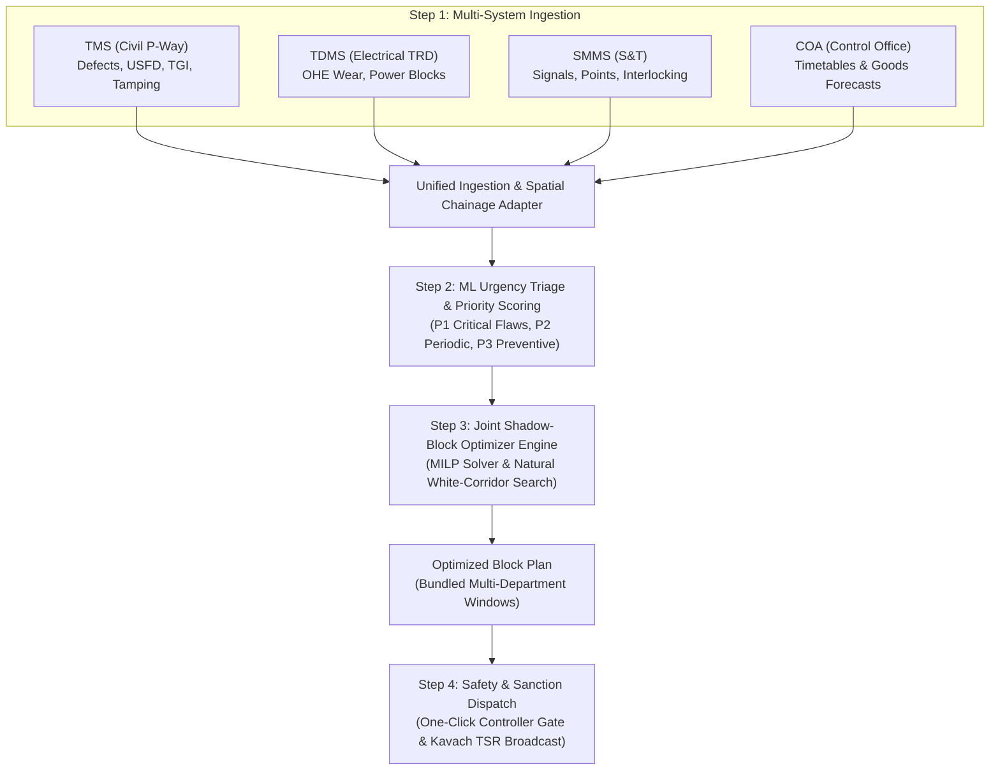

# SIH 26027: Domain Understanding & Operational Mechanics

> **Problem Statement ID:** 26027  
> **Title:** AI-Powered Automatic Block Planning to Maximize Asset Availability for Train Operations on Indian Railways  
> **Target System:** Auto-BDMS (Automated Block Demand Management System) & Joint Corridor Optimizer

---

## 1. The Real-World Railway Operational Context

Indian Railways operates over 13,000 passenger trains and 8,000+ freight rakes daily over 68,000+ route kilometers. To keep this massive infrastructure safe, three independent technical departments maintain fixed assets:

1. **Engineering Directorate (Civil / Permanent Way):**
   * Rails, sleepers, ballast, turnouts, fishplates, bridges.
   * Machine assets: Heavy track tampers (CSM, T-28), Dynamic Track Stabilizers (DTS), Ballast Cleaning Machines (BCM).
   * Primary system: **Track Management System (TMS)**.

2. **Electrical / Traction Distribution (TRD) Directorate:**
   * 25kV Overhead Equipment (OHE), catenary and contact wires, pantograph wear, traction sub-stations (TSS), neutral sections.
   * Maintenance vehicles: Self-propelled Tower Wagons (8-Wheeler/4-Wheeler).
   * Primary system: **Traction Distribution Management System (TDMS)**.

3. **Signal & Telecommunication (S&T) Directorate:**
   * Electronic Interlocking (EI), point machines, track circuits, axle counters, signal aspects, Kavach RFID track balises.
   * Primary system: **Signalling Maintenance & Management System (SMMS)**.

---

## 2. The Core Problem: Decentralized & Siloed Block Requisitions

Currently, each department requests track disconnections/traffic blocks independently through the **Block Demand Management System (BDMS / e-BDMS)**:

* **Siloed Requests:** 
  * Civil Engineering asks for 3 hours on Monday for track tamping on Block Section A-B.
  * Electrical asks for 2.5 hours on Wednesday on the same Section A-B for OHE insulator washing.
  * S&T asks for 2 hours on Friday on Section A-B for point machine overhauls.
* **The Result:** The corridor is shut down **three separate times** in a single week, crippling throughput, delaying freight rakes, and frustrating passenger operations.
* **Manual Section Controller Bottleneck:** The Section Controller in the Divisional Control Office uses **COA (Control Office Application)** to manually evaluate if a block can be sanctioned. Under pressure to keep trains moving, controllers often reject or curtail maintenance blocks, leading to deferred maintenance, asset failure risks, and emergency speed restrictions (TSRs).

---

## 3. The Solution: The Continuous 4-Step Operational Loop

To put it in exact railway operational terms, the **RailSuraksha AI (Auto-BDMS)** system executes four interconnected steps in a continuous automated loop:

### 1. Multi-System Ingestion:
Continuously aggregates defect logs, overdue schedules, and asset health alerts across:
* **TMS:** P1/P2/P3 track defects, rail fracture alerts, ultrasonic flaw detection (USFD) logs, Track Geometry Index (TGI) from Track Recording Cars.
* **TDMS:** Catenary/contact wire wear, neutral section inspections, power shut-off requisitions.
* **SMMS:** Point machine overhaul cycles, track circuit fail-safe status, signal aspect inspections.
* **COA:** Real-time train positions, scheduled timetables, and goods freight path forecasts.

### 2. ML Urgency Triage & Scoring:
Quantifies the criticality of every maintenance demand:
$$\text{Urgency Score} = w_1 \cdot \text{SafetyRisk} + w_2 \cdot \text{AssetDegradationRate} + w_3 \cdot \text{OverdueDays}$$
Classifies demands into **P1 (Immediate Safety Risk)**, **P2 (Scheduled Periodicity Bound)**, and **P3 (Preventive / Deferrable)**.

### 3. Joint Shadow-Block Optimizer (The Core Innovation):
Instead of scheduling separate blocks, the engine **co-locates and bundles** demands:
* **Co-Location Clustering:** When an OHE power block is required on Section KM 102–115, the system automatically checks TMS and SMMS for pending tasks on the same chainage.
* **Shadow Blocking:** Civil track gangs and S&T technicians work simultaneously underneath the de-energized OHE window, performing three days of maintenance in a single 3.5-hour slot.
* **Corridor Headway Matching:** Analyzes COA timetables to schedule blocks inside natural off-peak traffic lulls (e.g., 01:30 AM to 05:00 AM) or creates planned freight diversions without canceling a single passenger service.

### 4. Safety Integration & Kavach Dissemination:
When the Section Controller clicks `[SANCTION BLOCK]`:
* **Kavach TCAS Dissemination:** Temporary Speed Restrictions (TSR) and track circuit closures are broadcast directly to locomotive cab units via radio balises.
* **Interlocking Lockout:** The electronic interlocking (EI) on the section is safely clamped to prevent conflicting signal aspects.
* **Auditor Compliance Dossier:** Generates an immutable 4-step explainable record complying with RDSO Chapter 15 and General & Subsidiary Rules (G&SR).

---

## 4. Multi-Horizon Planning Capabilities

The system provides planning capabilities across three distinct operational horizons:

| Horizon | Scope | Primary Objective & Assets |
| :--- | :--- | :--- |
| **24-Hour Tactical Horizon** | Immediate Day Operations | Night-lull slot allocation, emergency P1 flaw patching, real-time COA freight rescheduling, dynamic TSR generation. |
| **7-Day Operational Horizon** | Weekly Rolling Corridor Plan | Bundling multi-department blocks into rolling corridor maintenance days; machine crew and Tower Wagon roster alignment. |
| **30-Day Strategic Horizon** | Cyclical Corridor Overhauls | High-capacity machine routing (CSM tampers, BCM ballast cleaners), Track Geometry Index (TGI) improvement tracking, seasonal monsoon/winter fog preparation. |

---

## 5. Measured Operational Impact

* **Corridor Downtime Reduction:** **35% to 40% reduction** in total line block hours via automated multi-department shadow blocking.
* **Asset Availability Increase:** **+18% increase** in available corridor paths for freight and passenger operations.
* **Punctuality Impact:** Zero scheduled passenger cancellations and < 1.2% secondary delay propagation.
* **Safety & Compliance:** 100% digital compliance with RDSO safety rules and zero field gang collisions.