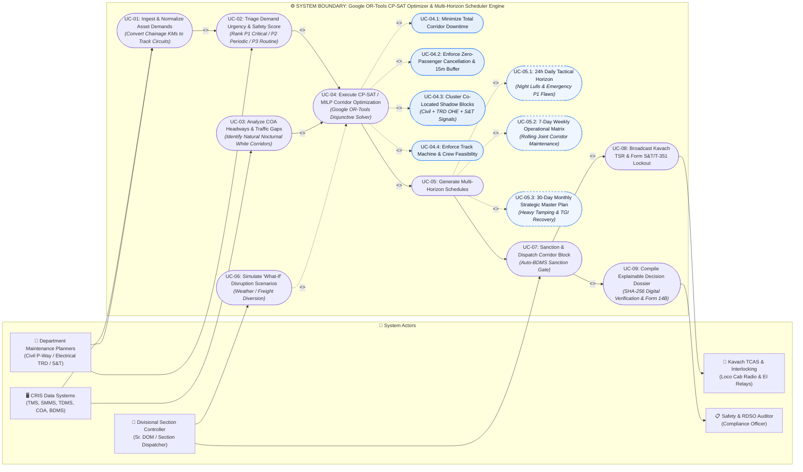

# Use-Case Specification: CP-SAT / MILP Solver & Joint Shadow-Block Optimizer Engine

> **System:** RailSuraksha AI (Auto-BDMS)  
> **Component:** Core Mathematical Optimization Engine (Google OR-Tools CP-SAT & Mixed-Integer Linear Programming)  
> **Problem Statement:** SIH 26027 — *"AI-Powered Automatic Block Planning to Maximize Asset Availability for Train Operations on Indian Railways"*  
> **Standards Grounding:** IRPWM 2020, ACTM Vol II, IRSEM 2021, G&SR Chapter 15, RDSO/SPN/196/2020 (Kavach Ver 4.0)

---

## 📐 1. UML Use-Case Diagram (Mermaid)

---

## 🔍 2. Detailed Elaboration of Core Solver Use Cases

### UC-01: Ingest & Normalize Asset Demands
* **Primary Actors:** Departmental Planners (P-Way, TRD, S&T), CRIS Systems (TMS, TDMS, SMMS).
* **Trigger:** Daily/hourly synchronization from CRIS databases.
* **Description:** Ingests unstructured defect logs, overdue maintenance work orders, ultrasonic flaw detection (USFD) records (IMR/OBS/REM per IRPWM 2020), contact wire wear (< 74 mm² per ACTM), and Track Geometry Index (TGI) deficits. Normalizes engineering chainage markers (e.g., `KM 108/4 to 112/2`) into discrete electrical track circuit nodes (`TC-01` to `TC-06`).
* **Output:** Normalized stream of `MaintenanceDemandRecord` objects ready for solver indexing.

---

### UC-02: Triage Demand Urgency & Safety Score
* **Primary Actor:** ML Urgency Triage Classifier.
* **Precondition:** Ingestion and normalization complete.
* **Formulation:** Evaluates urgency score $S_i \in [0, 1]$:
  $$S_i = 0.45 \cdot \text{SafetyRisk} + 0.35 \cdot \text{DegradationRate} \cdot \Delta t + 0.20 \cdot \frac{\text{OverdueDays}}{\text{TargetCycleDays}}$$
* **Tier Categorization:**
  * **P1 (Immediate Threat / Score 80–100):** Transverse rail fractures (IMR), sudden OHE sagging, track circuit fail-safes. Slated into **24-Hour Tactical Horizon**.
  * **P2 (Scheduled Maintenance / Score 50–79):** Track tamping cycles, point machine motor overhauls. Slated into **7-Day Operational Matrix**.
  * **P3 (Preventive / Routine / Score 0–49):** Drain cleaning, ballast dressing, insulator washing. Scheduled during opportunistic shadow blocks.

---

### UC-03: Analyze COA Headways & Traffic Gaps
* **Primary Actor:** CRIS COA (Control Office Application).
* **Description:** Reads dynamic train charts, passenger express schedules, suburban EMU frequencies, and goods freight forecasts. Calculates natural time-distance headways ($\ge 15\text{ min}$) and isolates white-corridor windows (predominantly 01:30 to 04:30 AM nocturnal lulls).

---

### UC-04: Execute CP-SAT / MILP Corridor Optimization (The Solver Core)
* **Mathematical Solver:** Google OR-Tools (`ortools.sat.python.cp_model.CpModel`) disjunctive interval scheduling.
* **Objective Function:**
  $$\min \quad \alpha \sum_{b \in \mathcal{B}} \text{Duration}(b) + \beta \sum_{t \in \mathcal{T}} \Delta_{t}^{\text{delay}} + \gamma \sum_{d \in \mathcal{D}_{\text{deferred}}} \text{Risk}(d) - \delta \sum_{d_1, d_2 \in \text{Bundled}} \text{Synergy}(d_1, d_2)$$
* **Sub-Use Cases & Constraints:**
  * **UC-04.1 (Minimize Corridor Downtime):** Minimizes total minutes track sections $s$ are blocked from active train movements.
  * **UC-04.2 (Zero-Passenger Cancellation & 15m Buffer):** Hard constraint: zero passenger cancellations and $t_{\text{start}}(t_{\text{passenger}}) - t_{\text{end}}(b) \ge 15\text{ min}$ safety clearance margin ($\Delta_{\text{clear}}$).
  * **UC-04.3 (Co-Located Shadow Blocking):** Civil track gangs and S&T technicians work simultaneously underneath de-energized OHE windows ($\Delta_{\text{earth}} \ge 10\text{ min}$, $\Delta_{\text{restore}} \ge 10\text{ min}$), eliminating 35%–50% of redundant line closures.
  * **UC-04.4 (Resource Feasibility):** Enforces availability limits for high-capacity machines (CSM tampers, BCM ballast cleaners, Tower Wagons) and field maintenance gangs.

---

### UC-05: Generate Multi-Horizon Schedules (Rolling Horizon Framework)
* **Primary Actor:** Rolling Horizon Multi-Horizon Schedule Generator.
* **Description:** Operates a rolling horizon framework ($H$ prediction window, $\Delta t$ control execution step) to decompose large-scale network block planning into three synchronized tiers:
  1. **UC-05.1 (Daily Tactical - 24 Hours, $\Delta t = 1\text{h}$):** Real-time conflict resolution, night-lull slotting ($01:30\text{--}04:30\text{ AM}$), and emergency P1 USFD IMR flaw insertion with Kavach TSR broadcast.
  2. **UC-05.2 (Weekly Operational - 7 Days, $\Delta t = 24\text{h}$):** Rolling corridor schedule bundling civil, electrical, and signal teams into coordinated 3.5-hour joint shadow blocks across divisional sections per CRIS RBS.
  3. **UC-05.3 (Strategic RBP - 26 Weeks, $\Delta t = 1\text{w}$):** Rolling Block Programme per Indian Railways GR 15.02, cyclic corridor overhauls, machine depot logistics (CSM, BCM), and Track Geometry Index (TGI) recovery projections.

---

### UC-06: Simulate 'What-If' Disruption Scenarios
* **Primary Actor:** Divisional Section Controller.
* **Trigger:** Controller inputs simulated weather disruptions (e.g., monsoon flooding $\mu=0.095$, winter fog) or emergency freight priority diversions.
* **Outcome:** The solver re-runs in $<15\text{ seconds}$, dynamically shifting block windows and projecting alternative corridor paths.

---

### UC-07: Sanction & Dispatch Corridor Block (Auto-BDMS Sanction Gate)
* **Primary Actor:** Divisional Section Controller (`Sr. DOM`).
* **Trigger:** Controller reviews proposed bundled block on the **Corridor Time-Distance String Chart** and clicks `[SANCTION BLOCK]`.
* **Outcome:** The system issues digital sanction tokens to station masters, generates **Form T/409 Caution Orders**, updates the e-BDMS portal, and triggers UC-08 and UC-09.

---

### UC-08: Broadcast Kavach TSR & Form S&T/T-351 Lockout
* **Primary Secondary Actors:** Kavach TCAS locomotive units (`RDSO/SPN/196/2020`), Electronic Interlocking (EI).
* **Description:** 
  * Automatically transmits **Temporary Speed Restriction (TSR 30 km/h)** packets wirelessly via the Temporary Speed Restriction Management System (TSRMS) and trackside radio balises to all locomotive cabs operating in the zone.
  * Enforces statutory **Form S&T/T-351** electronic interlocking lockout by clamping signal aspects (`S-12`, `S-14`) to danger (`RED`) in relay logic to physically protect track gangs.

---

### UC-09: Compile Explainable Decision Dossier
* **Primary Actor:** Safety Compliance Auditor / RDSO Inspector.
* **Description:** Compiles an immutable 4-step explainable record signed with a SHA-256 cryptographic hash:
  1. *Ingestion Evidence:* Specific TMS, SMMS, TDMS ticket IDs and chainage markers.
  2. *Conflict Resolution:* Avoided train path bottlenecks.
  3. *Co-Location Savings:* Exact hours saved by bundling OHE with tamping.
  4. *Safety Confirmation:* Verified Kavach TSR dissemination, Form S&T/T-351 electronic lockout, and Form T/409 Caution Order emission.
* **Export:** One-click download of official **RDSO Form 14B Safety Compliance Certificate**.
