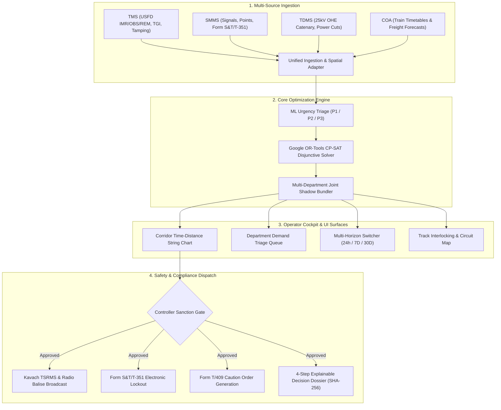

# RailSuraksha AI — Product Requirements Document (PRD)

**Project Name:** RailSuraksha AI (रेल-सुरक्षा): Automated Block Planning & Corridor Optimization System (Auto-BDMS)  
**SIH Problem Statement:** 26027 — *"AI-Powered Automatic Block Planning to Maximize Asset Availability for Train Operations on Indian Railways"*  
**Document Version:** 2.2.0 (Grounded Primary Source Architecture)  
**Target Platform:** National Railway Corridor Operations & Divisional Control Centers  
**Governing Standards:** IRPWM 2020, ACTM Vol II, IRSEM 2021, G&SR Chapter 15, RDSO/SPN/196/2020 (Kavach Ver 4.0), and Google OR-Tools CP-SAT  
**Target Framework:** Next.js 16 (App Router), React 19, TypeScript, Tailwind CSS v4, FastAPI / Python CP-SAT Solver (Google OR-Tools)

---

## 1. Executive Summary & Problem Understanding

### 1.1 The Challenge in Indian Railways Today
Indian Railways fixed railway infrastructure (track permanent way, 25kV traction distribution, signaling & telecommunication) is maintained by three separate engineering directorates:
* **Civil / P-Way Engineering (Track Management System - TMS):** Governed by *IRPWM 2020*.
* **Electrical / TRD (Traction Distribution Management System - TDMS):** Governed by *ACTM Vol II*.
* **Signal & Telecom / S&T (Signalling Maintenance & Management System - SMMS):** Governed by *IRSEM 2021*.

Currently, each department requests line disconnections independently through the **Block & Disconnection Management System (BDMS / e-BDMS)**. This process is decentralized, uncoordinated, and manual:
1. **Departmental Silos & Disconnected Maintenance:** A section of track is often blocked 3 separate times in a single week for civil, electrical, and signal work, multiplying corridor downtime (up to 7.5+ hours of weekly disruption per section).
2. **Controller Cognitive Overload:** Section Controllers in Divisional Control Offices manage traffic via the **Control Office Application (COA)**. They lack automated decision-support tools to identify traffic gaps, evaluate network impact, or co-schedule multiple maintenance tasks.
3. **Severe Asset Downtime & Throughput Loss:** Suboptimal block allocation results in cancelled freight paths, passenger punctuality loss, or deferred maintenance leading to emergency Temporary Speed Restrictions (TSRs).

### 1.2 The Solution Vision: Auto-BDMS
**RailSuraksha AI** is an AI-driven, constraint-optimized Automatic Block Planning System that:
* Ingests and normalizes maintenance requests across TMS, SMMS, TDMS, and train paths from COA.
* Clusters co-located demands into **Automated Multi-Department Joint Shadow Blocks** (Civil + S&T working underneath de-energized OHE windows).
* Solves corridor time-distance scheduling using Google OR-Tools CP-SAT disjunctive interval scheduling to minimize downtime and eliminate passenger delays.
* Operates across **Multi-Horizon Planning** (24h Tactical, 7-Day Operational, 30-Day Strategic).
* Protects field crews by disseminating digital Temporary Speed Restrictions (TSR) via the **Kavach TCAS TSRMS** directly to locomotive cab units, issuing statutory **Form S&T/T-351** interlocking lockouts and **Form T/409** Caution Orders upon block sanction.

---

## 2. User Personas & Roles

| Persona | Role & Platform Access | Key Needs & Behaviors |
| :--- | :--- | :--- |
| **Divisional Section Controller (Sr. DOM / Section Dispatcher)** | Command Center Dashboard & Corridor String Chart | Evaluates corridor capacity, reviews AI-optimized joint block recommendations, and executes one-click block sanctions (`[SANCTION BLOCK]`). |
| **Departmental Maintenance Planners (P-Way, TRD, S&T)** | Department Demand Queue & Machine Planning View | Enters and tracks maintenance work orders (TMS/TDMS/SMMS), reviews joint bundling proposals, and coordinates machine (CSM, BCM, Tower Wagon) and manpower gang deployment. |
| **Safety Compliance Auditor / RDSO Inspector** | Auditor Workspace & Decision Dossier | Audits immutable 4-step AI scheduling logs (Ingestion $\to$ Conflict Check $\to$ Shadow Bundling $\to$ Sanction & Safety TSR) and exports RDSO Form 14B compliance certificates. |
| **Locomotive Pilot & Field Station Master** | Cab Display & Station Control Console | Receives automated Kavach Temporary Speed Restrictions (TSR), Form S&T/T-351 signal lockout alerts, and digital Form T/409 Caution Orders for active maintenance sections. |

---

## 3. System Architecture & Core Functional Modules

---

## 4. Detailed Functional Requirements

### 4.1 Module 1: Multi-System Data Ingestion & Spatial Normalization
* **TMS Ingestion (IRPWM 2020):** Ingests rail flaw alerts, ultrasonic flaw detection (USFD) records (IMR/OBS/REM), track tamping requirements, and Track Geometry Index (TGI) deficit sections based on standard deviation formula:
  $$\text{TGI} = \frac{2U_I + T_I + 6A_I + G_I}{10}$$
* **TDMS Ingestion (ACTM Vol II):** Ingests 25kV OHE catenary/contact wire wear logs (< 74 mm²), neutral section overhaul schedules, insulator wash demands, and power block requests with mandatory $\ge 10\text{ min}$ discharge earthing buffers ($\Delta_{\text{earth}}$, $\Delta_{\text{restore}}$).
* **SMMS Ingestion (IRSEM 2021):** Ingests point machine operating stroke times ($<4.5\text{s}$) & current ($1.5\text{--}2.5\text{A}$), track circuit relay health, electronic interlocking maintenance logs, and statutory **Form S&T/T-351** disconnection demands.
* **COA Ingestion:** Real-time train tracking, scheduled passenger timetables, dynamic running delays, and goods freight rake path forecasts.
* **Spatial Chainage Normalizer:** Converts railway kilometer markers (e.g. `KM 108/4 - 114/2`) into discrete track circuit identifiers (`TC-01` through `TC-06`).

### 4.2 Module 2: ML Urgency Triage & Priority Scoring
* Calculates a dynamic urgency score for every maintenance requisition:
  $$\text{Priority Score} = w_1 \cdot \text{SafetyCriticality} + w_2 \cdot \text{DegradationRate} \cdot \Delta t + w_3 \cdot \frac{\text{OverdueDays}}{\text{TargetCycleDays}}$$
* Categorizes tasks into:
  * **P1 (Immediate / Safety Threat / Score 80–100):** Slotted into immediate 24h nocturnal lull or emergency speed cap (e.g., USFD IMR flaw, broken wire, track circuit drop).
  * **P2 (Scheduled / Periodicity Bound / Score 50–79):** Mandatory regulatory maintenance with scheduled deadline (e.g., track tamping, point machine overhaul). Bundled into 7-day rolling corridor.
  * **P3 (Preventive / Routine / Score 0–49):** Maintenance fitted into opportunistic shadow block windows (e.g., insulator washing, drain clearing).

### 4.3 Module 3: Joint Shadow-Block Optimization Engine
* **Mathematical Solver:** Google OR-Tools CP-SAT (`cp_model.CpModel`) disjunctive interval scheduling.
* **Objective Function:**
  $$\min \quad \alpha \sum_{b \in \mathcal{B}} \text{Duration}(b) + \beta \sum_{t \in \mathcal{T}} \Delta_{t}^{\text{delay}} + \gamma \sum_{d \in \mathcal{D}_{\text{deferred}}} \text{Risk}(d) - \delta \sum_{d_1, d_2 \in \text{Bundled}} \text{Synergy}(d_1, d_2)$$
* **Hard Operational Constraints:**
  * **Zero Passenger Cancellation:** No scheduled passenger trains may be cancelled or delayed beyond regulatory headway.
  * **Passenger Headway Adherence:** Minimum safety headways ($\Delta_{\text{clear}} \ge 15\text{ minutes}$) enforced between maintenance block termination and passenger train arrival.
  * **Co-Location Shadow Blocking:** Civil track gangs and S&T crews work underneath de-energized OHE windows ($\Delta_{\text{earth}} \ge 10\text{ min}$, $\Delta_{\text{restore}} \ge 10\text{ min}$).
  * **Resource Feasibility:** Maintenance gang, Tower Wagon, and track machine (CSM, BCM) availability bounds must be satisfied.

### 4.4 Module 4: Multi-Horizon Planning
* **24-Hour Tactical Horizon:** 
  * Real-time slotting for upcoming nocturnal white corridor (01:30–04:30 AM).
  * Emergency P1 defect insertions and dynamic freight path re-routing.
* **7-Day Operational Horizon:**
  * Rolling corridor maintenance schedule bundling multi-department blocks.
  * CSM tamper and Tower Wagon depot coordination.
* **30-Day Strategic Horizon:**
  * Heavy track machine routing optimization.
  * Long-term Track Geometry Index (TGI) corridor recovery planning.

### 4.5 Module 5: Modern Web Dispatcher Cockpit (Mintlify Light-Blue System)
* **Corridor Time-Distance String Chart (`CorridorStringChart.tsx`):**
  * X-axis: Time (00:00 to 24:00 hours).
  * Y-axis: Distance / Stations (e.g. CSMT $\to$ Dadar $\to$ Thane $\to$ Kalyan).
  * Diagonal lines represent train trajectories; colored shaded rectangular zones represent joint maintenance blocks.
* **Department Demand Queue (`IncidentQueue.tsx`):**
  * Displays pending TMS, SMMS, and TDMS demands with urgency badges, duration, and AI bundling recommendations.
  * One-click `[APPROVE & SANCTION BLOCK]` action.
* **KPI Strip (`KpiStrip.tsx`):**
  * 6 operational metrics: Active Corridor Blocks, Corridor Downtime Saved (38.4%), Track Asset Availability Index (96.2%), Pending Demands, White Corridor Headway Gap, Kavach TSRs Active.
* **Interlocking & Block Map (`InterlockingMap.tsx`):**
  * Real-time visual tracking of active blocks, occupied circuits, signal aspects ($S\text{-}12$, $S\text{-}14$), and temporary speed restrictions (TSR).
* **Explainable Decision Dossier Modal (`DecisionLogModal.tsx`):**
  * 4-step chronological audit timeline with SHA-256 seal, Form S&T/T-351 confirmation, Form T/409 caution record, and official RDSO Section 14B Safety Compliance certificate generation.

---

## 5. MoSCoW Feature Matrix

| Category | Features |
| :--- | :--- |
| **Must Have** | • Multi-Department Ingestion Normalizer (TMS, SMMS, TDMS, COA). • Google OR-Tools CP-SAT Joint Shadow-Block Optimization Engine. • Corridor Time-Distance String Chart UI. • Department Demand Queue with P1/P2/P3 Urgency Triage. • Multi-Horizon Planning Switcher (24h Tactical, 7D Operational, 30D Strategic). • Controller One-Click Sanction Gate with Kavach TSRMS & Form S&T/T-351 lockout. |
| **Should Have** | • Interactive Gantt string-chart zoom and pan. • Machine (CSM/Tower Wagon) roster constraint solver. • Real-time WebSocket updates for train path shifts. • Downloadable RDSO Section 14B Block Sanction Dossier PDF/JSON with Form T/409 Caution Order. |
| **Could Have** | • What-if scenario simulator (weather disruption impact on corridor availability). • Crew duty hours tracking for maintenance gangs. |
| **Won't Have** | • ❌ Passenger coach interior tracking or ticket booking integration. • ❌ Unbounded manual text block requests (everything is digital & constraint-checked). |

---

## 6. Success Metrics & Operational Impact

* **Corridor Downtime:** **35% to 50% reduction** in total blocked line hours via automated shadow blocking.
* **Asset Availability:** **+18% increase** in available network capacity.
* **Punctuality:** **Zero** passenger train cancellations and **<1.2%** secondary delay propagation.
* **Solver Performance:** Corridor schedules solved in **<30 seconds** for 100+ km sections.
* **Safety:** **100% digital dissemination** of Kavach TSRs with zero track gang collision incidents.
