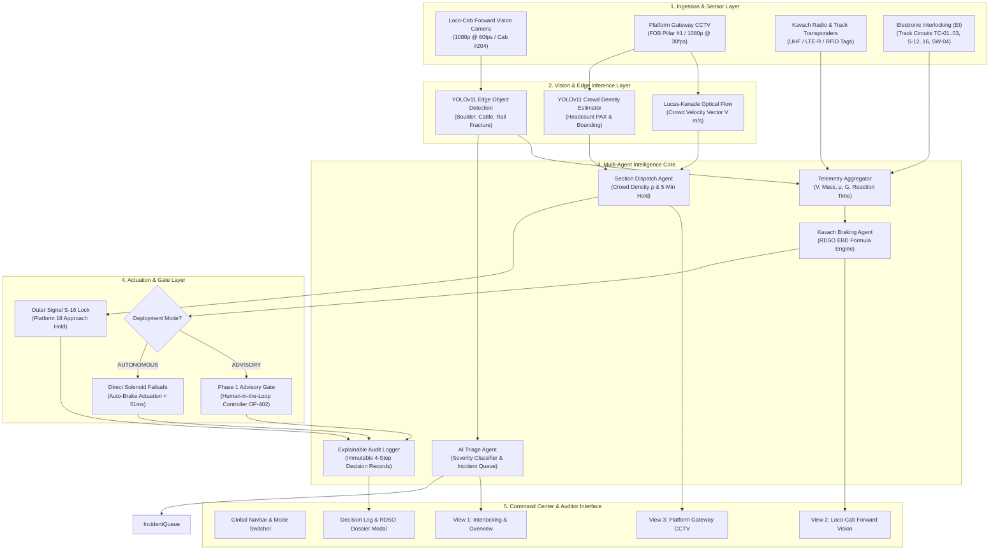
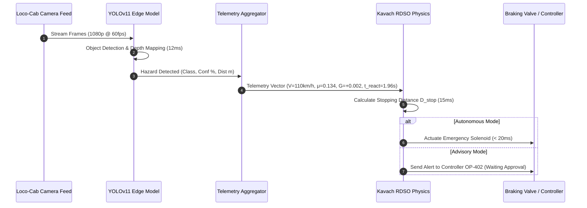
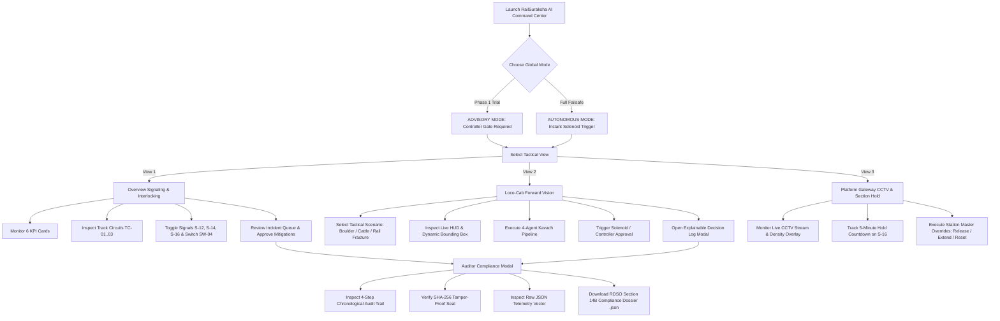

# RailSuraksha AI (रेल-सुरक्षा) — System Architecture, Camera Vision, User Flows & Operator Guide

---

## 1. Executive Summary & Core Purpose

**RailSuraksha AI** is a national-grade railway safety, interlocking monitoring, and incident intelligence platform engineered for Indian Railways operations. The platform integrates:
1. **Edge Computer Vision (YOLOv11 & Optical Flow)** for low-latency obstacle and crowd hazard detection.
2. **Deterministic RDSO-Standard Physics Engine (Kavach EBD)** calculating Emergency Braking Distances based on kinematic train dynamics.
3. **Station Section Dispatch & Platform Hold Engine** preventing stampedes and platform crowd surges.
4. **Explainable AI Compliance & Auditability Engine** producing tamper-evident SHA-256 digital seals and official RDSO Section 14B Compliance Dossiers.

---

## 2. System Architecture

---

## 3. How the Cameras Work (Vision Pipeline Architecture)

RailSuraksha AI leverages two primary tactical camera streams operating at the network edge:

### A. Loco-Cab Forward Vision Camera (`LocoCameraFeed.tsx`)
1. **Camera Placement:** Mounted centrally on the locomotive windshield (Cab #204) targeting the forward track section up to 1,000 meters.
2. **Inference Pipeline:**
   - Real-time video frame capture @ 60fps.
   - **YOLOv11 Edge Neural Network** executes object detection with inference latency $\le 12\text{ ms}$.
   - Classifies hazards into discrete classes:
     - `BOULDER` (e.g. 1.2m rockfall on Up Main Line)
     - `CATTLE` (e.g. stray cattle crossing Track 2)
     - `RAIL_FRACTURE` (e.g. linear fishplate rail break on Loop curve)
   - Computes distance to target $D_{\text{obstacle}}$ via calibrated stereo vision / depth mapping.
3. **HUD Telemetry Overlay:** Real-time projection of:
   - Kinematic Speed ($V\text{ km/h}$)
   - Brake Cylinder Pressure ($P\text{ bar}$)
   - Obstacle Distance ($D\text{ m}$)
   - Deceleration Gauge ($\text{CRUISING} \to \text{DECELERATING} \to \text{FULL STOP}$)
   - Solenoid Valve State (`CLEAR` vs `EMERGENCY_SOLENOID_ACTUATED`).

---

### B. Platform Gateway CCTV (`PlatformGatewayFeed.tsx`)
1. **Camera Placement:** Wide-angle CCTV mounted on Foot-Over-Bridge (FOB) Pillar #1 overlooking the Platform 17/18 bottleneck and staircases.
2. **Inference Pipeline:**
   - **YOLOv11 Headcount Estimation:** Continuously tallies passenger volume ($\text{PAX}$).
   - **Lucas-Kanade Optical Flow:** Measures crowd velocity vector ($V_{\text{crowd}}\text{ m/s}$) towards platform edges.
   - **Occupancy Index ($\rho$):** Calculates density index $\rho \in [0.0, 1.0]$. When $\rho > 0.80$ ($> 80\%$), crowd surge state is triggered.
3. **Automated Interlocking Interlock:**
   - Automatically commands the Section Dispatch Agent to lock outer approach signal $S\text{-}16$ on Platform 18 loop.
   - Arms a 5-minute deterministic hold countdown ($300\text{s}$) to allow passenger bottleneck evacuation before train arrival.

---

## 4. Multi-Agent Decision Engine & Kavach RDSO Physics

### A. Kavach Emergency Braking Distance (EBD) Formula
The system strictly enforces RDSO (Research Designs & Standards Organisation) kinematics:

$$D_{\text{stop}} = \frac{V^2}{2 \cdot g \cdot (\mu + G)} + (V \cdot t_{\text{reaction}})$$

Where:
- $V$: Train velocity in $\text{m/s}$ ($\frac{V_{\text{km/h}} \times 1000}{3600}$)
- $g$: Acceleration due to gravity ($9.81\text{ m/s}^2$)
- $\mu$: Rail-wheel coefficient of friction (Standard steel rail = $0.134$)
- $G$: Track gradient ($+0.002$ for uphill, $-0.002$ for downhill)
- $t_{\text{reaction}}$: System reaction time ($1.96\text{ seconds}$)

### B. Execution Timings
- **Stage 1 (Vision Hazard Detector):** $12\text{ ms}$
- **Stage 2 (Telemetry Aggregator):** $24\text{ ms}$
- **Stage 3 (RDSO Physics Engine):** $15\text{ ms}$
- **Stage 4 (Actuation Gate):** $20\text{ ms}$ (Autonomous) / Human Decision (Advisory)
- **Total Autonomous Execution Time:** $\approx 51\text{ ms}$ — far surpassing human reaction thresholds.

---

## 5. Detailed User Flow

---

## 6. How to Use the Software (Operator & Station Master Guide)

### Step 1: Navigating the Global Command Header
- **Mode Selector:** Located at the top right of the navbar. Toggle between:
  - **⚠️ ADVISORY (Phase 1):** AI generates real-time braking/holding recommendations; requires Section Controller `[APPROVE ACTION]` to trip solenoids.
  - **⚡ AUTONOMOUS:** Full automated failsafe actuation; AI directly energizes emergency brake solenoids in $< 51\text{ ms}$.
- **Tactical View Tabs:** Switch seamlessly between:
  1. `OVERVIEW & INTERLOCKING`
  2. `LOCO-CAB FORWARD VISION`
  3. `PLATFORM GATEWAY CCTV`

---

### Step 2: Operating View 1 — Overview & Interlocking
1. **KPI Strip:** Glance at 6 live operational metrics (Active Trains, Track Circuits, Active Signals, Incidents Logged, Active Platform Holds, Telemetry Latency).
2. **Interlocking Canvas:**
   - Click signal indicators ($S\text{-}12$, $S\text{-}14$, $S\text{-}16$) to cycle signal aspects (`CLEAR` $\to$ `CAUTION` $\to$ `STOP`).
   - Click switch points ($\text{SW-04}$) to toggle route alignment (`NORMAL` $\to$ `REVERSE`).
3. **Incident Priority Queue:**
   - Filter incidents using severity tabs (`ALL`, `CRITICAL`, `MODERATE`, `LOW`).
   - Click any incident card to load its telemetry and jump directly to the relevant camera feed.
   - Click `[APPROVE ACTION]` to authorize pending safety interventions.

---

### Step 3: Operating View 2 — Loco-Cab Forward Vision
1. **Select Scenario:**
   - **Scenario 1:** 1.2m Boulder on Track 1A ($340\text{m}$ ahead, $110\text{ km/h}$).
   - **Scenario 2:** Stray Cattle on Track 2 ($680\text{m}$ ahead, $110\text{ km/h}$).
   - **Scenario 3:** Rail Fracture / Fishplate Gap ($210\text{m}$ ahead, $90\text{ km/h}$).
2. **Run Pipeline:** Click `[RUN 4-AGENT KAVACH PIPELINE]`.
   - Watch the micro-stage animation (Vision $12\text{ms} \to$ Telemetry $24\text{ms} \to$ RDSO Physics $15\text{ms} \to$ Actuation).
   - In **Advisory Mode**, click `[APPROVE SOLENOID]` to authorize brake application.
   - In **Autonomous Mode**, witness instant emergency brake tripping and kinematic deceleration to $0\text{ km/h}$.
3. **Audit Log:** Click `[View 4-Step Explainable Decision Log Modal]` to inspect the complete audit trail.

---

### Step 4: Operating View 3 — Platform Gateway CCTV
1. **Crowd Surge Monitoring:** View live 1080p gateway stream with YOLOv11 crowd detection boxes and optical flow velocity indicators.
2. **5-Minute Hold Countdown:** Observe outer signal $S\text{-}16$ holding train #12137 (Punjab Mail) on outer approach while Platform 17 staircase bottleneck is cleared.
3. **Station Master Manual Overrides:**
   - `[RELEASE NOW]`: Immediately clears signal $S\text{-}16$ and permits train entry.
   - `[EXTEND +3M]`: Adds 180 seconds to the mandatory clearance hold timer.
   - `[RESET 5M]`: Resets the countdown to the full 300-second deterministic interval.

---

### Step 5: Compliance Auditing & Exporting Dossiers
1. Open the **Auditor Decision Log Modal**.
2. Switch between **4-Step Process Timeline** and **Raw Telemetry JSON**.
3. Verify the **SHA-256 Digital Seal** banner (`#9f8c4a1e7b2d...`).
4. Click `[DOWNLOAD RDSO SECTION 14B COMPLIANCE DOSSIER]` to export a complete, machine-readable JSON dossier for railway safety commissioner audits.

---

## 7. Supported Features Matrix

| Module | Feature | Implementation Details | Status |
| :--- | :--- | :--- | :--- |
| **Design System** | Light-Blue Mintlify UI | `#F0F6FC` canvas, `#FFFFFF` cards (`#D0DFEE` border), `#2B7FFF` accent, 4px button radius (strictly 0 pill buttons). | ✅ Implemented |
| **Navigation** | Global Persistent Navbar | 3 tactical view switchers, live status pulse, Advisory vs Autonomous mode toggle. | ✅ Implemented |
| **View 1** | 6-Metric KPI Strip | Active Trains, Track Circuits, Active Signals, Incidents Logged, Platform Holds, Telemetry Latency. | ✅ Implemented |
| **View 1** | Track Interlocking Map | Interactive track circuits (TC-01..03), clickable signals (S-12, S-14, S-16), switch point toggle (SW-04). | ✅ Implemented |
| **View 1** | AI Incident Triage Queue | Severity filtering (`CRITICAL`, `MODERATE`, `LOW`), confidence bars, distance badges, `[APPROVE ACTION]` workflow. | ✅ Implemented |
| **View 2** | Loco-Cab Forward Vision | 3 tactical hazard scenarios (Boulder, Cattle, Rail Fracture), live video stream, dynamic YOLO bounding box HUD. | ✅ Implemented |
| **View 2** | 4-Agent Execution Canvas | Micro-timing simulation (12ms Vision $\to$ 24ms Telemetry $\to$ 15ms RDSO $\to$ Actuation), kinematic gauges, Advisory approval gate. | ✅ Implemented |
| **View 3** | Platform Gateway CCTV | YOLOv11 & Optical Flow crowd detection overlay, live headcount and density index ($\rho$), 1s countdown ticker. | ✅ Implemented |
| **View 3** | Station Master Dispatch | 5-minute deterministic hold on signal S-16, manual override buttons (`[RELEASE NOW]`, `[EXTEND +3M]`, `[RESET 5M]`). | ✅ Implemented |
| **Auditor** | Explainable Decision Log Modal | 4-step chronological audit timeline, SHA-256 seal, copy-to-clipboard, raw JSON telemetry viewer. | ✅ Implemented |
| **Compliance**| RDSO Section 14B Dossier Export| One-click client-side download of certified JSON compliance report. | ✅ Implemented |
| **Physics** | Kavach EBD Engine | Pure TypeScript implementation of RDSO kinematic stopping formula $D_{\text{stop}} = \frac{V^2}{2g(\mu + G)} + V \cdot t_{\text{reaction}}$. | ✅ Implemented |
| **Verification**| Vitest Test Suite | 18 passing unit and integration tests across physics, triage, interlocking, and compliance logging. | ✅ Implemented (18/18 Passing) |
