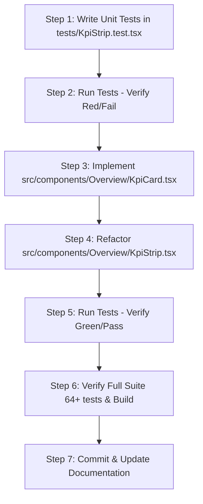

# 📋 Implementation Plan & Risk Analysis: `TICKET-DEV2-01` (6-Metric Block Planning KPI Strip)

**Target Ticket:** [`docs/ticket/TICKET-DEV2-01-kpi-strip-metrics.md`](file:///C:/Users/RyzenShine/Railsuraksha/RailSuraksha-AI-/docs/ticket/TICKET-DEV2-01-kpi-strip-metrics.md)  
**Assignee / Role:** Developer 2 — UI Layouts & Operational Metrics  
**Priority:** `P1 (High)` | **Design System:** Light-Blue Mintlify Discipline (`#F0F6FC` Base, `#FFFFFF` Surface, `#D0DFEE` Border, `#2B7FFF` Accent)  
**Governing Standards:** IRPWM 2020, ACTM Vol II, IRSEM 2021, RDSO Kavach Ver 4.0

---

## 📌 1. Executive Summary & Objective

The objective of `TICKET-DEV2-01` is to refactor `src/components/Overview/KpiStrip.tsx` and extract a reusable atom/molecule `src/components/Overview/KpiCard.tsx`. This replaces the legacy telemetry indicators with the **6 core operational metrics of IRIS AI (Automatic Block Planning & Corridor Optimization)**.

### Target 6-Metric Strip Overview
| # | Metric Title | Key Value Format | Trend / Status Badge | Subtext / Operational Context | Accent Theme |
|---|---|---|---|---|---|
| **1** | **Corridor Downtime Saved** | `38.4%` (or dynamic %) | `⚡ ROI ACTIVE` / `↑ 4.2h` | Shadow Blocking Multi-Dept Bundling | Emerald / Success |
| **2** | **Track Availability Index** | `96.2%` (or dynamic %) | `TARGET > 95%` | Section Availability (IRPWM 2020) | Blue / Primary |
| **3** | **Active Corridor Blocks** | `03 Active` / `02 Active` | `NOCTURNAL` | Possessory Windows (01:30–04:45) | Indigo / Twilight |
| **4** | **Pending Demands** | `08 In Queue` / `06 In Queue` | `02 P1 CRITICAL` | Civil + Electrical + S&T Demands | Amber / Warning |
| **5** | **White Corridor Headway Gap** | `3h 15m` (from 195 mins) | `OPTIMAL LULL` | Next possessory window: 01:30–04:45 | Slate / Cyan |
| **6** | **Active Kavach TSRs** | `02 Enforced` / `01 Enforced` | `30 km/h SPEED` | RDSO Kavach Speed Supervision | Rose / Red |

---

## 🏗️ 2. Architectural Changes & File Manifest

```text
┌───────────────────────────────────────────────────────────────────────────────────┐
│                              FILE ARCHITECTURE IMPACT                             │
├─────────────────────────────────────┬─────────────────────────────────────────────┤
│ File Path                           │ Nature of Change                            │
├─────────────────────────────────────┼─────────────────────────────────────────────┤
│ src/components/Overview/KpiCard.tsx │ [CREATE] Reusable single metric card atom   │
│ src/components/Overview/KpiStrip.tsx│ [REFACTOR] 6-card grid consuming KPI metrics │
│ tests/KpiStrip.test.tsx             │ [CREATE] Comprehensive Vitest unit tests    │
│ src/types/apiContracts.ts           │ [VERIFY] CorridorKpiMetrics contract        │
│ src/lib/mockData.ts                 │ [VERIFY] MOCK_CORRIDOR_KPIS fallback        │
└─────────────────────────────────────┴─────────────────────────────────────────────┘
```

---

## 🔍 3. Detailed Component Specifications

### 3.1 New Component: `src/components/Overview/KpiCard.tsx`

#### Props Interface
```typescript
export interface KpiCardProps {
  id?: string;
  title: string;
  value: string | number;
  unit?: string;
  subtext?: string;
  badgeText?: string;
  badgeVariant?: 'primary' | 'success' | 'warning' | 'danger' | 'neutral' | 'indigo';
  pulse?: boolean;
  icon?: React.ReactNode;
  trend?: 'UP' | 'DOWN' | 'NEUTRAL';
  trendValue?: string;
  className?: string;
  onClick?: () => void;
}
```

#### Styling Discipline & Tokens
- **Container Surface:** `#FFFFFF`, `border: 1px solid #D0DFEE`.
- **Card Radius:** Exactly `rounded-[16px]` (16px).
- **Badge / Button Radius:** Strictly `rounded-[4px]` (**Strictly zero pill buttons / zero `rounded-full`**).
- **Typography:**
  - Title: `text-xs font-semibold text-slate-500 tracking-tight uppercase`
  - Value: `text-2xl font-bold font-mono text-slate-800 tracking-tight`
  - Subtext: `text-[11px] text-slate-500 font-medium`
  - Badge: `text-[10px] font-mono font-bold px-2 py-0.5 border rounded-[4px]`
- **Micro-Interactions:** Subtle hover elevation (`hover:border-[#2B7FFF] transition-all duration-200 hover:-translate-y-0.5`).

---

### 3.2 Refactored Component: `src/components/Overview/KpiStrip.tsx`

#### Props Interface & Default Behavior
```typescript
import { CorridorKpiMetrics } from '@/types/apiContracts';
import { MOCK_CORRIDOR_KPIS } from '@/lib/mockData';

export interface KpiStripProps {
  metrics?: CorridorKpiMetrics;
  className?: string;
}
```

#### Data Transformation & Formatting Helpers
```typescript
// Converts raw minute integer (e.g. 195) to standard railway headway format (3h 15m)
export function formatHeadway(minutes: number): string {
  if (isNaN(minutes) || minutes <= 0) return '0h 00m';
  const hours = Math.floor(minutes / 60);
  const mins = minutes % 60;
  return `${hours}h ${mins.toString().padStart(2, '0')}m`;
}

// Formats count with 2-digit zero padding
export function formatCount(count: number, suffix: string): string {
  const safeCount = Math.max(0, count || 0);
  const padded = safeCount < 10 ? `0${safeCount}` : `${safeCount}`;
  return `${padded} ${suffix}`;
}
```

#### Grid Layout
- `grid grid-cols-2 sm:grid-cols-3 lg:grid-cols-6 gap-4 mb-6`
- Responsive across mobile (2 columns), tablet (3 columns), and wide desktop (6 columns).

---

### 3.3 New Test Suite: `tests/KpiStrip.test.tsx`

```typescript
// Vitest Test Suite Requirements (Environment: Node with renderToStaticMarkup)
// 1. Renders all 6 metric cards with fallback MOCK_CORRIDOR_KPIS.
// 2. Renders dynamic metric overrides passed via props.
// 3. Formats white corridor headway minutes (195 -> "3h 15m").
// 4. Formats zero-padded counts ("03 Active", "08 In Queue", "02 Enforced").
// 5. Adheres to styling discipline (contains rounded-[16px], rounded-[4px], zero rounded-full on badges).
```

---

## ⚠️ 4. Potential Problems, Risks & Mitigation Strategies

| # | Risk / Problem | Potential Impact | Root Cause | Prevention & Mitigation Strategy |
|---|---|---|---|---|
| **1** | **Strict Zero-Pill Design Rule Violation** | Lint/Design Review Failure | Accidentally using `rounded-full` or `rounded-full` badges instead of `rounded-[4px]`. | Explicitly enforce `rounded-[4px]` or `rounded` on all badges and status tags. Add an explicit Vitest assertion checking that badges do not contain `rounded-full`. |
| **2** | **Prop Signature Breakage in `page.tsx`** | Runtime / Compile Error | `src/app/page.tsx` calls `<KpiStrip />` without props; making `metrics` required will cause TypeScript build failure. | Declare `metrics` as optional (`metrics?: CorridorKpiMetrics`) with default fallback `metrics = MOCK_CORRIDOR_KPIS`. |
| **3** | **Headway Minute Formatting Edge Cases** | UI formatting bugs | Raw number `whiteCorridorHeadwayMinutes` could be `0`, `undefined`, negative, or non-multiples of 60. | Implement robust pure function `formatHeadway()` handling `undefined`, `NaN`, and negative values cleanly (`0h 00m`). |
| **4** | **Static Spec vs Dynamic Mock Mismatch** | Flaky Unit Tests | Ticket markdown mentions `03 Active`, `08 In Queue`, `02 Enforced`, but `MOCK_CORRIDOR_KPIS` has `activeBlocksCount: 2`, `pendingDemandsCount: 6`, `activeKavachTsrsCount: 1`. | Write tests against the dynamic data mapping (`${pad(count)} Active`) rather than hardcoding static mock numbers. |
| **5** | **Responsive Breakpoint Layout Cramping** | Text truncation or card overflow on mobile | 6 cards on small screens (`grid-cols-2`) could wrap labels or badges awkwardly. | Use compact font tokens (`text-xs`, `text-[10px]`, `font-mono`), compact badge padding (`px-2 py-0.5`), and ensure flex-wrap containers. |
| **6** | **Vitest Node Environment Compatibility** | Broken test runner | Project runs Vitest in Node environment without DOM (`vitest.config.ts: environment: 'node'`). | Use `renderToStaticMarkup` from `react-dom/server` for all component tests to execute with zero jsdom dependencies. |

---

## 🚀 5. Step-by-Step Implementation Workflow (TDD)



### Execution Steps
1. **Step 1: Write Vitest Unit Test (`tests/KpiStrip.test.tsx`)**
   - Test default render from `MOCK_CORRIDOR_KPIS`.
   - Test custom `metrics` prop rendering.
   - Test formatters and design token classes.
2. **Step 2: Create `src/components/Overview/KpiCard.tsx`**
   - Implement `KpiCard` with proper variant styles, hover transitions, and strict 16px/4px border radius.
3. **Step 3: Refactor `src/components/Overview/KpiStrip.tsx`**
   - Wire the 6 IRIS AI operational metric cards to `KpiCard`.
4. **Step 4: Execute Test Suite**
   - Run `node ./node_modules/vitest/vitest.mjs run tests/KpiStrip.test.tsx` and full suite.
5. **Step 5: Validate Next.js Build**
   - Run Next.js build / typecheck to confirm zero regressions.

---

## 📌 6. Verification Checklist

- [ ] `tests/KpiStrip.test.tsx` passes 100%.
- [ ] Renders all 6 cards:
  1. *Corridor Downtime Saved*
  2. *Track Availability Index*
  3. *Active Corridor Blocks*
  4. *Pending Demands*
  5. *White Corridor Headway Gap*
  6. *Active Kavach TSRs*
- [ ] No `rounded-full` pill badges used.
- [ ] Clean responsive rendering across mobile, tablet, and desktop.
- [ ] Full Vitest suite passes with zero regressions.
