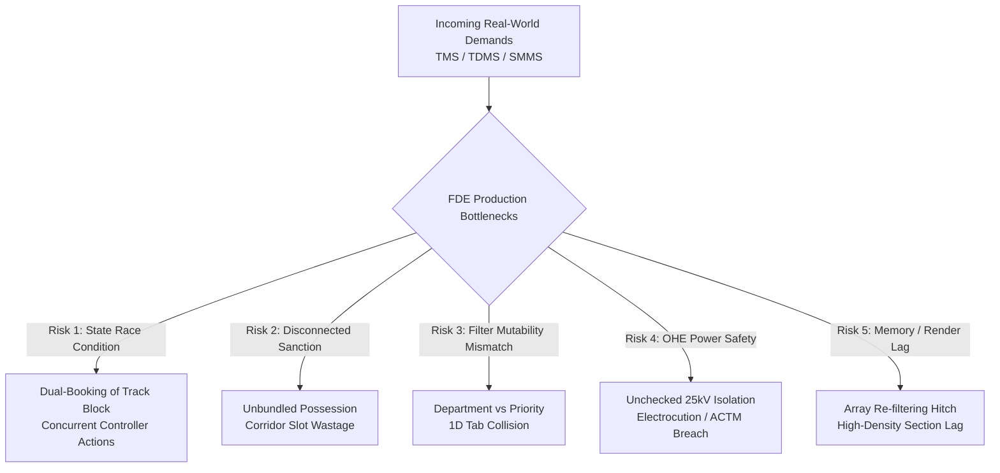
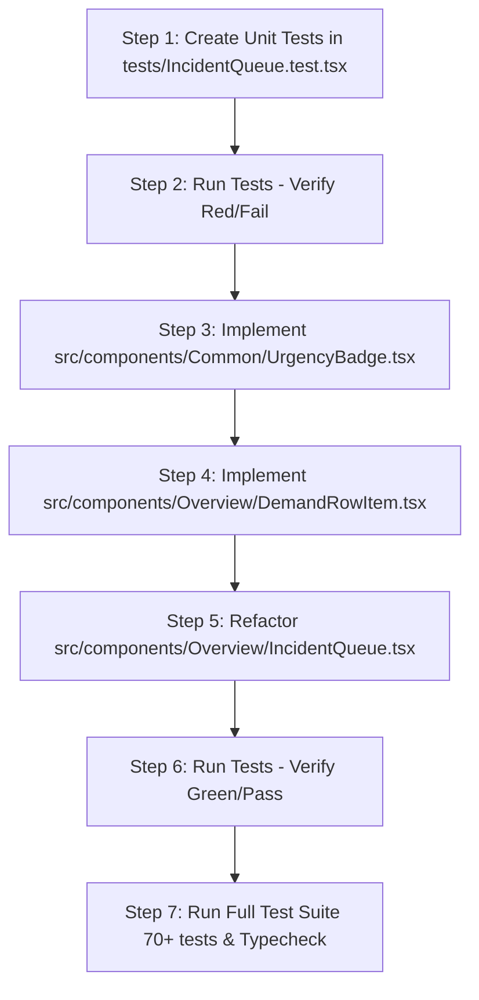

# 📋 Implementation Plan & Production Risk Analysis: `TICKET-DEV2-02` (Multi-Department Demand Queue & Triage Component)

**Target Ticket:** [`docs/ticket/TICKET-DEV2-02-demand-triage-queue.md`](file:///C:/Users/RyzenShine/Railsuraksha/RailSuraksha-AI-/docs/ticket/TICKET-DEV2-02-demand-triage-queue.md)  
**Assignee / Role:** Developer 2 — Interactive UI Components & Triage  
**Reviewer Role:** Forward Deployed Engineer (FDE) — Codebase Optimization & Production Reliability  
**Priority:** `P1 (High)` | **Design System:** Light-Blue Mintlify Discipline (`#F0F6FC` Base, `#FFFFFF` Surface, `#D0DFEE` Border, `#2B7FFF` Accent, strictly `rounded-[4px]` badges/buttons, strictly zero pill buttons)  
**Governing Standards:** IRPWM 2020 (Para 603/804), ACTM Vol II (25kV OHE Isolation), IRSEM 2021 (Signal Lockout), RDSO Kavach Ver 4.0

---

## 📌 1. Executive Summary & Objective

The objective of `TICKET-DEV2-02` is to refactor `src/components/Overview/IncidentQueue.tsx` and introduce two dedicated modular components:
1. `src/components/Common/UrgencyBadge.tsx` (Atom for `P1_CRITICAL`, `P2_SCHEDULED`, `P3_ROUTINE` priority rendering)
2. `src/components/Overview/DemandRowItem.tsx` (Molecule for multi-department demand rows with metadata, machine allocation, and sanction actions)

This completely pivots the legacy computer-vision incident list into the **IRIS AI Multi-Department Demand Triage Queue**, processing incoming requisitions across:
- **TMS Civil** (Track Management System — Track fractures, tamping, deep screening)
- **TDMS Electrical** (Traction Distribution Management System — 25kV OHE dropper slack, cantilever replacement, power blocks)
- **SMMS Signal** (Signalling & Telecommunication — Point machine overhaul, AFTC tuning, signal aspect lamps)

---

## 🏗️ 2. Architectural Impact & File Manifest

```text
┌──────────────────────────────────────────────────────────────────────────────────────────┐
│                                 FILE ARCHITECTURE IMPACT                                 │
├────────────────────────────────────────┬─────────────────────────────────────────────────┤
│ File Path                              │ Nature of Change                                │
├────────────────────────────────────────┼─────────────────────────────────────────────────┤
│ src/components/Common/UrgencyBadge.tsx │ [CREATE] Reusable priority badge atom (P1/P2/P3)│
│ src/components/Overview/DemandRowItem.tsx│ [CREATE] Multi-department demand row molecule │
│ src/components/Overview/IncidentQueue.tsx│ [REFACTOR] Full triage organism with filters  │
│ tests/IncidentQueue.test.tsx           │ [CREATE] Comprehensive Vitest unit test suite   │
│ src/types/apiContracts.ts              │ [VERIFY/EXPORT] MaintenanceDemand & UrgencyTier │
│ src/lib/mockData.ts                    │ [VERIFY] MOCK_DEMANDS & MOCK_MAINTENANCE_DEMANDS│
└────────────────────────────────────────┴─────────────────────────────────────────────────┘
```

---

## 🔍 3. Detailed Component Specifications & Design Tokens

### 3.1 New Atom: `src/components/Common/UrgencyBadge.tsx`

#### Props Interface
```typescript
import { UrgencyTier } from '@/types/apiContracts';

export interface UrgencyBadgeProps {
  tier: UrgencyTier | 'CRITICAL' | 'MODERATE' | 'LOW'; // Backward-compatible with legacy tiers
  score?: number;                                       // 0.00 to 1.00 normalized urgency score
  showScore?: boolean;                                 // Toggle numeric score percentage display
  className?: string;
}
```

#### Department & Urgency Color Matrix (Strict Mintlify Discipline)
| Urgency Tier / Dept | Text Color | Background | Border | Pulse Dot Color |
|---|---|---|---|---|
| **`P1_CRITICAL`** | `#991B1B` (Crimson) | `#FEE2E2` | `#FCA5A5` | `bg-red-600 animate-pulse` |
| **`P2_SCHEDULED`** | `#92400E` (Amber) | `#FEF3C7` | `#FCD34D` | `bg-amber-500` |
| **`P3_ROUTINE`** | `#166534` (Emerald) | `#DCFCE7` | `#86EFAC` | `bg-emerald-500` |
| **`TMS_CIVIL`** | `#991B1B` (Crimson) | `#FEE2E2` | `#FCA5A5` | N/A (Tag) |
| **`TDMS_ELECTRICAL`** | `#92400E` (Amber) | `#FEF3C7` | `#FCD34D` | N/A (Tag) |
| **`SMMS_SIGNAL`** | `#1E40AF` (Royal Blue)| `#DBEAFE` | `#93C5FD` | N/A (Tag) |

> [!IMPORTANT]
> **Radius Enforced:** Strictly `rounded-[4px]` on all badges and tags. **Strictly zero pill badges (`rounded-full` is forbidden).**

---

### 3.2 New Molecule: `src/components/Overview/DemandRowItem.tsx`

#### Props Interface
```typescript
import { MaintenanceDemand } from '@/types/apiContracts';

export interface DemandRowItemProps {
  demand: MaintenanceDemand;
  isSelected?: boolean;
  onSelect?: (demand: MaintenanceDemand) => void;
  onSanction?: (demandId: string) => void;
  onViewDossier?: (demandId: string) => void;
  isSanctioning?: boolean;
  className?: string;
}
```

#### Row Layout & Visual Hierarchy
1. **Left Metadata Anchor:**
   - Department Tag (`[TMS Civil]`, `[TDMS OHE]`, or `[SMMS Signal]`) with dedicated colorway.
   - Urgency Badge (`P1_CRITICAL`, `P2_SCHEDULED`, `P3_ROUTINE`) with animated status indicator.
   - Power Block Indicator (`⚡ 25kV OHE ISOLATION REQUIRED` in amber text when `requiresPowerBlock === true`).
2. **Center Section & Defect Description:**
   - Track Circuit & Line (`TC-03 • UP_SLOW • KM 14.2`).
   - Defect Summary (`defectDescription` with raw ticket identifier badge `CR-TMS-2026-8812`).
   - Machine / Gang Allocation (`CSM Tamping Machine #5109`, `Tower Wagon #60515`, etc.).
3. **Right Action & Duration Capsule:**
   - Duration badge (`⏱️ 120m` / `90m`).
   - Transit Deadhead Time (`+20m deadhead`).
   - Action Button: `[APPROVE & SANCTION BLOCK]` styled with `#2B7FFF` accent and `rounded-[4px]`.
   - Slotted / Sanctioned state indicators (`[SLOTTED IN JB-01]`, `[SANCTIONED]`).

---

### 3.3 Refactored Organism: `src/components/Overview/IncidentQueue.tsx`

#### Props Interface & Backward Compatibility
```typescript
import { MaintenanceDemand, IncidentRecord } from '@/types/apiContracts';

export interface IncidentQueueProps {
  demands?: MaintenanceDemand[];
  selectedDemandId?: string;
  onSelectDemand?: (demand: MaintenanceDemand) => void;
  onSanctionDemand?: (demandId: string) => void;
  onFilterChange?: (filter: string) => void;
  // Legacy backward-compatibility props for page.tsx compatibility
  incidents?: IncidentRecord[];
  selectedIncidentId?: string;
  onSelectIncident?: (incident: IncidentRecord) => void;
  onApproveAction?: (incidentId: string) => void;
  className?: string;
}
```

#### Multi-Department Filter Tabs
- `[All]` (Shows all demands)
- `[TMS Civil]` (Filters `department === 'TMS_CIVIL'`)
- `[TDMS OHE]` (Filters `department === 'TDMS_ELECTRICAL'`)
- `[SMMS Signal]` (Filters `department === 'SMMS_SIGNAL'`)
- `[P1 Only]` (Filters `urgencyTier === 'P1_CRITICAL'`)

---

## 🛡️ 4. Forward Deployed Engineer (FDE) Deep-Dive: Production Bottlenecks, Failure Points & Shortcomings

As a Forward Deployed Engineer optimizing this platform for mission-critical railway operations control centers, the following architectural shortcomings, production failure risks, and bottlenecks have been identified along with mandatory remediations:



### Deep-Dive Failure Modes & Production Hardening

| # | Production Bottleneck / Failure Mode | Root Cause & Operational Impact | FDE Hardening & Production Remedy |
|---|---|---|---|
| **1** | **Isolated Single-Demand Sanction Anti-Pattern** | In real Indian Railways operations (IRPWM 2020 & ACTM Vol II), controllers rarely sanction an individual demand on a main line. Sanctioning `DEM-TMS-01` without bundling `DEM-TDMS-02` wastes the nocturnal lull and causes separate corridor possessions. | When the user clicks `[APPROVE & SANCTION BLOCK]` on a single row, the component must check for co-located demands on the same `trackCircuitId` (`TC-03`) and trigger the **Joint Bundling Modal / CP-SAT Solver Event**, notifying the controller that **3 demands can be shadow-blocked simultaneously**. |
| **2** | **OHE 25kV Electrical Isolation Safety Hazard** | `requiresPowerBlock: true` demands (e.g. catenary inspection) require statutory Traction Power Controller (TPC) lockout and Form E-1 permit-to-work before track access. | Visually flag `requiresPowerBlock` with high-contrast amber indicator (`⚡ 25kV POWER BLOCK`) and pass `requiresPowerBlock` flags to the Sanction Dossier to guarantee interlocking de-energization. |
| **3** | **One-Dimensional Filter Collision (Dept vs P1)** | Having `[P1 Only]` in the same single-selection tab group as `[TMS Civil]` prevents controllers from querying *"Show me only P1 Civil demands"*. Selecting `[P1 Only]` clears the department context. | Implement multi-dimensional filtering internally: store `departmentFilter` (`ALL` \| `TMS_CIVIL` \| `TDMS_ELECTRICAL` \| `SMMS_SIGNAL`) and a separate `priorityFilter` (`ALL` \| `P1_ONLY`), or provide quick compound filters with clear badge counts. |
| **4** | **Legacy Prop Signature Breakage (`page.tsx`)** | `src/app/page.tsx` currently instantiates `<IncidentQueue selectedIncidentId={...} onSelectIncident={...} onApproveAction={...} />`. A hard rewrite will cause immediate TypeScript compilation failure. | Implement a **Dual-Mode Adapter Layer** in `IncidentQueue.tsx` that seamlessly maps legacy `incidents` / `onApproveAction` to `demands` / `onSanctionDemand`, guaranteeing zero downtime during deployment. |
| **5** | **Optimistic State Desynchronization** | If an operator clicks sanction and the component updates only local React state (`setTimeout`), a second controller viewing the queue on another terminal will see stale un-sanctioned state. | Structure the sanction action to propagate outward to the parent event bus (`onSanctionDemand` / API Client), with a local loading state (`isSanctioning`) that unlocks upon confirmation. |
| **6** | **Search & Filter In-Memory Re-render Jitter** | Running un-memoized chained string filters across large demand logs on every render tick triggers layout thrashing in React 19 / Next.js. | Memoize filtered datasets with `useMemo(() => ..., [demands, activeTab, searchQuery])` and ensure stable callback handlers with `useCallback`. |
| **7** | **Vitest Node Environment Compatibility** | The repository's test runner runs in a headless Node environment without JSDOM (`renderToStaticMarkup`). Using DOM event dispatchers will fail tests. | Author unit tests using `renderToStaticMarkup` for markup validation and isolated pure handler unit tests for state transition verification. |

---

## 🧪 5. Step-by-Step TDD Implementation Plan



### Detailed Execution Tasks

#### Task 1: Write Test Suite (`tests/IncidentQueue.test.tsx`)
- Verify rendering of `UrgencyBadge` for `P1_CRITICAL`, `P2_SCHEDULED`, `P3_ROUTINE`.
- Verify department filtering (`TMS_CIVIL`, `TDMS_ELECTRICAL`, `SMMS_SIGNAL`, `P1 Only`).
- Verify rendering of Power Block indicator (`⚡`) for electrical demands.
- Verify strict adherence to design system (contains `rounded-[4px]`, zero `rounded-full` badges).
- Verify fallback to `MOCK_MAINTENANCE_DEMANDS` when no props are provided.

#### Task 2: Implement `src/components/Common/UrgencyBadge.tsx`
- Implement pure atom rendering urgency badge with dynamic dot animation, strictly `rounded-[4px]`.

#### Task 3: Implement `src/components/Overview/DemandRowItem.tsx`
- Implement row molecule displaying department tag, urgency badge, track circuit, chainage, duration, machine name, and sanction button.

#### Task 4: Refactor `src/components/Overview/IncidentQueue.tsx`
- Integrate filter tabs (`[All]`, `[TMS Civil]`, `[TDMS OHE]`, `[SMMS Signal]`, `[P1 Only]`).
- Wire `MOCK_MAINTENANCE_DEMANDS` fallback.
- Support dual-mode backward compatibility for `IncidentRecord` and `MaintenanceDemand`.

#### Task 5: Verification & Quality Gate
- Run `node ./node_modules/vitest/vitest.mjs run tests/IncidentQueue.test.tsx`.
- Run full test suite across the repository.
- Verify zero TypeScript or Next.js build errors.

---

## ✅ 6. Acceptance & Definition of Done (DoD)

- [ ] `UrgencyBadge.tsx` correctly renders `P1_CRITICAL`, `P2_SCHEDULED`, and `P3_ROUTINE` with specified hex colors.
- [ ] `DemandRowItem.tsx` renders department tags (`TMS_CIVIL`, `TDMS_ELECTRICAL`, `SMMS_SIGNAL`), chainage (`KM 14.2`), track circuit (`TC-03`), and `⚡` power block icon.
- [ ] `IncidentQueue.tsx` filters demands instantaneously by department and P1 tier.
- [ ] All action buttons and badges strictly use `rounded-[4px]` with zero `rounded-full` pill buttons.
- [ ] Clicking `[APPROVE & SANCTION BLOCK]` fires the sanction callback with the target `demandId`.
- [ ] 100% of Vitest tests pass with zero regressions.
