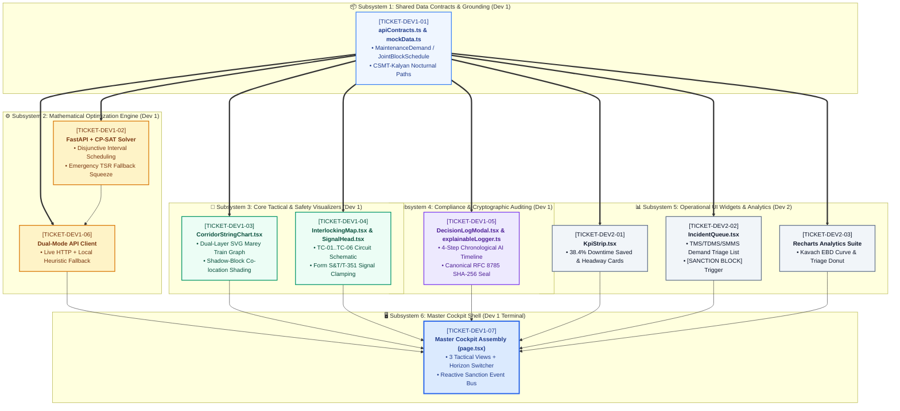
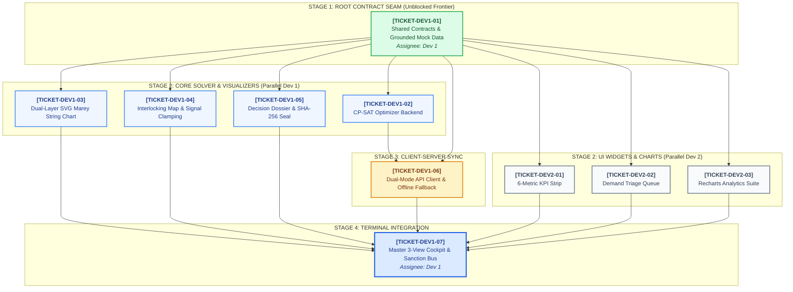
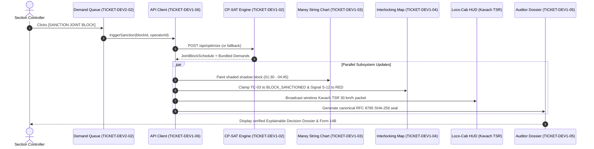

# 🎫 IRIS AI — Master Ticket Backlog & Graphified Topology

> **System:** IRIS AI (Automatic Block Planning & Corridor Optimization — SIH 26027)  
> **Topology Engine:** `/graphify` AST-Driven Subsystem & Dependency Cartography  
> **Status:** Stage 1 Frontier Active (`TICKET-DEV1-01` Unblocked)

---

## 👥 Ticket Backlog & Ownership Matrix

| Ticket ID | File / Feature | Assignee | Priority | Subsystem Domain |
| :--- | :--- | :--- | :--- | :--- |
| **`TICKET-DEV1-01`** | [`TICKET-DEV1-01-contracts-and-mock-data.md`](./TICKET-DEV1-01-contracts-and-mock-data.md) | **Dev 1 (Core)** | **P0 (Root)** | Core Contracts, Data Seams & CSMT–Kalyan Datasets |
| **`TICKET-DEV1-02`** | [`TICKET-DEV1-02-cpsat-optimizer-backend.md`](./TICKET-DEV1-02-cpsat-optimizer-backend.md) | **Dev 1 (Core)** | **P0** | Google OR-Tools CP-SAT Solver & Emergency TSR Squeeze |
| **`TICKET-DEV1-03`** | [`TICKET-DEV1-03-svg-marey-string-chart.md`](./TICKET-DEV1-03-svg-marey-string-chart.md) | **Dev 1 (Core)** | **P0** | Dual-Layer SVG Marey Time-Distance String Chart (Core Visualizer) |
| **`TICKET-DEV1-04`** | [`TICKET-DEV1-04-interlocking-track-map.md`](./TICKET-DEV1-04-interlocking-track-map.md) | **Dev 1 (Core)** | **P0** | Section Interlocking State Machine, Circuits & Signal Clamping |
| **`TICKET-DEV1-05`** | [`TICKET-DEV1-05-decision-dossier-modal.md`](./TICKET-DEV1-05-decision-dossier-modal.md) | **Dev 1 (Core)** | **P0** | 4-Step Decision Dossier, Canonical SHA-256 Seal & RDSO Form 14B |
| **`TICKET-DEV1-06`** | [`TICKET-DEV1-06-dual-mode-api-client.md`](./TICKET-DEV1-06-dual-mode-api-client.md) | **Dev 1 (Core)** | **P1** | Dual-Mode Data Client & Zero-Fail Offline Fallback Architecture |
| **`TICKET-DEV1-07`** | [`TICKET-DEV1-07-master-cockpit-assembly.md`](./TICKET-DEV1-07-master-cockpit-assembly.md) | **Dev 1 (Core)** | **P0 (Terminal)**| Master 3-View Command Cockpit, Horizon Switcher & Sanction Event Bus |
| **`TICKET-DEV2-01`** | [`TICKET-DEV2-01-kpi-strip-metrics.md`](./TICKET-DEV2-01-kpi-strip-metrics.md) | **Dev 2 (UI)** | P1 | 6-Metric Block Planning KPI Strip & Summary Cards |
| **`TICKET-DEV2-02`** | [`TICKET-DEV2-02-demand-triage-queue.md`](./TICKET-DEV2-02-demand-triage-queue.md) | **Dev 2 (UI)** | P1 | Multi-Department Demand Queue List, Filter Tabs & Badges |
| **`TICKET-DEV2-03`** | [`TICKET-DEV2-03-recharts-analytics-suite.md`](./TICKET-DEV2-03-recharts-analytics-suite.md) | **Dev 2 (UI)** | P2 | Recharts Analytics Suite (Kavach Deceleration Curve & Triage Donut) |

---

## 🏛️ Subsystem Architecture & Boundary Topology

---

## 🌲 Multi-Stage Execution & Dependency DAG

---

## ⚡ Real-Time Reactive Sanction Event Bus Topology

