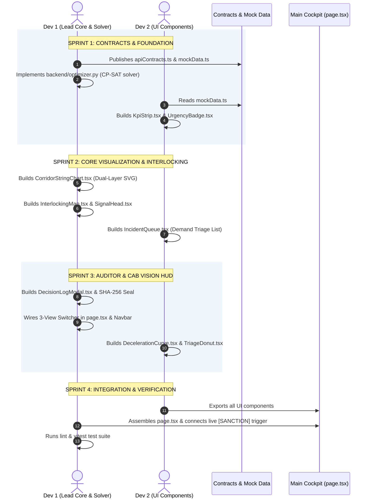

# 🤝 IRIS AI — 2-Developer & 2-Agent Parallel Collaboration Plan (SIH 26027)

**System Name:** IRIS AI (Intelligent Railway Inspection and Restoration AI): Automatic Block Planning & Corridor Optimization  
**Methodology:** MULTICA Multi-Agent Collaboration Engine + Contract-First Seams (Zero Merge Conflicts)  
**Document Version:** 3.0.0 (Core Features Assigned to Dev 1)  
**Date:** 2026-09-26  

---

## 👥 1. Role Allocation & Zero-Collision Ownership Matrix

```text
┌─────────────────────────────────────────────────────────────────────────────────────────┐
│              2-DEVELOPER PARALLEL WORK SPLIT (SIH 26027) — CORE TO DEV 1                │
├─────────────────────────────────────────────────┬───────────────────────────────────────┤
│ DEVELOPER 1 + AGENT 1 (LEAD INTEGRATOR & CORE)  │ DEVELOPER 2 + AGENT 2 (UI COMPONENTS) │
├─────────────────────────────────────────────────┼───────────────────────────────────────┤
│ 📁 Exclusive File Domain:                       │ 📁 Exclusive File Domain:             │
│   • src/types/apiContracts.ts                   │   • src/components/Overview/KpiStrip  │
│   • src/lib/mockData.ts                         │   • src/components/Overview/IncidentQueue│
│   • src/lib/apiClient.ts                        │   • src/components/Common/UrgencyBadge│
│   • src/components/Planner/CorridorStringChart  │   • src/components/Charts/**          │
│   • src/components/Overview/InterlockingMap.tsx │                                       │
│   • src/components/Common/SignalHead.tsx        │                                       │
│   • src/components/Auditor/DecisionLogModal.tsx │                                       │
│   • src/lib/agents/explainableLogger.ts         │                                       │
│   • src/app/page.tsx (Main View Switcher)       │                                       │
│   • src/components/Navbar.tsx                   │                                       │
│   • src/components/LocoCameraFeed.tsx           │                                       │
│   • backend/optimizer.py & backend/main.py      │                                       │
│   • src/app/globals.css                         │                                       │
├─────────────────────────────────────────────────┼───────────────────────────────────────┤
│ 🎯 Primary Deliverables (CORE):                 │ 🎯 Primary Deliverables (SUPPORTING): │
│   1. Establish Shared TypeScript Contracts      │   1. 6-Metric Block Planning KPI Strip│
│   2. Dual-Layer SVG Marey String Chart (SVG)    │   2. Department Demand Queue & Triage │
│   3. Async CP-SAT Optimizer Backend (Port 8000) │   3. Recharts Kinematic & Triage Donut│
│   4. Interlocking Track Map & Signal Clamping   │                                       │
│   5. 4-Step Decision Dossier & SHA-256 Audit    │                                       │
│   6. Dual-Mode API Data Client & Offline Sync   │                                       │
│   7. 3-View Master Cockpit & Sanction Bus       │                                       │
└─────────────────────────────────────────────────┴───────────────────────────────────────┘
```

---

## 🔒 2. Shared Contract Seam (`src/types/apiContracts.ts`)

**Dev 1 publishes this contract first.** Both Dev 1 and Dev 2 program against these exact interfaces with zero shared state:

```typescript
// src/types/apiContracts.ts

export type DeploymentMode = 'ADVISORY' | 'AUTONOMOUS';
export type DepartmentCode = 'TMS_CIVIL' | 'TDMS_ELECTRICAL' | 'SMMS_SIGNAL';
export type UrgencyTier = 'P1_CRITICAL' | 'P2_SCHEDULED' | 'P3_ROUTINE';
export type HorizonTier = 'TACTICAL_24H' | 'OPERATIONAL_7D' | 'STRATEGIC_30D';
export type TrackCircuitId = 'TC-01' | 'TC-02' | 'TC-03' | 'TC-04' | 'TC-05' | 'TC-06';

export interface MaintenanceDemand {
  demandId: string;
  department: DepartmentCode;
  trackCircuitId: TrackCircuitId;
  stationSection: string;
  chainageKm: number;
  urgencyTier: UrgencyTier;
  urgencyScore: number;
  durationMinutes: number;
  requiresPowerBlock: boolean;
  assignedMachine?: string;
  status: 'PENDING_TRIAGE' | 'SLOTTED' | 'SANCTIONED';
}

export interface JointBlockSchedule {
  blockId: string;
  corridorName: string;
  startTimeMinutes: number;  // 90 = 01:30 IST
  endTimeMinutes: number;    // 285 = 04:45 IST
  affectedTrackCircuits: TrackCircuitId[];
  bundledDemandIds: string[];
  downtimeSavedMinutes: number;
  corridorDowntimeSavedPct: number;
  passengerDelaysMinutes: 0; // Strictly 0
  kavachTsrSpeedKmh: number;
  status: 'PROPOSED' | 'SANCTIONED' | 'ACTIVE' | 'RESTORED';
}

export interface CorridorKpiMetrics {
  corridorDowntimeSavedPct: number; // 38.4%
  assetAvailabilityIndexPct: number; // 96.2%
  activeBlocksCount: number;
  pendingDemandsCount: number;
  whiteCorridorHeadwayMinutes: number; // 195 mins (3h 15m)
  activeKavachTsrsCount: number;
}

export interface TrackCircuitState {
  circuitId: TrackCircuitId;
  stationName: string;
  status: 'CLEAR' | 'OCCUPIED' | 'MAINTENANCE_SLOTTED' | 'BLOCK_SANCTIONED';
  activeBlockId?: string;
  signalId: string;
  signalAspect: 'RED' | 'YELLOW' | 'DOUBLE_YELLOW' | 'GREEN';
  isSignalClamped: boolean;
  speedLimitKmh: number;
  oheEnergized: boolean;
}

export interface ExplainableDecisionDossier {
  dossierId: string;
  blockId: string;
  sanctionedBy: string;
  timestamp: string;
  sha256Signature: string;
  chronologicalTimeline: Array<{
    stepNumber: 1 | 2 | 3 | 4;
    title: string;
    agentName: string;
    description: string;
    timestamp: string;
  }>;
  bundledDemands: MaintenanceDemand[];
  statutoryForms: {
    formST351LockoutNumber: string;
    formT409CautionOrderNumber: string;
    rdsoForm14BCertificateHash: string;
  };
}
```

---

## ⏱️ 3. Synchronized 4-Sprint Implementation Workflow



---

## 🤖 4. Ready-to-Use Agent Prompts for Both Developers

### 🔵 Prompt for Developer 1 (Lead Core Architect & Solver)
```markdown
You are Developer 1 on IRIS AI.
Your exclusive files:
- `src/types/apiContracts.ts`
- `src/lib/mockData.ts`
- `src/lib/apiClient.ts`
- `src/components/Planner/CorridorStringChart.tsx`
- `src/components/Overview/InterlockingMap.tsx`
- `src/components/Common/SignalHead.tsx`
- `src/components/Auditor/DecisionLogModal.tsx`
- `src/lib/agents/explainableLogger.ts`
- `src/components/Navbar.tsx`
- `src/components/LocoCameraFeed.tsx`
- `src/app/page.tsx`
- `backend/optimizer.py` and `backend/main.py`
- `src/app/globals.css`

Design System: Light-Blue Mintlify (#F0F6FC Base, #FFFFFF Cards, #D0DFEE Border, #2B7FFF Accent, 4px button radius, strictly zero pill buttons).
Build the Dual-Layer SVG Marey String Chart, CP-SAT Solver, Interlocking Circuit Map, 4-Step Decision Dossier with SHA-256 seal, and connect the 3 tactical views in the master cockpit.
```

### 🟢 Prompt for Developer 2 (Supporting UI Components)
```markdown
You are Developer 2 on IRIS AI.
Your exclusive files:
- `src/components/Overview/KpiStrip.tsx` (6 operational metric cards)
- `src/components/Overview/IncidentQueue.tsx` (Department demand queue with TMS/TDMS/SMMS badges)
- `src/components/Common/UrgencyBadge.tsx`
- `src/components/Charts/` (Recharts decel curve and triage donut)

Do NOT modify `src/app/page.tsx`, `src/lib/apiClient.ts`, or backend files.
Import all types from `src/types/apiContracts.ts` and static data from `src/lib/mockData.ts`.
Follow the Light-Blue Mintlify design system (#F0F6FC Base, #FFFFFF Cards, #D0DFEE Border, 4px button radius, strictly zero pill buttons).
```
