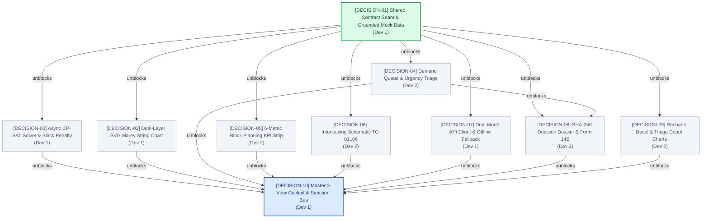

# 🗺️ IRIS AI — Wayfinder Decision Map & Blocking DAG

**Destination:** Production-ready IRIS AI (Automatic Block Planning & Corridor Optimization — SIH 26027) with Next.js 16 React 19 Frontend, Dual-Layer SVG Marey String Chart, Multi-Department Demand Triage Queue, Track Circuit Interlocking State Machine, Cab Defect Vision & Kavach HUD, Asynchronous Google OR-Tools CP-SAT Solver Backend, and SHA-256 RDSO Form 14B Decision Dossier.  
**Tracker System:** Local Markdown Tracker (`wayfinder:map`)  
**Methodology:** Wayfinder Cartography + Explicit Blocking Edges DAG  
**Document Version:** 1.0.0  
**Date:** 2026-09-25  

---

## 🧭 The Master Decision Map

### Destination
Deliver a verified, production-grade IRIS AI dual-mode application (Live FastAPI + Offline Static Fallback) adhering to the Light-Blue Mintlify design system, zero passenger delays, $\Delta_{\text{clear}} \ge 15\text{ min}$ safety headways, and immutable cryptographic audit trails.

### Notes
* **Design Discipline:** Light-Blue Mintlify (`#F0F6FC` Base, `#FFFFFF` Surface, `#D0DFEE` Border, `#2B7FFF` Signal Blue, strictly 4px button/input radius, strictly zero pill buttons).
* **Multi-Developer Split:** Dev 1 (Lead Integrator / Solver / Marey Chart / `page.tsx`) vs. Dev 2 (KPI Strip / Demand Queue / Interlocking / Dossier / Recharts).
* **Key Invariants:** Zero scheduled passenger train cancellations, $\le 2.0\text{s}$ async CP-SAT solver timeout, immutable SHA-256 seal verification.

### Decisions So Far
- [x] [Architectural Refactor vs Delete](./refactoring_plan.md#1-executive-summary--decision-matrix): **Retain & Repurpose >65% of codebase** (design tokens, Kavach EBD physics, SHA-256 audit logger, FastAPI base, CSMT–Kalyan datasets).
- [x] [BEADS 6-Subagent Pipeline Decomposition](./refactoring_plan.md#4-exhaustive-beads-pipeline-the-6-isolated-sub-agent-beads): Decomposed into IngestionNormalizer, UrgencyTriage, CorridorOptimizer, SanctionGate, SafetyActuator, ExplainableAuditor.
- [x] [2-Developer Parallel Split & Ticket Allocation Matrix](./two_developer_execution_plan.md): Isolated file domains for Dev 1 and Dev 2 with contract-first shared seams.

### Not Yet Specified (Fog of War)
- Live WebSocket event push from electronic interlocking relays (provisional REST/SSE model used currently).
- Direct Radio Block Center (RBC) Kavach IP socket broadcast protocol (simulated via JSON packet emit).

### Out of Scope
- Crew roster optimization and duty hour scheduling (CMS integration).
- Real-time locomotive GPS tracking hardware firmware.

---

## 🌲 Visual Blocking Dependency DAG

---

## 🎫 Wayfinder Decision Tickets

### 🟢 Unblocked Frontier Tickets (Takeable Immediately)

#### 🏷️ `DECISION-01`: Shared Contract Seam & Grounded Mock Data Structure
- **Label:** `wayfinder:task`
- **Assignee:** Developer 1 (Lead Integrator)
- **Status:** `OPEN (UNBLOCKED / FRONTIER)`
- **Target Files:** `src/types/apiContracts.ts`, `src/lib/mockData.ts`
- **Question:** How do we structure the shared TypeScript interfaces and mock datasets to allow Dev 1 (solver/chart) and Dev 2 (UI components) to build concurrently without merge conflicts?
- **Blocking Edges:** None (Roots the entire DAG).
- **Unblocks:** `DECISION-02`, `DECISION-03`, `DECISION-04`, `DECISION-05`, `DECISION-06`, `DECISION-07`, `DECISION-08`, `DECISION-09`.
- **Resolution Directives:**
  1. Define `MaintenanceDemand`, `JointBlockSchedule`, `CorridorKpiMetrics`, `DivisionalPolicyProfile`, `TrackCircuitState`, `ExplainableDecisionDossier`.
  2. Populate `MOCK_DEMANDS` (TMS Civil rail flaws, TDMS 25kV catenary, SMMS point machines).
  3. Populate `MOCK_JOINT_BLOCKS` with the 01:30–04:45 AM nocturnal lull on `TC-03/TC-04`.
  4. Populate `MOCK_TRAIN_PATHS` from real CSMT–Kalyan timetables.

---

### 🟡 Blocked Child Tickets (Sprint 2 & 3)

#### 🏷️ `DECISION-02`: Async CP-SAT Disjunctive Solver & Slack Penalty Model
- **Label:** `wayfinder:prototype`
- **Assignee:** Developer 1
- **Status:** `BLOCKED` by `DECISION-01`
- **Target Files:** `backend/optimizer.py`, `backend/main.py`
- **Question:** How do we implement Google OR-Tools CP-SAT interval scheduling in FastAPI without blocking the event loop or crashing under congested traffic constraints?
- **Blocking Edges:** Blocked by `DECISION-01`.
- **Unblocks:** `DECISION-10`.
- **Resolution Directives:**
  1. Wrap `solver.Solve()` in `asyncio.to_thread()`.
  2. Set `solver.parameters.max_time_in_seconds = 2.0` and `num_search_workers = 4`.
  3. Implement soft slack penalties on non-passenger paths to guarantee non-empty feasibility.

#### 🏷️ `DECISION-03`: Dual-Layer SVG Marey String Chart & Linear Coordinate Mapping
- **Label:** `wayfinder:prototype`
- **Assignee:** Developer 1
- **Status:** `BLOCKED` by `DECISION-01`
- **Target Files:** `src/components/Planner/CorridorStringChart.tsx`
- **Question:** How do we render 500+ daily train trajectories and interactive maintenance blocks smoothly at 60fps without SVG hydration mismatches or canvas hit-testing bugs?
- **Blocking Edges:** Blocked by `DECISION-01`.
- **Unblocks:** `DECISION-10`.
- **Resolution Directives:**
  1. Split into memoized static background grid (`React.memo`) and dynamic SVG path trajectories.
  2. Implement linear scaling helpers (`scaleX: 0..1440m -> px`, `scaleY: 0..54km -> px`).
  3. Render shaded rectangular blocks with cross-hatch fill and hover tooltips showing 38.4% saved downtime.

#### 🏷️ `DECISION-04`: Multi-Department Demand Queue Triage & Filter Taxonomy
- **Label:** `wayfinder:task`
- **Assignee:** Developer 2
- **Status:** `BLOCKED` by `DECISION-01`
- **Target Files:** `src/components/Overview/IncidentQueue.tsx`, `src/components/Overview/DemandRowItem.tsx`, `src/components/Common/UrgencyBadge.tsx`
- **Question:** How should the demand queue display and filter heterogeneous work requests (Civil, Electrical, Signal) while providing instant one-click sanction actions?
- **Blocking Edges:** Blocked by `DECISION-01`.
- **Unblocks:** `DECISION-08`, `DECISION-10`.
- **Resolution Directives:**
  1. Create department filter pills (`[All]`, `[TMS Civil]`, `[TDMS Electrical]`, `[SMMS Signal]`, `[P1 Only]`).
  2. Display urgency score progress bar, chainage KM, track circuit badge, and `[SANCTION BLOCK]` action button.

#### 🏷️ `DECISION-05`: 6-Metric Block Planning KPI Strip Design & Availability Metrics
- **Label:** `wayfinder:task`
- **Assignee:** Developer 2
- **Status:** `BLOCKED` by `DECISION-01`
- **Target Files:** `src/components/Overview/KpiStrip.tsx`, `src/components/Overview/KpiCard.tsx`
- **Question:** Which 6 core metrics best convey the ROI of automated block planning to divisional controllers and SIH judges?
- **Blocking Edges:** Blocked by `DECISION-01`.
- **Unblocks:** `DECISION-10`.
- **Resolution Directives:**
  1. Card 1: *Corridor Downtime Saved:* `38.4%` (Shadow Blocking ROI)
  2. Card 2: *Track Availability Index:* `96.2%`
  3. Card 3: *Active Corridor Blocks:* `03 Active`
  4. Card 4: *Pending Demands:* `08 In Queue`
  5. Card 5: *White Corridor Headway Gap:* `3h 15m`
  6. Card 6: *Active Kavach TSRs:* `02 Enforced (30 km/h)`

#### 🏷️ `DECISION-06`: Section Interlocking Schematic & Form S&T/T-351 Relay Clamping
- **Label:** `wayfinder:prototype`
- **Assignee:** Developer 2
- **Status:** `BLOCKED` by `DECISION-01`
- **Target Files:** `src/components/Overview/InterlockingMap.tsx`, `src/components/Common/SignalHead.tsx`
- **Question:** How do we schematically represent track circuits `TC-01..06`, live axle counters, and signal aspects that clamp to `RED` upon block sanction?
- **Blocking Edges:** Blocked by `DECISION-01`.
- **Unblocks:** `DECISION-10`.
- **Resolution Directives:**
  1. Horizontal circuit schematic with color-coded status (`CLEAR` green, `OCCUPIED` yellow, `BLOCK_SANCTIONED` red).
  2. 4-aspect LED signal heads with lock icon overlay when clamped.
  3. Form S&T/T-351 statutory notice drawer.

#### 🏷️ `DECISION-07`: Dual-Mode API Client Abort & Zero-Fail Mock Fallback
- **Label:** `wayfinder:task`
- **Assignee:** Developer 1
- **Status:** `BLOCKED` by `DECISION-01`
- **Target Files:** `src/lib/apiClient.ts`
- **Question:** How do we guarantee the frontend presentation never fails or hangs if the local Python process is offline or delayed?
- **Blocking Edges:** Blocked by `DECISION-01`.
- **Unblocks:** `DECISION-10`.
- **Resolution Directives:**
  1. Implement `AbortController` with 1500ms timeout.
  2. Wrap fetch calls in `try/catch` with fallback return of `MOCK_JOINT_BLOCKS`.

#### 🏷️ `DECISION-08`: Cryptographic SHA-256 Decision Dossier & Form 14B Export
- **Label:** `wayfinder:task`
- **Assignee:** Developer 2
- **Status:** `BLOCKED` by `DECISION-01`, `DECISION-04`
- **Target Files:** `src/components/Auditor/DecisionLogModal.tsx`, `src/lib/agents/explainableLogger.ts`
- **Question:** How do we generate an immutable 4-step chronological audit timeline with verifiable SHA-256 seal and RDSO Form 14B certificate export?
- **Blocking Edges:** Blocked by `DECISION-01`, `DECISION-04`.
- **Unblocks:** `DECISION-10`.
- **Resolution Directives:**
  1. Format 4 steps: (1) Ingestion $\to$ (2) Traffic Conflict Check $\to$ (3) Joint Shadow Bundling $\to$ (4) Sanction & Safety Dissemination.
  2. Compute deterministic SHA-256 seal.
  3. Export RDSO Form 14B certificate.

#### 🏷️ `DECISION-09`: Recharts Deceleration Curve & Incident Triage Donut Charts
- **Label:** `wayfinder:prototype`
- **Assignee:** Developer 2
- **Status:** `BLOCKED` by `DECISION-01`
- **Target Files:** `src/components/Charts/KinematicDecelChart.tsx`, `src/components/Charts/IncidentTriageDonutChart.tsx`
- **Question:** How do we visually depict the RDSO Kavach deceleration profile ($V(d)$) and demand severity segmentation using Recharts without hydration mismatch?
- **Blocking Edges:** Blocked by `DECISION-01`.
- **Unblocks:** `DECISION-10`.
- **Resolution Directives:**
  1. Isolate Recharts in `'use client'` components wrapped in `next/dynamic({ ssr: false })`.
  2. Plot deceleration area curve with obstacle reference lines.

---

### 🔵 Terminal Assembly Ticket (Sprint 4)

#### 🏷️ `DECISION-10`: Master 3-View Cockpit State Orchestrator & Sanction Action Event Bus
- **Label:** `wayfinder:task`
- **Assignee:** Developer 1
- **Status:** `BLOCKED` by `DECISION-02..09`
- **Target Files:** `src/app/page.tsx`, `src/components/Navbar.tsx`
- **Question:** How do we assemble the 3 tactical views (Corridor Planner, Interlocking Map, Cab HUD) and wire the global `[SANCTION BLOCK]` button to update state across all components simultaneously?
- **Blocking Edges:** Blocked by all preceding tickets (`DECISION-02` through `DECISION-09`).
- **Resolution Directives:**
  1. Implement tactical view tab switcher in `src/app/page.tsx`.
  2. Top Navbar Horizon Switcher (`[24h Tactical]`, `[7D Operational]`, `[30D Strategic]`) and `[Advisory / Autonomous]` toggle.
  3. Wire `handleSanction(blockId)` to clamp interlocking circuits, activate Kavach TSRs, and trigger the Decision Dossier modal.
