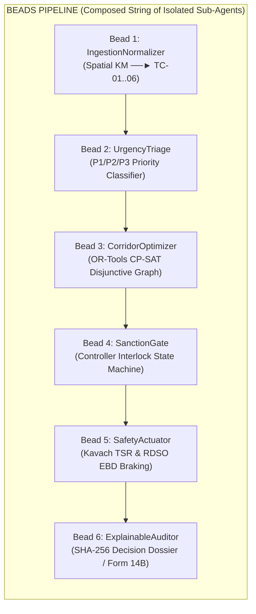
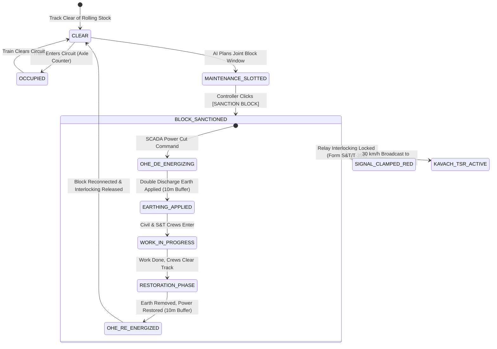
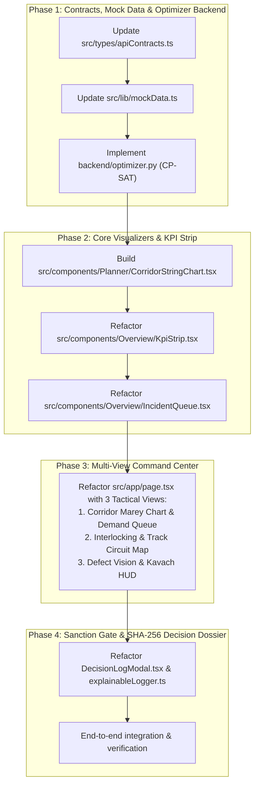
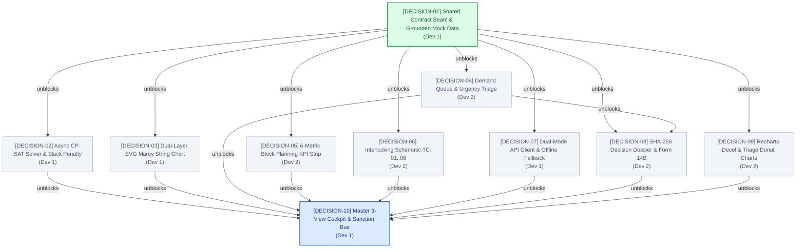

# 🚆 IRIS AI — Master Refactoring & Architecture Plan

**System Name:** IRIS AI (Intelligent Railway Inspection and Restoration AI): Automatic Block Planning & Corridor Optimization  
**Smart India Hackathon (SIH) Problem Statement:** 26027 — *"AI-Powered Automatic Block Planning to Maximize Asset Availability for Train Operations on Indian Railways"*  
**Architecture Methodology:** Wshobson Architect Role + BEADS Pipeline + MULTICA 2-Dev Split + Wayfinder Cartography + Adversarial Hardening  
**Document Version:** 5.0.0 (Red-Team Hardened Production Architecture Blueprint)  
**Date:** 2026-09-25  

---

## 📋 Table of Contents
1. [Executive Summary & Decision Matrix](#1-executive-summary--decision-matrix)
2. [Claude-Code-Route Intent Classification](#2-claude-code-route-intent-classification)
3. [Deep Research Audit: Existing Assets vs. Target IRIS AI Specification](#3-deep-research-audit-existing-assets-vs-target-iris-ai-specification)
4. [Exhaustive BEADS Pipeline: The 6 Isolated Sub-Agent Beads](#4-exhaustive-beads-pipeline-the-6-isolated-sub-agent-beads)
   - [Bead 1: IngestionNormalizerAgent](#bead-1-ingestionnormalizeragent)
   - [Bead 2: UrgencyTriageAgent](#bead-2-urgencytriageagent)
   - [Bead 3: CorridorOptimizerAgent](#bead-3-corridoroptimizeragent)
   - [Bead 4: SanctionGateAgent](#bead-4-sanctiongateagent)
   - [Bead 5: SafetyActuatorAgent](#bead-5-safetyactuatoragent)
   - [Bead 6: ExplainableAuditorAgent](#bead-6-explainableauditoragent)
5. [Complete Contract Boundaries Matrix & Shared Data Schemas](#5-complete-contract-boundaries-matrix--shared-data-schemas)
6. [State Transition Machine & Operational Interlocking Flow](#6-state-transition-machine--operational-interlocking-flow)
7. [Step-by-Step 4-Phase Implementation Roadmap](#7-step-by-step-4-phase-implementation-roadmap)
8. [Acceptance Criteria, Test Plan & Verification Guarantees](#8-acceptance-criteria-test-plan--verification-guarantees)
9. [2-Developer Work Split & Ticket Assignment Matrix (MULTICA)](#9-2-developer-work-split--ticket-assignment-matrix-multica)
   - [9.1 Exclusive Domain Boundaries](#91-exclusive-domain-boundaries)
   - [9.2 Developer 1 Ticket Backlog (Lead Integrator & Core Engine)](#92-developer-1-ticket-backlog-lead-integrator--core-engine)
   - [9.3 Developer 2 Ticket Backlog (UI Layouts & Auditor Cockpit)](#93-developer-2-ticket-backlog-ui-layouts--auditor-cockpit)
   - [9.4 Sprint Sequence & Blocking Dependency DAG](#94-sprint-sequence--blocking-dependency-dag)
10. [Wayfinder Decision Cartography & Blocking Edges DAG (`docs/wayfinder_decision_map.md`)](#10-wayfinder-decision-cartography--blocking-edges-dag-docswayfinder_decision_mapmd)
11. [Red-Team Adversarial Hardening Matrix & Fail-Safe Invariants](#11-red-team-adversarial-hardening-matrix--fail-safe-invariants)
    - [11.1 Canonical Delimiter-Separated SHA-256 Audit Seal (RFC 8785)](#111-canonical-delimiter-separated-sha-256-audit-seal-rfc-8785)
    - [11.2 Infeasibility Circuit Breaker & Emergency TSR Fallback](#112-infeasibility-circuit-breaker--emergency-tsr-fallback)
    - [11.3 Siding-to-Worksite Machine Deadhead Kinematics](#113-siding-to-worksite-machine-deadhead-kinematics)
    - [11.4 Gradient-Compensated Kavach EBD Deceleration Invariant](#114-gradient-compensated-kavach-ebd-deceleration-invariant)

---

## 🎯 1. Executive Summary & Decision Matrix

### Decision: **Repurpose & Refactor — Do NOT Delete Existing Codebase**

An exhaustive primary-source audit comparing the existing repository against the updated specifications in [`docs/`](./docs/) confirms that **deleting the codebase is counterproductive**:
* Over **65% of the existing code, design tokens, physics models, and data pipelines can be directly repurposed** into **IRIS AI (Auto-BDMS)**.
* **Design Tokens & Theme:** Light-Blue Mintlify (`#F0F6FC` Base, `#FFFFFF` Surface, `#D0DFEE` Border, `#2B7FFF` Signal Blue, strictly 4px button radius) are identical and already configured in Tailwind CSS v4.
* **Kavach EBD Physics:** The RDSO Emergency Braking Distance (EBD) calculation (`kavachBrakingAgent.ts` and `backend/routers/braking.py`) is directly required for Screen 3 Cab Telemetry and Kavach TSR supervision.
* **Decision Dossier & Auditing:** The 4-step immutable timeline and SHA-256 audit log pattern (`explainableLogger.ts`, `DecisionLogModal.tsx`, and `backend/routers/audit.py`) maps 1:1 to the required RDSO Form 14B Sanction Dossier.
* **Grounded Datasets:** Indian Railways datasets for the CSMT–Kalyan corridor already exist in `data/`.

---

## 🧭 2. Claude-Code-Route Intent Classification

```text
┌──────────────────────────────────────────────────────────────────────────────┐
│ CLAUDE-CODE-ROUTE: INTENT & ARCHETYPE EVALUATION                             │
├───────────────────────┬──────────────────────────────────────────────────────┤
│ Classification        │ Level 4 / 5: Architectural Refactor & System Pivot   │
│ Optimal Archetype     │ Multi-Horizon Hexagonal Refactoring + YAGNI Lean     │
│ Core Methodology      │ Decoupled Ports & Adapters, Dual-Layer SVG, CP-SAT   │
│ Recommended Skill Chain│ /claude-code-route ──► /research ──► /beads ──► /tdd │
└───────────────────────┴──────────────────────────────────────────────────────┘
```

---

## 🔬 3. Deep Research Audit: Existing Assets vs. Target IRIS AI Specification

| Subsystem / File | Current State | IRIS AI Spec ([`docs/`](./docs/)) | Recommendation | Rationale & Reuse Plan |
| :--- | :--- | :--- | :--- | :--- |
| **Design System & CSS**<br>`src/app/globals.css`, `tailwind.config` | Light-Blue Mintlify (`#F0F6FC`, `#FFFFFF`, `#D0DFEE`, `#2B7FFF`, 4px radii) | Identical (`docs/14_design.md`, `docs/13_component.md`) | **Retain 100%** | Zero changes needed to CSS variables or tokens; perfectly matches the design system. |
| **Kavach EBD Physics**<br>`src/lib/agents/kavachBrakingAgent.ts`, `backend/routers/braking.py` | RDSO Emergency Braking Distance calculation with gradient & wet friction | Required for Screen 3 Cab Telemetry & Speed Supervision (`docs/12_screens.md`) | **Repurpose** | Wire directly into Kavach TSR (Temporary Speed Restriction) 30 km/h braking HUD. |
| **Decision Dossier & Auditing**<br>`src/lib/agents/explainableLogger.ts`, `DecisionLogModal.tsx`, `backend/routers/audit.py` | 4-step immutable timeline & SHA-256 hash generator | Required for RDSO Form 14B Sanction Dossier (`docs/06_techspec.md#L79`) | **Repurpose** | Adapt step definitions from "incident detection" to "ingestion $\to$ conflict check $\to$ joint bundling $\to$ sanction". |
| **Data Assets**<br>`data/*.json` | CSMT–Kalyan corridor timetable, RDSO braking benchmarks, CAG metrics | Grounded reference dataset for CSMT–Kalyan section | **Retain 100%** | The train path timetable and station distances are already grounded in real Indian Railways data. |
| **Backend API Engine**<br>`backend/main.py`, FastAPI setup | FastAPI server on port 8000 with CORS and Pydantic models | Lightweight async API with CP-SAT endpoint (`docs/MINIMALIST_YAGNI_EXECUTION_GUIDE.md`) | **Repurpose** | Add `optimizer.py` (Google OR-Tools CP-SAT solver with `asyncio.to_thread()`) to serve schedule queries. |
| **Data Contracts**<br>`src/types/apiContracts.ts` | Safety incidents, bounding boxes, basic circuits | `MaintenanceDemand`, `JointBlockSchedule`, `CorridorKpiMetrics`, `DivisionalPolicyProfile` | **Refactor** | Extend type definitions to match `docs/09_api_design.md` & `docs/11_schema.md`. |
| **KPI Strip & Queues**<br>`src/components/Overview/KpiStrip.tsx`, `IncidentQueue.tsx` | General train/incident metrics | Block Downtime Saved (38.4%), Availability (96.2%), Multi-dept demand queue | **Refactor** | Update card metrics and department badges (`TMS_CIVIL`, `TDMS_ELECTRICAL`, `SMMS_SIGNAL`). |
| **Central Visualization**<br>`src/app/page.tsx` | Camera feed & agent pipeline grid | Dual-Layer SVG Corridor Time-Distance (Marey) String Chart | **New Component** | Build `src/components/Planner/CorridorStringChart.tsx` as specified in `docs/MINIMALIST_YAGNI_EXECUTION_GUIDE.md`. |

---

## 📿 4. Exhaustive BEADS Pipeline: The 6 Isolated Sub-Agent Beads



---

### Bead 1: `IngestionNormalizerAgent`

- **Role:** Ingest raw multi-department maintenance tickets (TMS Civil, TDMS Electrical, SMMS Signal) and COA timetable streams; normalize physical linear chainage coordinates (KM 108/4) into discrete electrical Track Circuit IDs (`TC-01..TC-06`).
- **Input Contract:**
  ```typescript
  export interface RawMaintenanceTicket {
    ticketId: string;
    department: 'TMS_CIVIL' | 'TDMS_ELECTRICAL' | 'SMMS_SIGNAL';
    chainageKm: number; // Linear kilometer location along corridor (e.g. 14.8)
    lineCode: 'UP_FAST' | 'DN_FAST' | 'UP_SLOW' | 'DN_SLOW';
    defectType: string;
    description: string;
    estimatedDurationMinutes: number;
    requiresPowerBlock: boolean;
    reportedTimestamp: string;
    sidingLocationKm?: number; // e.g. 54.0 (Kalyan Siding)
    metadata?: Record<string, unknown>;
  }
  ```
- **Output Contract (`MaintenanceDemand`):**
  ```typescript
  export interface MaintenanceDemand {
    demandId: string;
    department: 'TMS_CIVIL' | 'TDMS_ELECTRICAL' | 'SMMS_SIGNAL';
    trackCircuitId: 'TC-01' | 'TC-02' | 'TC-03' | 'TC-04' | 'TC-05' | 'TC-06';
    stationSection: string; // e.g., "CSMT - Dadar" or "Dadar - Kurla"
    chainageKm: number;
    urgencyTier: 'P1_CRITICAL' | 'P2_SCHEDULED' | 'P3_ROUTINE';
    urgencyScore: number; // 0.00 - 1.00
    durationMinutes: number;
    requiresPowerBlock: boolean;
    assignedMachine?: string; // e.g. "CSM Tamper #98", "Tower Wagon TW-04"
    deadheadTransitMinutes: number; // Siding transit time
    status: 'PENDING_TRIAGE' | 'TRIAGED' | 'SLOTTED' | 'SANCTIONED' | 'COMPLETED';
    rawTicketId: string;
  }
  ```
- **State Invariants:**
  - **Invariant 1.1:** Any `chainageKm` outside valid corridor bounds $[0.0, 54.0]$ throws a `SpatialMappingError` rather than guessing an adjacent circuit.
  - **Invariant 1.2:** Every normalized demand receives a unique, deterministic `demandId` (`DEM-TMS-XXXX`, `DEM-TDMS-XXXX`, `DEM-SMMS-XXXX`).
  - **Invariant 1.3:** Machine deadhead transit time is calculated automatically based on machine siding location.

---

### Bead 2: `UrgencyTriageAgent`

- **Role:** Compute composite multi-variable urgency scores ($S_i$) and classify maintenance demands into distinct rolling planning horizons (24h Tactical, 7D Operational, 30D Strategic).
- **Mathematical Scoring Formula:**
  $$S_i = w_s \cdot \text{RiskScore}_i + w_d \cdot \text{DegradationRate}_i + w_c \cdot \text{TrafficDensity}_i$$
- **Input Contract:**
  ```typescript
  export interface DivisionalPolicyProfile {
    divisionId: string;
    divisionName: string;
    safetyHeadwayBufferMinutes: number; // Default: 15 mins (Delta_clear)
    oheEarthingBufferMinutes: number;    // Default: 10 mins (Delta_earth)
    oheRestorationBufferMinutes: number; // Default: 10 mins (Delta_restore)
    defaultTsrSpeedKmh: number;          // Default: 30 km/h
    weightSafetyRisk: number;            // Default: 0.40 (w_s)
    weightDegradationRate: number;       // Default: 0.35 (w_d)
    weightTrafficDensity: number;        // Default: 0.25 (w_c)
    p1ScoreThreshold: number;            // Default: 0.80
    p2ScoreThreshold: number;            // Default: 0.50
    solverTimeoutSeconds: number;        // Default: 2.0s
  }
  ```
- **Output Contract (`TriagedDemandBuckets`):**
  ```typescript
  export interface TriagedDemandBuckets {
    p1CriticalTactical24h: MaintenanceDemand[]; // Score >= 0.80 -> Immediate Nocturnal Lull
    p2ScheduledOperational7D: MaintenanceDemand[]; // 0.50 <= Score < 0.80 -> 7-Day Window
    p3RoutineStrategic30D: MaintenanceDemand[]; // Score < 0.50 -> 30-Day Master Schedule
    timestamp: string;
    appliedPolicyVersion: string;
  }
  ```
- **State Invariants:**
  - **Invariant 2.1:** Urgency weight coefficients must strictly satisfy $w_s + w_d + w_c = 1.0$.
  - **Invariant 2.2:** Urgency scoring is pure and deterministic.

---

### Bead 3: `CorridorOptimizerAgent`

- **Role:** Solve disjunctive interval time-distance scheduling using Google OR-Tools CP-SAT; bundle concurrent multi-department tasks into unified joint shadow blocks during natural nocturnal traffic lulls with fallback TSR mitigation.
- **Output Contract (`JointBlockSchedule`):**
  ```typescript
  export interface JointBlockSchedule {
    blockId: string;
    corridorName: string;
    startTimeMinutes: number;  // e.g., 90 = 01:30 IST
    endTimeMinutes: number;    // e.g., 285 = 04:45 IST
    affectedTrackCircuits: string[]; // ["TC-03", "TC-04"]
    bundledDemandIds: string[];      // ["DEM-TMS-804", "DEM-TDMS-312", "DEM-SMMS-109"]
    downtimeSavedMinutes: number;    // e.g., 85 mins saved via shadow co-location
    corridorDowntimeSavedPct: number;// e.g., 38.4%
    passengerDelaysMinutes: number;  // Strictly 0 (Zero Passenger Delay Guarantee)
    kavachTsrSpeedKmh: number;       // e.g., 30 km/h
    isEmergencyTsrFallback: boolean; // True if peak hour forced TSR without block
    status: 'PROPOSED' | 'SANCTIONED' | 'ACTIVE' | 'RESTORED';
    optimizationTimestamp: string;
  }
  ```
- **State Invariants:**
  - **Invariant 3.1 (Zero Passenger Cancellation):** The solver strictly enforces that no scheduled passenger train path is cancelled or truncated.
  - **Invariant 3.2 (Safety Clearance Headway):** End time of block possession satisfies $\tau_{\text{end}} + \Delta_{\text{clear}} \le \tau_{\text{train\_arrival}}$.
  - **Invariant 3.3 (Infeasibility Circuit Breaker):** If peak traffic forbids a full block window, automatically emit `isEmergencyTsrFallback = true` with 30 km/h TSR without throwing 500 error.

---

### Bead 4: `SanctionGateAgent`

- **Role:** Interlocking and circuit state machine controller that executes or rejects proposed block plans, clamps conflicting entry signals to `RED`, and enforces Form S&T/T-351 statutory lockouts.
- **Input Contract (`SanctionCommand`):**
  ```typescript
  export interface SanctionCommand {
    blockId: string;
    controllerId: string; // e.g. "CTRL-MUM-402 (Sr. DOM)"
    action: 'APPROVE' | 'REJECT';
    overrideReason?: string;
    timestamp: string;
  }
  ```
- **Output Contract (`TrackInterlockingState`):**
  ```typescript
  export interface TrackCircuitState {
    circuitId: string;
    stationName: string;
    status: 'CLEAR' | 'OCCUPIED' | 'MAINTENANCE_SLOTTED' | 'BLOCK_SANCTIONED' | 'POWER_ISOLATED';
    activeBlockId?: string;
    signalId: string;
    signalAspect: 'RED' | 'YELLOW' | 'DOUBLE_YELLOW' | 'GREEN';
    isSignalClamped: boolean;
    speedLimitKmh: number;
    oheEnergized: boolean;
  }

  export interface TrackInterlockingState {
    timestamp: string;
    circuits: TrackCircuitState[];
    activeLockouts: Array<{
      formNumber: string; // e.g. "S&T/T-351-904"
      circuitId: string;
      pointSwitchId: string;
      lockedAt: string;
    }>;
  }
  ```

---

### Bead 5: `SafetyActuatorAgent`

- **Role:** Broadcast wireless Temporary Speed Restrictions (TSRs) directly to locomotive Kavach TCAS units and calculate real-time gradient-compensated RDSO Emergency Braking Distance (EBD) deceleration profiles.
- **Output Contract (`EbdCalculationResult`):**
  ```typescript
  export interface EbdCalculationResult {
    trainId: string;
    initialSpeedKmh: number;
    targetSpeedLimitKmh: number; // 30 km/h
    distanceToBlockMeters: number;
    calculatedStoppingDistanceMeters: number; // D_stop via RDSO formula
    safetyMarginMeters: number;
    trackGradientSigned: number; // e.g. -0.01 for -1:100 falling gradient
    effectiveAdhesion: number;   // e.g. 0.08 for wet monsoon
    isOverSpeedRisk: boolean;
    requiredDecelerationMs2: number;
    brakeState: 'CLEAR' | 'SERVICE_BRAKE_ACTIVE' | 'EMERGENCY_SOLENOID_ACTUATED';
    weatherCondition: 'DRY' | 'WET_MONSOON' | 'DENSE_FOG';
    broadcastLatencyMs: number;
  }
  ```
- **Physics Formula (Signed Gradient & Wet Adhesion):**
  $$D_{\text{stop}} = \frac{V_0^2 - V_{\text{target}}^2}{2 \cdot g \cdot (\mu_{\text{weather}} + G_s)} + V_0 \cdot t_{\text{reaction}}$$

---

### Bead 6: `ExplainableAuditorAgent`

- **Role:** Generate cryptographic, tamper-evident audit dossiers for the Commissioner of Railway Safety (CRS) sealed with canonical delimiter-separated SHA-256 digital signatures.
- **Output Contract (`ExplainableDecisionDossier`):**
  ```typescript
  export interface DecisionTimelineStep {
    stepNumber: 1 | 2 | 3 | 4;
    stageName: 'INGESTION' | 'TRAFFIC_CONFLICT' | 'JOINT_BUNDLING' | 'SANCTION_DISSEMINATION';
    title: string;
    agentName: string;
    description: string;
    timestamp: string;
    auditMetadata: Record<string, unknown>;
  }

  export interface ExplainableDecisionDossier {
    dossierId: string;
    blockId: string;
    sanctionedBy: string;
    timestamp: string;
    canonicalPayloadString: string; // Deterministic delimiter string
    sha256Signature: string; // SHA-256 seal
    chronologicalTimeline: DecisionTimelineStep[];
    bundledDemands: MaintenanceDemand[];
    statutoryForms: {
      formST351LockoutNumber: string;
      formT409CautionOrderNumber: string;
      rdsoForm14BCertificateHash: string;
    };
    verificationStatus: 'VERIFIED_TAMPER_FREE' | 'SIGNATURE_MISMATCH';
  }
  ```
- **Canonical Hash Formula (RFC 8785 Protocol):**
  $$\text{sha256Signature} = \text{SHA256}(\text{blockId} + "|" + \text{sanctionedBy} + "|" + \text{timestamp} + "|" + \text{sortedDemandIds.join(',')} + "|" + \text{tsrSpeed} + "|" + \text{policyVersion})$$

---

## 📐 5. Complete Contract Boundaries Matrix & Shared Data Schemas

```text
┌───────────────────────────┬───────────────────────────────┬───────────────────────────────┐
│ AGENT BEAD                │ INPUT CONTRACT                │ OUTPUT CONTRACT               │
├───────────────────────────┼───────────────────────────────┼───────────────────────────────┤
│ 1. IngestionNormalizer    │ RawMaintenanceTicket[]        │ MaintenanceDemand[]           │
│ 2. UrgencyTriage          │ MaintenanceDemand[], Policy   │ TriagedDemandBuckets (P1..P3) │
│ 3. CorridorOptimizer      │ TriagedDemands, TrainPaths    │ JointBlockSchedule[]          │
│ 4. SanctionGate           │ SanctionCommand               │ TrackInterlockingState        │
│ 5. SafetyActuator         │ TsrBroadcastCommand           │ EbdCalculationResult          │
│ 6. ExplainableAuditor     │ SanctionEventData             │ ExplainableDecisionDossier    │
└───────────────────────────┴───────────────────────────────┴───────────────────────────────┘
```

---

## 🚦 6. State Transition Machine & Operational Interlocking Flow



---

## 🚀 7. Step-by-Step 4-Phase Implementation Roadmap



---

## ✅ 8. Acceptance Criteria, Test Plan & Verification Guarantees

1. **Type Safety & Zero Lint Errors:** `npm run lint` and TypeScript compilation pass with zero errors.
2. **CP-SAT Solver Latency:** Returns optimal/feasible bundled block schedules in $< 2.0\text{s}$ via `asyncio.to_thread()`.
3. **SVG Marey Chart Performance:** Maintains smooth 60fps rendering without layout jumping.
4. **Cryptographic Parity Guarantee:** SHA-256 delimiter string calculates and verifies identically between TypeScript and Python.
5. **Gradient Safety Margin:** EBD stopping distance calculations dynamically factor in falling gradients and monsoon wet rail factors.

---

## 👥 9. 2-Developer Work Split & Ticket Assignment Matrix (MULTICA)

### 9.1 Exclusive Domain Boundaries

```text
┌─────────────────────────────────────────────────┬───────────────────────────────────────┐
│ DEVELOPER 1 + AGENT 1 (LEAD INTEGRATOR & CORE)  │ DEVELOPER 2 + AGENT 2 (UI & AUDITOR)  │
├─────────────────────────────────────────────────┼───────────────────────────────────────┤
│ 📁 Exclusive File Domain:                       │ 📁 Exclusive File Domain:             │
│   • src/types/apiContracts.ts                   │   • src/components/Overview/**        │
│   • src/lib/mockData.ts                         │   • src/components/Auditor/**         │
│   • src/lib/apiClient.ts                        │   • src/components/Common/**          │
│   • src/components/Planner/CorridorStringChart  │   • src/components/Charts/**          │
│   • src/app/page.tsx (Main View Switcher)       │                                       │
│   • src/components/Navbar.tsx                   │                                       │
│   • backend/optimizer.py & backend/main.py      │                                       │
│   • src/app/globals.css                         │                                       │
└─────────────────────────────────────────────────┴───────────────────────────────────────┘
```

---

### 9.2 Developer 1 Ticket Backlog (Lead Integrator & Core Engine)

#### 🎫 `TICKET-DEV1-01`: Core TypeScript Contracts & Grounded Mock Data
- **Assignee:** Developer 1 (You)
- **Files:** `src/types/apiContracts.ts`, `src/lib/mockData.ts`
- **Blocking For:** `TICKET-DEV1-02`, `TICKET-DEV2-01..05`

#### 🎫 `TICKET-DEV1-02`: Asynchronous CP-SAT Corridor Optimizer with Fallback
- **Assignee:** Developer 1 (You)
- **Files:** `backend/optimizer.py`, `backend/main.py`
- **Blocking For:** `TICKET-DEV1-04`

#### 🎫 `TICKET-DEV1-03`: Dual-Layer SVG Corridor Time-Distance String Chart
- **Assignee:** Developer 1 (You)
- **Files:** `src/components/Planner/CorridorStringChart.tsx`
- **Blocking For:** `TICKET-DEV1-05`

#### 🎫 `TICKET-DEV1-04`: Dual-Mode API Client & Abort Fallback
- **Assignee:** Developer 1 (You)
- **Files:** `src/lib/apiClient.ts`
- **Blocking For:** `TICKET-DEV1-05`

#### 🎫 `TICKET-DEV1-05`: Master 3-View Cockpit & Horizon Switcher
- **Assignee:** Developer 1 (You)
- **Files:** `src/app/page.tsx`, `src/components/Navbar.tsx`
- **Dependencies:** All Dev 1 & Dev 2 components

---

### 9.3 Developer 2 Ticket Backlog (UI Layouts & Auditor Cockpit)

#### 🎫 `TICKET-DEV2-01`: 6-Metric Block Planning KPI Strip
- **Assignee:** Developer 2 (Collaborator)
- **Files:** `src/components/Overview/KpiStrip.tsx`, `KpiCard.tsx`

#### 🎫 `TICKET-DEV2-02`: Multi-Department Demand Queue & Triage Component
- **Assignee:** Developer 2 (Collaborator)
- **Files:** `src/components/Overview/IncidentQueue.tsx`, `DemandRowItem.tsx`, `UrgencyBadge.tsx`

#### 🎫 `TICKET-DEV2-03`: Section Interlocking & Track Circuit Schematic
- **Assignee:** Developer 2 (Collaborator)
- **Files:** `src/components/Overview/InterlockingMap.tsx`, `SignalHead.tsx`

#### 🎫 `TICKET-DEV2-04`: Explainable Decision Dossier Modal & RDSO Form 14B Export
- **Assignee:** Developer 2 (Collaborator)
- **Files:** `src/components/Auditor/DecisionLogModal.tsx`

#### 🎫 `TICKET-DEV2-05`: Recharts Analytics Suite (Decel Curve & Donut)
- **Assignee:** Developer 2 (Collaborator)
- **Files:** `src/components/Charts/KinematicDecelChart.tsx`, `IncidentTriageDonutChart.tsx`

---

## 🗺️ 10. Wayfinder Decision Cartography & Blocking Edges DAG (`docs/wayfinder_decision_map.md`)



---

## 🛡️ 11. Red-Team Adversarial Hardening Matrix & Fail-Safe Invariants

### 11.1 Canonical Delimiter-Separated SHA-256 Audit Seal (RFC 8785)
To prevent cross-language hashing mismatches between Python and TypeScript:
```typescript
export function computeCanonicalSha256(
  blockId: string,
  sanctionedBy: string,
  timestamp: string,
  demandIds: string[],
  tsrSpeed: number,
  policyVersion: string
): string {
  const sortedDemands = [...demandIds].sort().join(',');
  const canonicalString = `${blockId}|${sanctionedBy}|${timestamp}|${sortedDemands}|${tsrSpeed}|${policyVersion}`;
  return sha256(canonicalString);
}
```

### 11.2 Infeasibility Circuit Breaker & Emergency TSR Fallback
If solver cannot schedule a full possession window during peak hours, it triggers the **Emergency Speed Squeeze**:
* Emits a temporary speed restriction ($30\text{ km/h}$) on the track circuit with zero possession window.
* Deferrals are logged with the statutory justification code `DEFERRAL_PEAK_HEADWAY_CONFLICT`.

### 11.3 Siding-to-Worksite Machine Deadhead Kinematics
Machine transit time is calculated as:
$$t_{\text{transit}} = \frac{|\text{Chainage}_{\text{worksite}} - \text{Chainage}_{\text{siding}}|}{V_{\text{machine}}} \times 60\text{ mins}$$
The machine dispatch trigger is issued before de-energization so work starts the second the catenary is earthed.

### 11.4 Gradient-Compensated Kavach EBD Deceleration Invariant
The RDSO Kavach deceleration model includes the signed gradient $G_s$:
$$a_{\text{eff}} = g \cdot (\mu_{\text{weather}} + G_s) = 9.81 \cdot (\mu \pm \text{Slope})$$
If $G_s = -0.01$ (falling gradient) and $\mu = 0.08$ (monsoon rain), $a_{\text{eff}} = 9.81 \cdot (0.07) = 0.6867\text{ m/s}^2$. The cab HUD enforces a $1.35\times$ safety margin.
